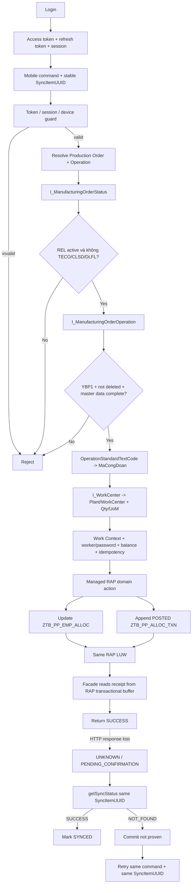

# CASLA Mobile Production Allocation – ABAP RAP Backend

Backend ABAP RAP cho **CASLA Mobile Production Allocation** trên SAP S/4HANA Cloud Public Edition / ABAP Cloud.

Repository quản lý authentication/session, RBAC + Work Context, giao/điều chuyển/thu hồi công việc, ghi nhận sản lượng, immutable transaction ledger, timeout reconciliation, Fiori correction/audit và master Công đoạn phục vụ enrichment/đơn giá.

> **Business boundary quan trọng:** trong project này, “ghi nhận về SAP” nghĩa là **ghi nhận nghiệp vụ CASLA vào custom Z tables chạy trên SAP thông qua custom RAP/OData V4 APIs**. Backend **không tạo standard SAP Production Confirmation**, material document hay business document chuẩn khác.

## Trạng thái hiện tại

Kiến trúc production-allocation đã được chuyển hoàn toàn sang **direct mobile command + managed RAP LUW + immutable ledger**.

Đã có:

- `initialAssign`, `transfer`, `recall`, `confirm`, `reverse`;
- direct mobile facade theo `ProductionOrder + Operation`;
- token/session/device guard cho protected mobile API;
- live SAP Manufacturing Order / Operation guard;
- `OperationStandardTextCode -> MaCongDoan`;
- `getSyncStatus` cho request timeout/chưa xác nhận;
- append-only `ZTB_PP_ALLOC_TXN` cho reconciliation/audit;
- Fiori controlled `correctConfirm`;
- versioned `ZTB_MD_CONGDOAN` + Fiori OData V4 service;
- draw.io ERD + execution flow;
- GitHub Actions ABAP Cloud quality gate.

Đã loại bỏ khỏi kiến trúc hiện hành:

- `ZTB_PP_SYNC_H` / `ZTB_PP_SYNC_I`;
- generic `submitSync` batch contract;
- SAP-side background worker/bgPF cho mobile commands;
- standard SAP Production Confirmation adapter;
- mọi rule liên quan “ca còn >= 60 phút”.

Latest quality gate của source final:

```text
@abaplint/cli 2.120.35
ABAP language version: Cloud
0 issue(s) found
241 file(s) analyzed
```

## Nguyên tắc kiến trúc

- **Server authoritative:** actor, session, permission và Work Context luôn được backend xác thực lại.
- **Session guard:** protected mobile API kiểm tra access token + active session + device.
- **Domain command only:** mobile/Fiori không được free-form CRUD balance hoặc ledger.
- **Immutable ledger:** mọi thay đổi nghiệp vụ được giải thích bằng transaction mới trong `ZTB_PP_ALLOC_TXN`.
- **Same RAP LUW:** current balance update và ledger append nằm trong cùng managed RAP transaction boundary.
- **Idempotent mobile commands:** mobile sinh `SyncItemUUID` trước khi gửi và reuse đúng ID khi retry.
- **Timeout != failure:** mất HTTP response không được kết luận business FAILED.
- **Mobile-owned reliability queue:** pending/retry nằm ở mobile; SAP không giữ queue xử lý mobile riêng.
- **Long-lived assignment:** công việc có thể kéo dài nhiều ngày hoặc nhiều tuần; ca làm việc không phải constraint.
- **SAP live validation:** custom snapshot không thay thế việc kiểm tra live Production Order / Operation trước mutation.

## 1. Luồng mobile



### RAP transactional-buffer rule

Sau internal action, ledger child vừa tạo có thể mới tồn tại trong **RAP transactional buffer**, chưa phải committed database state. Vì vậy facade đọc receipt bằng EML:

```abap
READ ENTITIES OF zr_pp_opalloc IN LOCAL MODE
  ENTITY OperationAllocation BY \_Transactions
  ...
```

không dùng Open SQL để cố đọc row vừa tạo trước save sequence.

## 2. Mobile API surface

### Authentication service

Service Definition: `ZUI_MOB_AUTH`

Phục vụ lifecycle authentication/session như login, refresh, logout và change password theo contract hiện có.

### Production service

Service Definition: `ZUI_PP_OPALLOC`

Mobile không CRUD trực tiếp `ZTB_PP_EMP_ALLOC` hoặc `ZTB_PP_ALLOC_TXN`. Projection chỉ expose command/status/history facade:

| Action | Mục đích |
| --- | --- |
| `submitInitialAssign` | Giao sản lượng ban đầu |
| `submitTransfer` | Điều chuyển sản lượng giữa nhân công |
| `submitRecall` | Thu hồi phần sản lượng còn lại hợp lệ |
| `submitConfirm` | Ghi nhận sản lượng hoàn thành CASLA |
| `submitReverse` | Đảo một CONFIRM hợp lệ bằng compensating transaction |
| `getSyncStatus` | Đối chiếu request sau timeout/response loss |
| `getWorkHistory` | Lịch sử/summary theo scope được phép |

Mobile gửi `ProductionOrder + Operation`; backend tự resolve `OperationUUID` và live operation state. `ActorUserUUID` không nhận từ payload mà được derive từ authenticated session.

## 3. Live Production Order / Operation guard

`ZCL_PP_OPERATION_GUARD` kiểm tra dữ liệu live trước mutation.

### `I_ManufacturingOrderStatus`

Chỉ xét active SAP **system status**:

- phải có `REL` (`I0002`);
- chặn `TECO` (`I0045`);
- chặn `CLSD` (`I0046`);
- chặn `DLFL` (`I0076`).

Terminal/deletion status thắng kể cả khi REL vẫn còn active.

### `I_ManufacturingOrderOperation`

Lookup theo:

```text
ManufacturingOrder          = ProductionOrder
ManufacturingOrderOperation_2 = Operation
```

Validation/snapshot:

- `OperationControlProfile = 'YBP1'`;
- `OperationIsToBeDeleted` phải initial;
- `OperationStandardTextCode` bắt buộc;
- planned quantity > 0;
- Operation UoM, Plant và WorkCenterInternalID bắt buộc.

Mapping nghiệp vụ:

```text
OperationStandardTextCode -> MaCongDoan
```

### `I_WorkCenter`

Resolve Work Center code bằng:

```text
Plant + WorkCenterInternalID
```

Kết quả live được snapshot vào `ZTB_PP_OP_ALLOC`. `MaCongDoan` phục vụ enrichment/reporting/payroll về sau; nó không thay thế live order/operation validation.

> Exact released status và field availability của các SAP CDS interface phải được verify bằng ADT/View Browser trên **đúng target Public Cloud tenant/release** khi activate.

## 4. Production persistence

### `ZTB_PP_OP_ALLOC` — operation snapshot

Các field nghiệp vụ chính:

```text
OPERATION_UUID
PRODUCTION_ORDER
OPERATION_NO
MA_CONGDOAN
PLANT
WORK_CENTER
OPERATION_QTY
UOM
OPERATION_STATUS
```

Business uniqueness cần enforce/test trên target tenant:

```text
CLIENT + PRODUCTION_ORDER + OPERATION_NO
```

Điều này đặc biệt quan trọng cho race condition của **first snapshot creation**, trước khi một RAP active instance đã tồn tại để lock.

### `ZTB_PP_EMP_ALLOC` — current balance

Balance theo Operation + Worker:

```text
Remaining
= InitialAssigned
+ TransferredIn
- TransferredOut
- Recalled
- Completed
```

`validateBalance` reject nếu Remaining âm hoặc invariant không khớp.

### `ZTB_PP_ALLOC_TXN` — immutable audit/reconciliation ledger

Transaction types hiện dùng:

- `INITIAL_ASSIGN`
- `TRANSFER`
- `RECALL`
- `CONFIRM`
- `REVERSE`
- `CORRECTION`

Ledger lưu các nhóm dữ liệu:

- `TransactionUUID`;
- `OriginalTransactionUUID` / original type cho lineage;
- `SyncItemUUID` cho mobile idempotency/reconciliation;
- actor/session/device;
- verified worker + verification evidence;
- worker/from/to worker;
- quantity/UoM/execution date;
- reason/source channel/status;
- audit timestamps.

Các field legacy `SAP_CONFIRMATION_*` / `SAP_ERROR_*` có thể còn tồn tại để tránh migration phá vỡ không cần thiết, nhưng **không đại diện cho standard SAP Production Confirmation integration** và không thuộc flow hiện hành.

## 5. Domain commands

### Initial Assign

- session/device guard;
- SAP live operation guard;
- Work Context `Plant + WorkCenter`;
- worker active + password verification;
- UoM/quantity validation;
- không vượt operation quantity;
- idempotency theo `SyncItemUUID`;
- create/update worker balance;
- append `INITIAL_ASSIGN`.

### Transfer

- source/target worker validation;
- source remaining phải đủ;
- worker nhận việc được verify;
- decrement source, increment/create target;
- append `TRANSFER`.

Assignment không phụ thuộc ca làm việc và có thể kéo dài nhiều ngày/tuần.

### Recall

- chỉ thu hồi lineage hợp lệ từ giao việc/điều chuyển;
- không vượt remaining balance;
- append `RECALL`;
- không sửa transaction gốc.

### Confirm

`CONFIRM` là CASLA business transaction trên custom Z tables:

```text
Completed += Quantity
Remaining -= Quantity
append CONFIRM POSTED
```

Không gọi standard SAP Production Confirmation API.

### Reverse

`REVERSE` là compensating transaction:

- original phải là POSTED `CONFIRM` hợp lệ;
- không sửa/xóa original;
- không cho reverse lần hai;
- tính effective quantity sau các `CORRECTION`;
- restore `Completed/Remaining`;
- append `REVERSE` linked bằng `OriginalTransactionUUID`.

## 6. Idempotency, timeout và request chưa xác nhận

SAP không còn `ZTB_PP_SYNC_H/I` và không có server-side mobile queue.

Mobile tạo `SyncItemUUID` **trước khi gửi mutation**.

### Normal success

```text
mobile sends command
        ↓
SAP validates + mutates balance + appends ledger
        ↓
RAP save succeeds
        ↓
mobile receives SUCCESS
        ↓
SYNCED
```

### HTTP response lost

```text
SAP may already have committed
        ↓
response lost / timeout
        ↓
mobile must NOT mark FAILED
        ↓
UNKNOWN / PENDING_CONFIRMATION
        ↓
getSyncStatus(AccessToken, DeviceID, SyncItemUUID)
```

Status semantics:

| Status | Ý nghĩa |
| --- | --- |
| `SUCCESS` | Backend chứng minh được đúng một POSTED ledger receipt của authenticated actor |
| `NOT_FOUND` | Backend chưa chứng minh commit; **không phải business failure** |
| duplicate/data-integrity case | Backend fail-closed thay vì chọn tùy ý một row |

Retry phải dùng **cùng command + cùng `SyncItemUUID` + cùng logical payload**. Same ID nhưng payload nghiệp vụ khác bị reject `IDEMPOTENCY_KEY_REUSED`.

## 7. Fiori Production Allocation Correction & Audit

Service Definition: `ZUI_PP_ALLOC_ADM`  
OData V4 Binding: `ZUI_PP_ALLOC_ADM_O4`

Entity sets:

- `OperationAllocations` — operation snapshot + controlled action `correctConfirm`;
- `AllocationTransactions` — read-only ledger/audit.

Không expose generic update cho `ZTB_PP_EMP_ALLOC` và không update/delete `ZTB_PP_ALLOC_TXN`.

Correction flow:

```text
Find original CONFIRM
        ↓
correctConfirm(
  TransactionUUID,
  NewQuantity,
  UnitOfMeasure,
  ReasonCode,
  ReasonText
)
        ↓
validate effective quantity + current balance
        ↓
update Completed / Remaining
        +
append CORRECTION signed delta
```

Ví dụ:

```text
CONFIRM      +100
CORRECTION    -20   -> effective 80
CORRECTION    +10   -> effective 90
```

Original CONFIRM giữ nguyên. Nếu đã REVERSE thì correction bị reject.

Fiori dùng SAP IAM/business-user context; mobile custom token không được nhét vào Fiori correction contract.

## 8. Master Công đoạn

Persistence: `ZTB_MD_CONGDOAN`

Versioned business key:

```text
CLIENT + MA_CONGDOAN + VALID_FROM
```

Fields chính:

```text
MA_CONGDOAN
TEN_CONGDOAN
BO_PHAN
DONGIA_XM
DONGIA_GC
VALID_FROM
VALID_TO
Created/Changed audit fields
```

`MA_CONGDOAN` tương ứng `OperationStandardTextCode` của operation SAP.

Mục đích:

- enrich tên/bộ phận;
- lưu đơn giá XM/GC theo validity period;
- chuẩn bị cho payroll/reporting/đối chiếu về sau.

Master này **không tham gia quyết định Production Order/Operation có được thao tác hay không**.

Validation:

- mã/tên/ValidFrom bắt buộc;
- `ValidTo >= ValidFrom`;
- đơn giá không âm;
- cùng `MaCongDoan` không overlap validity interval;
- hard delete bị chặn.

Service Definition: `ZUI_MD_CONGDOAN_ADM`  
OData V4 Binding: `ZUI_MD_CONGDOAN_ADM_O4`

## 9. Identity, RBAC và Work Context

```text
ZTB_MOB_USER
  +-- ZTB_MOB_CRED
  +-- ZTB_MOB_SESSION
  +-- ZTB_MOB_USR_ROL --> ZTB_MOB_ROLE
                            +-- ZTB_MOB_ROL_FNC --> ZTB_MOB_FUNC
                            +-- ZTB_MOB_ROL_WRK --> ZTB_MOB_WORK
```

Work Context chứa Plant + WorkCenter và metadata nghiệp vụ liên quan. Backend kiểm tra Work Context tại protected production command thay vì tin permission list phía client.

Login/refresh có thể trả permissions + Work Contexts để mobile render UX, nhưng quyền thực thi vẫn được validate server-side.

Login lockout theo workflow:

```text
5 password failures trong 1 phút -> lock 10 phút
```

## 10. Fiori administration services

| Service | Binding | Mục đích |
| --- | --- | --- |
| `ZUI_MOB_USER_ADM` | `ZUI_MOB_USER_ADM_O4` | User + initial/additional Roles |
| `ZUI_MOB_RBAC_ADM` | `ZUI_MOB_RBAC_ADM_O4` | Roles + Functions + Work Context |
| `ZUI_MD_CONGDOAN_ADM` | `ZUI_MD_CONGDOAN_ADM_O4` | Versioned Master Công đoạn / đơn giá |
| `ZUI_PP_ALLOC_ADM` | `ZUI_PP_ALLOC_ADM_O4` | Controlled CONFIRM correction + audit ledger |

Admin bindings phải được bảo vệ bằng IAM/business catalog trên tenant và **không** đưa vào mobile communication scenario.

## 11. Concurrency và data-integrity

Managed RAP root `OperationAllocation` dùng `lock master`; child balance/ledger lock dependent theo root. Điều này bảo vệ mutation trên operation instance đã tồn tại.

Các case vẫn phải stress-test trên target tenant:

1. hai request đầu tiên đồng thời cho cùng `ProductionOrder + Operation` khi snapshot chưa tồn tại;
2. duplicate `SyncItemUUID` đồng thời;
3. concurrent transfer/confirm trên cùng worker balance;
4. lock conflict/retry behavior;
5. HTTP timeout ngay sau server commit.

Target system phải enforce/verify uniqueness của:

```text
CLIENT + PRODUCTION_ORDER + OPERATION_NO
```

Không tạo unique index mù trên `SyncItemUUID` cho mọi ledger row nếu chưa account semantics của Fiori/CORRECTION rows không phải mobile command.

## 12. Data model diagram

Draw.io source:

[`docs/CASLA_DATA_MODEL.drawio`](docs/CASLA_DATA_MODEL.drawio)

File có 2 page:

1. **ERD** — Auth/Session/RBAC/Work + PP snapshot/balance/ledger + Master Công đoạn.
2. **Mobile Flow** — direct command, RAP LUW, transactional-buffer receipt read, timeout reconciliation và Fiori correction.

## 13. Repository layout

```text
serialized/                     abapGit deployable ABAP repository objects
.github/workflows/abaplint.yml  ABAP Cloud static quality gate
docs/
  ABAP_RAP_MOBILE_SYNC_PLAN.md  current command/reconciliation architecture
  FIORI_ELEMENTS_ADMIN.md       Fiori admin surface design
  CASLA_DATA_MODEL.drawio       ERD + execution flow
IMPLEMENTATION_STATUS.md        implementation/tenant activation status
SECURITY_PERFORMANCE_REVIEW.md  security/concurrency review
REVIEW_REMEDIATION_STATUS.md    consolidated remediation state
```

## 14. Validation và target deployment

CI quality gate:

```text
.github/workflows/abaplint.yml
@abaplint/cli 2.120.35
Node.js 22
ABAP language version: Cloud
```

Latest final-tree result:

```text
abaplint: 0 issue(s) found, 241 file(s) analyzed
```

`abaplint` không thay thế SAP target validation. Trước production cần:

1. import bằng abapGit;
2. activate DDIC -> CDS -> BDEF -> behavior classes -> service definitions/bindings bằng ADT;
3. chạy ATC/ABAP Cloud checks trên đúng tenant release;
4. verify released status/fields của SAP CDS dùng trong `ZCL_PP_OPERATION_GUARD` bằng ADT/View Browser;
5. publish OData V4 bindings;
6. gán đúng IAM business catalogs/roles cho từng Fiori admin surface;
7. enforce/test operation business-key uniqueness;
8. stress-test concurrency + idempotency + timeout/reconciliation;
9. smoke-test balance invariant + immutable reverse/correction lineage;
10. xác nhận mobile communication role không truy cập được admin services.

## 15. Definition of done trước production

Repository-side implementation được coi là hoàn chỉnh khi source/metadata đã import và activate thành công trên target tenant. Production rollout chỉ nên thực hiện sau khi tất cả mục sau pass:

- ADT activation sạch;
- ATC/ABAP Cloud sạch hoặc exception được review rõ ràng;
- released SAP CDS dependencies được xác nhận trên đúng release;
- OData metadata/action signatures đúng với mobile/Fiori clients;
- concurrency tests không tạo duplicate snapshot/ledger/balance corruption;
- response-loss reconciliation hoạt động với same `SyncItemUUID`;
- Fiori correction tạo `CORRECTION` thay vì sửa original ledger;
- raw ledger/balance CRUD không exposed;
- IAM/communication scenario separation được kiểm chứng.
