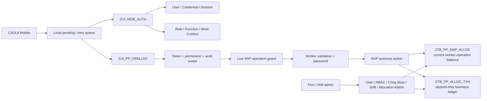
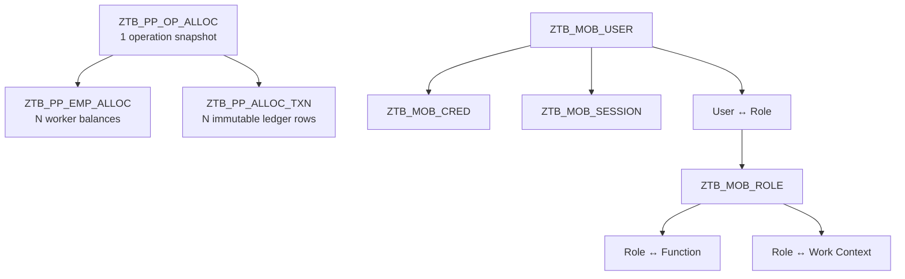
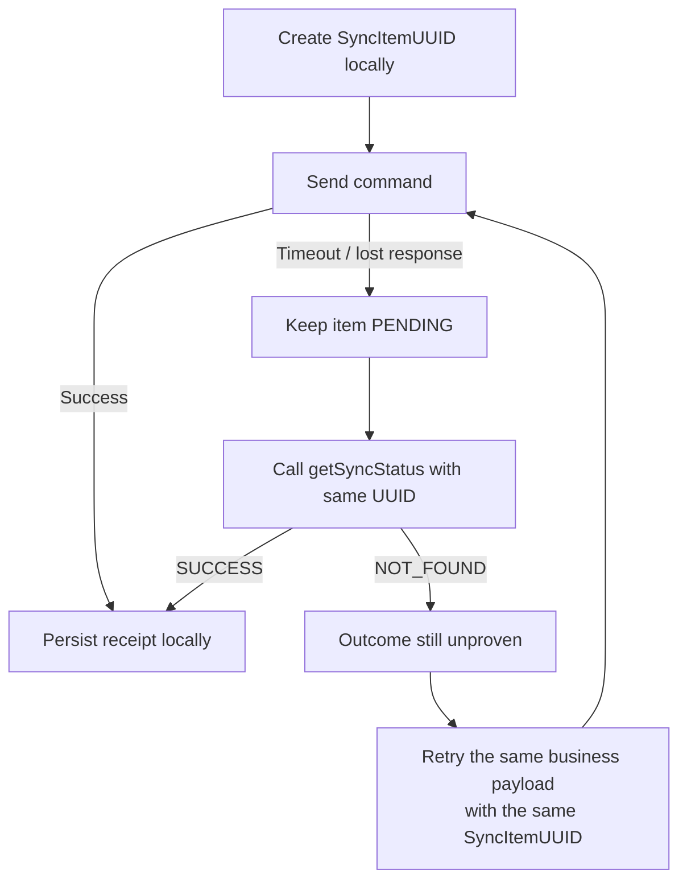

# CASLA Mobile Production Allocation

Backend **ABAP Cloud RAP + OData V4** cho ứng dụng CASLA Mobile, phục vụ giao việc theo công đoạn sản xuất, điều chuyển/thu hồi khối lượng, ghi nhận sản lượng hoàn thành, đồng bộ offline và tra cứu lịch sử.

> **Ranh giới nghiệp vụ quan trọng:** hệ thống này ghi nhận **CASLA allocation ledger** trong các bảng `Z*`. Luồng hiện tại **không tạo SAP Production Confirmation chuẩn**, không tạo material document và không được hiểu là đã post một chứng từ sản xuất chuẩn của SAP.

## Đọc tài liệu theo thứ tự nào?

| Tài liệu | Dùng khi |
| --- | --- |
| [`docs/TECHNICAL_DOCUMENTATION.md`](docs/TECHNICAL_DOCUMENTATION.md) | Cần hiểu kiến trúc, data model, security, RAP action, shift, idempotency, history và deployment |
| [`docs/FLOWS_AND_HAPPY_CASES.md`](docs/FLOWS_AND_HAPPY_CASES.md) | Cần xem flow Mermaid, payload mẫu và các happy case end-to-end với cùng một bộ dữ liệu |
| [`docs/WORKING_SHIFTS.md`](docs/WORKING_SHIFTS.md) | Cần đi sâu vào cấu hình ca và ca qua ngày |
| [`docs/FIORI_ELEMENTS_ADMIN.md`](docs/FIORI_ELEMENTS_ADMIN.md) | Cần triển khai/admin bằng Fiori Elements |
| [`docs/PP_DEMO_DATA_QUERIES.md`](docs/PP_DEMO_DATA_QUERIES.md) | Cần kiểm tra/demo dữ liệu PP |
| [`docs/ABAP_RAP_MOBILE_SYNC_PLAN.md`](docs/ABAP_RAP_MOBILE_SYNC_PLAN.md) | Cần xem nền tảng thiết kế đồng bộ mobile |

Nếu tài liệu và code mâu thuẫn, thứ tự ưu tiên là:

```text
ABAP implementation / behavior hiện tại
        > CDS action contract hiện tại
        > TECHNICAL_DOCUMENTATION.md
        > tài liệu plan / audit lịch sử
```

## Kiến trúc tổng quan



### Các nguyên tắc thiết kế

1. **Server là nguồn sự thật** cho identity, session, permission, work context, worker và live SAP operation.
2. Mobile gọi **business action**, không CRUD trực tiếp balance/ledger.
3. `ZTB_PP_ALLOC_TXN` là ledger có tính audit; reverse/correction tạo dòng bù thay vì sửa lịch sử gốc.
4. Cập nhật balance và append ledger diễn ra trong cùng RAP transactional unit.
5. Mobile tạo `SyncItemUUID` **trước lần gửi đầu tiên** và giữ nguyên UUID đó khi retry.
6. Timeout là trạng thái **chưa biết kết quả**, không phải bằng chứng command đã fail.
7. Pending/retry queue nằm ở mobile; SAP không duy trì một queue mobile song song.

## Domain model cốt lõi



Balance của từng worker trên từng operation phải thỏa:

```text
RemainingQuantity
  = InitialAssignedQuantity
  + TransferredInQuantity
  - TransferredOutQuantity
  - RecalledQuantity
  - CompletedQuantity
```

Balance hiện tại là **worker-operation based**, không phải worker-operation-shift based. Một assignment có thể tồn tại qua nhiều ca; shift là snapshot của từng transaction/event.

## Mobile business actions

Bề mặt mobile PP dùng các static facade action để client không cần biết `OperationUUID` nội bộ:

| Action | Ý nghĩa |
| --- | --- |
| `submitInitialAssign` | Giao số lượng ban đầu cho worker |
| `submitTransfer` | Chuyển số lượng còn lại từ worker A sang worker B |
| `submitRecall` | Thu hồi phần chưa làm từ assignment/transfer hợp lệ |
| `submitConfirm` | Ghi nhận sản lượng CASLA đã hoàn thành |
| `submitReverse` | Đảo một `CONFIRM` đã post |
| `getSyncStatus` | Reconcile sau timeout bằng `SyncItemUUID` |
| `getWorkHistory` | Lấy summary/ledger history theo scope |

Các bound action `initialAssign`, `transfer`, `recall`, `confirm`, `reverse` là lớp domain nội bộ phía RAP. Mobile projection không được dùng raw CRUD để thay thế các action này.

## Shift-aware event

Client mới nên gửi **cùng lúc**:

```json
{
  "ShiftID": "DAY",
  "ExecutedAt": "2026-09-08T02:00:00Z",
  "ExecutionDate": "2026-09-08"
}
```

Backend dùng `ExecutedAt` + cấu hình ca/timezone để tính `WorkDate`, sau đó yêu cầu `ExecutionDate` (nếu client gửi) phải khớp với ngày nghiệp vụ vừa tính.

Compatibility mode vẫn cho phép request cũ bỏ cả `ShiftID` và `ExecutedAt`, nhưng khi đó phải có `ExecutionDate`. Không được gửi chỉ một trong hai field shift-aware.

## Offline / retry đúng cách



Nếu receipt đã tồn tại và payload retry khớp, backend trả idempotent success và **không append thêm transaction**. Nếu cùng `SyncItemUUID` nhưng dữ liệu nghiệp vụ khác, backend fail closed với `IDEMPOTENCY_KEY_REUSED`.

## Repository layout

```text
serialized/                  abapGit serialization: tables, CDS, behavior, classes, services
  zpk_xnsl_sm_backend_auth/  authentication/session/password
  zpk_xnsl_sm_backend_role/  role/function
  zpk_xnsl_sm_backend_wc/    work-context + worker reference
  zpk_xnsl_sm_backend_cd/    Công đoạn master

docs/                        tài liệu kỹ thuật và vận hành
scripts/                     repository checks
.github/workflows/            CI
```

## Service map

| Service definition | Mục đích |
| --- | --- |
| `ZUI_MOB_AUTH` | Mobile login / logout / refresh / change password |
| `ZUI_PP_OPALLOC` | Mobile allocation, confirmation, sync status, history, shift read/value help |
| `ZUI_MOB_USER_ADM` | Fiori user administration |
| `ZUI_MOB_RBAC_ADM` | Role / function / work-context administration |
| `ZUI_MD_CONGDOAN_ADM` | Công đoạn master administration |
| `ZUI_PP_ALLOC_ADM` | Allocation audit + controlled confirmation correction |
| `ZUI_PP_SHIFT_ADM` | Managed-draft shift configuration |

Service binding trong Git là deployment descriptor. Sau import/activation vẫn phải publish/authorize đúng trên tenant đích.

## Trước khi chạy trên tenant

- Kiểm tra released SAP CDS/API mà `ZCL_PP_OPERATION_GUARD` đang dùng có khả dụng trên tenant.
- Cấu hình `PASSWORD_PEPPER` và policy liên quan trong `ZTB_MOB_CONFIG`.
- Tạo role/function/work context thật; menu trả về từ login chỉ để dựng UI, backend vẫn revalidate mọi command.
- Cấu hình shift theo từng plant/timezone và kiểm thử cả boundary của ca qua ngày.
- Dùng UoM hợp lệ trong SAP tenant; ví dụ trong docs dùng `ST` chỉ là dữ liệu minh họa.
- Publish OData V4 binding và kiểm tra authorization default/IAM/communication arrangement phù hợp.
- Chạy repository checks, ABAP Unit và integration test trên tenant trước khi production.

## Ví dụ end-to-end

Một bộ dữ liệu mẫu duy nhất được dùng xuyên suốt các ví dụ:

```text
Plant            1000
Work Center      WC000001
Production Order 100000000001
Operation        0010
Operation Qty    100 ST
Worker A         HD000001
Worker B         HD000002
Shift            DAY (06:00-14:00 local, minh họa)
```

Happy path điển hình:

```text
INITIAL_ASSIGN 40 ST -> HD000001
TRANSFER       10 ST -> HD000002
CONFIRM        25 ST by HD000001
RECALL          5 ST from HD000002
```

Sau chuỗi trên:

```text
HD000001: Initial=40, Out=10, Completed=25, Remaining=5
HD000002: In=10, Recalled=5, Remaining=5
```

Payload chi tiết, transaction lineage, idempotent retry, timeout reconciliation và overnight-shift case nằm tại [`docs/FLOWS_AND_HAPPY_CASES.md`](docs/FLOWS_AND_HAPPY_CASES.md).
