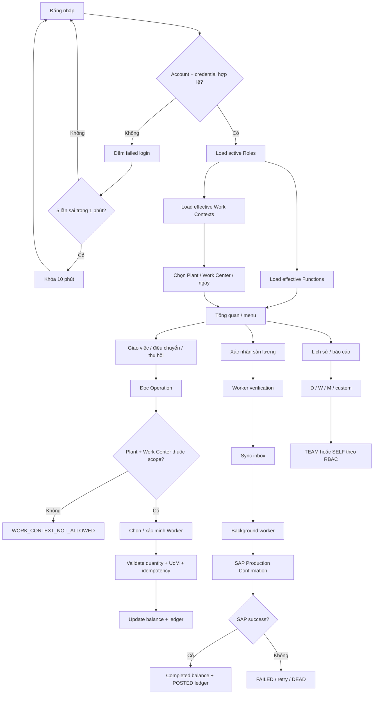

# CASLA Mobile Production Allocation – ABAP RAP Backend

ABAP RAP backend cho **CASLA Mobile**, phục vụ luồng giám sát sản xuất từ đăng nhập, phân quyền, xác định phạm vi làm việc, giao/điều chuyển/thu hồi sản lượng, xác minh công nhân, tra cứu lịch sử và chuẩn bị đồng bộ xác nhận sản lượng về SAP.

Repository theo nguyên tắc **server-authoritative + ledger-first + fail-closed**:

- quyền chức năng và phạm vi Plant/Work Center được đọc lại từ backend;
- actor được suy ra từ access token, không nhận từ payload;
- worker phải được xác minh tại thời điểm thao tác;
- transaction phải idempotent và có audit/lineage;
- không ghi local success cho production confirmation khi SAP chưa thực sự thành công.

> **Target**
>
> - SAP S/4HANA Cloud Public Edition
> - ABAP for Cloud Development
> - Managed RAP, non-draft
> - OData V4
> - abapGit source of truth: `serialized/`

---

## 1. Flow nghiệp vụ chuẩn



### Invariants chính

1. **Username != UserUUID.** Credential, role, session và audit dùng `UserUUID` sau khi account được resolve.
2. **Permission từ client chỉ dùng để render UI.** Backend luôn re-read grants.
3. **Work Context cũng là authorization scope.** Client không được tự mở Plant/Work Center ngoài Role được cấp.
4. **ActorUserUUID lấy từ token/session**, không lấy từ request.
5. **Worker verification** phải đúng worker, password và hiệu lực nghiệp vụ tại thời điểm thao tác.
6. **Quantity không âm, không vượt balance**, và không cộng lẫn Unit of Measure.
7. **SyncItemUUID phải idempotent.** Duplicate/race phải fail-closed.
8. **Confirm/Reverse chỉ được success khi SAP integration thật thành công.**

---

## 2. Identity, RBAC và Work Context

Mô hình authorization đầy đủ:

```text
ZTB_MOB_USER
    |
    +-- ZTB_MOB_USR_ROL
            |
            +-- ZTB_MOB_ROLE
                    |
                    +-- ZTB_MOB_ROL_FNC --> ZTB_MOB_FUNC
                    |
                    +-- ZTB_MOB_ROL_WRK --> ZTB_MOB_WORK
```

Ý nghĩa:

- **User → Role**: một user có thể có nhiều role.
- **Role → Function**: role quyết định chức năng được phép dùng.
- **Role → Work**: role quyết định vị trí/phạm vi sản xuất được phép thao tác.
- Một role bị inactive sẽ mất hiệu lực ngay mà không cần xóa mapping.
- Một Work Context bị inactive sẽ không còn được trả cho mobile và không còn cấp scope runtime.

### `ZTB_MOB_WORK`

Work master chứa:

| Field | Ý nghĩa |
| --- | --- |
| `WORK_ID` | ID vị trí làm việc |
| `WORK_NAME` | Tên vị trí |
| `PLANT` | Nhà máy |
| `WORKCENTER` | Work Center / tổ |
| `BO_PHAN` | Bộ phận |
| `LOCATION` | Vị trí mô tả |
| `IS_ACTIVE` | `A` active / `I` inactive |

### `ZTB_MOB_ROL_WRK`

Mapping N:M:

```text
CLIENT + ROLE_ID + WORK_ID
```

Không hard-delete Work master khi ngừng sử dụng; chuyển `IS_ACTIVE = 'I'` để không làm mất lịch sử/grant reference.

---

## 3. Login, lockout và effective context

Mobile auth đi qua `ZUI_MOB_AUTH`.

### Login

1. Normalize username.
2. Tìm duy nhất account + credential active.
3. Verify password bằng KDF dùng chung.
4. Nếu sai, áp rule từ flow:
   - cửa sổ **1 phút**;
   - đủ **5 lần sai** → khóa **10 phút**;
   - lưu `FAILED_LOGIN_COUNT`, `LAST_FAIL_AT`, `LOCKED_UNTIL`.
5. Nếu đúng:
   - reset failed-login state;
   - revoke session cũ cùng device;
   - giới hạn active sessions;
   - phát access + refresh token;
   - trả `_Permissions`;
   - trả `_WorkContexts`.

`_WorkContexts` được resolve theo:

```text
User
 -> UserRole
 -> active Role
 -> RoleWork
 -> active Work
```

Nếu nhiều role cùng cấp một `WORK_ID`, mobile chỉ nhận một Work Context hiệu lực.

Token plaintext không lưu database; chỉ lưu hash. Refresh token được rotate; đổi password revoke active sessions.

---

## 4. Hai Fiori Elements admin apps – không tách màn hình dư thừa

Thiết kế quản trị cố ý giữ **2 app**.

### App 1 – User Administration

- Service Definition: `ZUI_MOB_USER_ADM`
- OData V4 Service Binding: `ZUI_MOB_USER_ADM_O4`
- Main entity set: `SupervisorAccounts`
- Pattern: **List Report + Object Page**

Khi bấm **Tạo tài khoản**, action `createUser` yêu cầu luôn `RoleID` ban đầu. Backend kiểm tra role active rồi deep-create trong **cùng RAP LUW**:

```text
User
 + Credential
 + Initial UserRole
```

Sau khi tạo, User Object Page có:

- **Thông tin tài khoản**
- **Chức danh** (`_Roles`)

Tại `_Roles` có thể gán thêm/bỏ role ngay trong cùng Object Page; không tạo app riêng chỉ để maintain UserRole.

### App 2 – RBAC & Work Administration

- Service Definition: `ZUI_MOB_RBAC_ADM`
- OData V4 Service Binding: `ZUI_MOB_RBAC_ADM_O4`
- Main entity set: `Roles`
- Pattern: **List Report + Object Page**

Role Object Page có ba phần:

- **Thông tin chức danh**
- **Quyền chức năng** (`_Functions`)
- **Vị trí làm việc** (`_WorkAssignments`)

`_Functions` dùng Function value help và hiển thị FuncID/FuncName/Module.

`_WorkAssignments` dùng Work Context value help và hiển thị WorkID/WorkName/Plant/WorkCenter/Bộ phận/Location.

Work master `WorkContexts` nằm **trong cùng RBAC admin service**. Khi tạo Fiori Elements frontend, cấu hình nó là secondary route/page của cùng app, không cần thêm Launchpad tile/app thứ ba.

Chi tiết setup: [`docs/FIORI_ELEMENTS_ADMIN.md`](docs/FIORI_ELEMENTS_ADMIN.md).

> Repo hiện là ABAP backend, không chứa tenant-bound UI5 deployment project. Hai SRVB OData V4 binding đã được serialize; frontend shell/semantic object/catalog/Launchpad mapping phải được generate/publish từ binding thật trên tenant, không hard-code URL giả trong Git.

---

## 5. Value help và validation admin

| Dữ liệu | Value Help | Rule server-side |
| --- | --- | --- |
| Initial/User Role | `ZI_MOB_Role_VH` | chỉ role `Status = 'A'`; backend validate lại |
| Role Function | `ZI_MOB_Func_VH` | mapping trong Role composition |
| Role Work | `ZI_MOB_Work_VH` | chỉ Work `IsActive = 'A'`; backend validate lại |

Value help chỉ hỗ trợ UX. Người dùng nhập ID thủ công hoặc sửa request vẫn không bypass được RAP validation.

---

## 6. Work scope tại runtime

`ZCL_MOB_TOKEN_VALIDATOR` là source dùng chung cho:

- token/session validation;
- function permissions;
- effective Work Contexts;
- Plant + Work Center scope check.

Các internal domain actions sau re-check Work scope trước khi thay đổi balance/ledger:

- `initialAssign`
- `transfer`
- `recall`

Ví dụ logic:

```text
Actor from token
    ↓
Operation.Plant + Operation.WorkCenter
    ↓
Active UserRole -> Active Role -> RoleWork -> Active Work
    ↓
Allowed ? continue : WORK_CONTEXT_NOT_ALLOWED
```

Không dùng Work Context do mobile gửi lại làm source authorization.

---

## 7. Production allocation

Persistence:

| Table | Vai trò |
| --- | --- |
| `ZTB_PP_OP_ALLOC` | Operation snapshot/header |
| `ZTB_PP_EMP_ALLOC` | Current balance theo operation + worker |
| `ZTB_PP_ALLOC_TXN` | Transaction ledger + audit + lineage |
| `ZTB_PP_SYNC_H` | Sync inbox header |
| `ZTB_PP_SYNC_I` | Sync inbox item |

### Balance invariant

```text
Remaining
= InitialAssigned
+ TransferredIn
- TransferredOut
- Recalled
- Completed
```

`validateBalance` từ chối save khi remaining âm hoặc không khớp công thức.

### Initial assignment

Backend kiểm tra:

1. token + device + function;
2. operation tồn tại;
3. actor có Work Context chứa operation Plant/Work Center;
4. quantity/UoM hợp lệ;
5. worker active đúng Plant/Work Center/ngày;
6. worker password đúng;
7. `SyncItemUUID` idempotent;
8. total assignment không vượt operation quantity;
9. worker balance không duplicate.

### Transfer / Recall

Ngoài balance/UoM/idempotency/worker verification, cả hai đều kiểm tra Work Context của authenticated actor trước mutation.

Transaction audit ghi các field đã có trong `ZTB_PP_ALLOC_TXN`:

- `ActorUserUUID`
- `VerifiedWorkerUserUUID`
- `WorkerVerifiedAt`
- `InitiatorSessionID`
- `DeviceID`
- `VerificationMethod`

---

## 8. Confirm, Reverse và Sync

### Trạng thái hiện tại

`confirm` và `reverse` vẫn **fail-closed có chủ đích**.

Lý do: chưa có SAP Production Confirmation adapter/reversal contract đã được xác minh trên tenant đích. Không được cập nhật local `CompletedQuantity`/`POSTED` rồi coi như SAP đã confirmation.

Flow đích:

```text
Mobile submitSync
    ↓
ZTB_PP_SYNC_H / ZTB_PP_SYNC_I = QUEUED
    ↓
Background worker
    ↓
server-side token + permission + work-scope + worker + idempotency checks
    ↓
internal EML
    ↓
SAP Production Confirmation when required
    ↓
SUCCESS / PARTIAL / FAILED / DEAD
```

`submitSync` + background worker vẫn là phần cần hoàn thiện trước khi mở external mutation surface.

---

## 9. Work history

`getWorkHistory` được expose qua `ZUI_PP_OPALLOC` và token-scoped.

Range:

| RangeCode | Khoảng |
| --- | --- |
| `D` | hôm nay |
| `W` | 7 ngày |
| `M` | 30 ngày |
| `C` | custom, tối đa 92 ngày/request |

Scope:

- `PP_HIST_TEAM`: supervisor scope dựa trên actor + transaction lineage.
- `PP_HIST_SELF`: worker chỉ thấy các row liên quan chính mình.

Nguồn số liệu là transaction `POSTED` trong `ZTB_PP_ALLOC_TXN` + operation header. `ZTB_KB_NHANCONG` chỉ enrich worker name, không quyết định ownership lịch sử.

---

## 10. External worker master

Repository phụ thuộc:

| Object | Ownership | Rule |
| --- | --- | --- |
| `ZTB_KB_NHANCONG` | Package đối tác | read-only; không sửa structure/index |

Mọi access phải đi qua `ZI_PP_WORKERREF`.

Worker validation xét WorkerID, Plant, Work Center, ValidFrom, ValidTo và ExecutionDate.

---

## 11. Service boundaries

| Service | Audience | Nội dung |
| --- | --- | --- |
| `ZUI_MOB_AUTH` | Mobile | login / refresh / logout / changePassword |
| `ZUI_PP_OPALLOC` | Mobile | operation read + getWorkHistory; mutation projection vẫn đóng |
| `ZUI_MOB_USER_ADM` | Fiori Admin | User + Role assignment |
| `ZUI_MOB_RBAC_ADM` | Fiori Admin | Role + Function + Work Context administration |

Admin OData V4 bindings đã serialize:

```text
ZUI_MOB_USER_ADM_O4 -> ZUI_MOB_USER_ADM
ZUI_MOB_RBAC_ADM_O4 -> ZUI_MOB_RBAC_ADM
```

Mobile không được trực tiếp gọi account/RBAC maintenance hoặc internal allocation mutation để bypass sync/security boundary.

---

## 12. Mobile identity persistence

| Table | Vai trò |
| --- | --- |
| `ZTB_MOB_USER` | account |
| `ZTB_MOB_CRED` | password credential |
| `ZTB_MOB_SESSION` | token/session state |
| `ZTB_MOB_ROLE` | Role master |
| `ZTB_MOB_FUNC` | Function master |
| `ZTB_MOB_USR_ROL` | User → Role |
| `ZTB_MOB_ROL_FNC` | Role → Function |
| `ZTB_MOB_WORK` | Work Context master |
| `ZTB_MOB_ROL_WRK` | Role → Work Context |
| `ZTB_MOB_CONFIG` | environment/security config |

---

## 13. RAP architecture

```text
Fiori Elements / Mobile
        |
        v
Projection CDS + Projection BDEF
        |
        v
Interface / Root CDS
        |
        v
Managed RAP Behavior
        |
        +-- ZBP_I_MOB_USER
        +-- ZBP_I_MOB_ROLE
        +-- ZBP_I_MOB_WORK
        +-- ZBP_R_PP_OPALLOC
        |
        v
Validators / domain services
        |
        +-- ZCL_MOB_TOKEN_VALIDATOR
        +-- ZCL_PP_WORKER_VALIDATOR
        +-- ZCL_PP_WORK_HISTORY
        |
        v
Persistence
```

Composition admin:

```text
User
  +-- _Roles

Role
  +-- _Functions
  +-- _WorkAssignments
```

Đây là lý do không cần tách UserRole/RoleFunction/RoleWork thành các app riêng.

---

## 14. Security rules không được phá

- Không lưu plaintext access/refresh token.
- Không nhận authenticated actor từ payload.
- Không tin `_Permissions` hoặc `_WorkContexts` gửi ngược từ client.
- Không expose credential/session cho device đọc trực tiếp.
- Role/Work inactive phải mất hiệu lực runtime dù mapping còn tồn tại.
- UserRole và RoleWork create phải validate master active server-side.
- Mutation phải idempotent.
- Duplicate balance/sync row phải fail-closed, không chọn ngẫu nhiên.
- Confirmation/reversal không local-success trước SAP-success.

---

## 15. Database indexes cần có trên tenant

Các index quan trọng của flow hiện tại:

```text
ZTB_MOB_USER
  UNIQUE (MANDT, NORMALIZED_USERNAME)

ZTB_MOB_SESSION
  UNIQUE (MANDT, ACCESS_TOKEN_HASH)
  UNIQUE (MANDT, REFRESH_TOKEN_HASH)
  (MANDT, USER_UUID, STATUS, LOGIN_AT)

ZTB_PP_SYNC_H
  UNIQUE (MANDT, DEVICE_ID, EXTERNAL_ID)

ZTB_PP_SYNC_I
  UNIQUE (MANDT, SYNC_UUID, EXTERNAL_ITEM_ID)

ZTB_PP_OP_ALLOC
  UNIQUE (MANDT, PRODUCTION_ORDER, OPERATION_NO)

ZTB_PP_ALLOC_TXN
  UNIQUE (MANDT, SYNC_ITEM_UUID)  # xử lý initial/empty value theo tenant DB rule
  (MANDT, ACTOR_USER_UUID, TRANSACTION_TYPE, TRANSACTION_STATUS, EXECUTION_DATE)
  (MANDT, OPERATION_UUID, WORKER_ID, EXECUTION_DATE, TRANSACTION_STATUS)
```

Primary key của `ZTB_MOB_ROL_WRK` đã là `(MANDT, ROLE_ID, WORK_ID)` nên đáp ứng lookup/grant uniqueness cơ bản. Chỉ bổ sung secondary index sau khi có query profile thực tế; không index mọi field theo cảm tính.

---

## 16. Trạng thái triển khai

| Area | Status |
| --- | --- |
| Login/logout/refresh | ✅ Implemented |
| Lockout 5 lần/1 phút → 10 phút | ✅ Implemented |
| Change password/session revoke | ✅ Implemented |
| User → Role admin | ✅ Implemented |
| Role → Function admin | ✅ Implemented |
| `ZTB_MOB_WORK` | ✅ Implemented |
| `ZTB_MOB_ROL_WRK` | ✅ Implemented |
| Role → Work RAP composition | ✅ Implemented |
| Create User + initial active Role in one LUW | ✅ Implemented |
| Login/refresh effective `_WorkContexts` | ✅ Implemented |
| PP Plant/WorkCenter scope check | ✅ Implemented for internal assign/transfer/recall |
| Fiori UI annotations/value helps | ✅ Implemented |
| User Admin OData V4 binding | ✅ Serialized |
| RBAC & Work Admin OData V4 binding | ✅ Serialized |
| Worker verification/audit | ✅ Implemented |
| Initial assign/transfer/recall domain logic | ✅ Implemented internally |
| Work history | ✅ Implemented |
| `submitSync` pipeline | 🟡 Not complete |
| Background sync worker | 🟡 Not complete |
| SAP confirmation adapter | ❌ Not configured |
| Confirm / Reverse | 🔒 Fail-closed |
| Shift remaining >= 60 minutes | ⏸ Waiting for authoritative shift source |
| Fiori frontend shell + FLP publication | ⏳ Generate/publish from actual tenant bindings |

“Implemented internally” không đồng nghĩa mobile được phép gọi trực tiếp. Mutation surface vẫn phải đi qua sync boundary khi pipeline hoàn thiện.

---

## 17. Validation

Branch Work Context đã được chạy bằng:

```text
@abaplint/cli 2.120.35
ABAP language version: Cloud
0 issue(s) found
191 file(s) analyzed
```

Validation này đã bao gồm RAP/CDS/ABAP runtime changes cho Work Context. `abaplint` không thay thế activation/compiler trên tenant SAP; trước deploy vẫn phải activate bằng ADT và chạy ATC trên hệ đích.

SRVB bindings cũng phải được deserialize/activate/publish trên tenant và kiểm tra bằng service binding preview.

---

## 18. Import và activation

1. Dùng package `ZPK_XNSL_SM_BACKEND` trên DEV.
2. Bảo đảm `ZTB_KB_NHANCONG` tồn tại và accessible.
3. Link abapGit repository.
4. Pull branch/release cần deploy.
5. Activate theo dependency order:

```text
Tables
  ↓
Interface / abstract CDS
  ↓
Behavior definitions + pools
  ↓
Projection CDS/BDEF/DCL
  ↓
Service Definitions
  ↓
OData V4 Service Bindings
```

6. Chạy ATC/Cloud readiness checks.
7. Preview `ZUI_MOB_USER_ADM_O4` và `ZUI_MOB_RBAC_ADM_O4`.
8. Generate đúng hai Fiori Elements admin apps theo [`docs/FIORI_ELEMENTS_ADMIN.md`](docs/FIORI_ELEMENTS_ADMIN.md).
9. Test User→Role→Function/Work end-to-end trước khi nối mobile mutation pipeline.

---

## 19. Việc còn lại để hoàn thiện toàn flow

1. Activate/publish hai admin OData V4 bindings trên tenant và generate/publish hai Fiori Elements frontend apps.
2. Xác định authoritative source cho **shift / shift end time** để implement rule remaining shift >= 60 phút.
3. Hoàn thiện `submitSync` accept-only API.
4. Hoàn thiện background worker + retry/dead-letter handling.
5. Chốt canonical RBAC function IDs cho từng external mutation operation.
6. Chọn released SAP Production Confirmation API phù hợp tenant.
7. Implement confirmation adapter + SAP reference/idempotency.
8. Enable `confirm` sau integration test.
9. Implement `reverse` theo SAP reversal contract.
10. Bổ sung ABAP Unit/integration tests cho role/work scope, balance, duplicate sync, auth và retry.
11. Activate/ATC/integration-test toàn flow trên tenant đích trước production rollout.

---

## 20. Repository layout

```text
.
├── .abapgit.xml
├── README.md
├── IMPLEMENTATION_STATUS.md
├── SECURITY_PERFORMANCE_REVIEW.md
├── abaplint.json
├── docs/
│   └── FIORI_ELEMENTS_ADMIN.md
└── serialized/
    ├── *.tabl.xml
    ├── *.ddls.asddls
    ├── *.bdef.asbdef
    ├── *.clas.abap
    ├── *.srvd.srvdsrv
    └── *.srvb.xml
```

`.abapgit.xml` dùng `/serialized/` làm `STARTING_FOLDER`; đây là source of truth để deserialize vào ABAP system.
