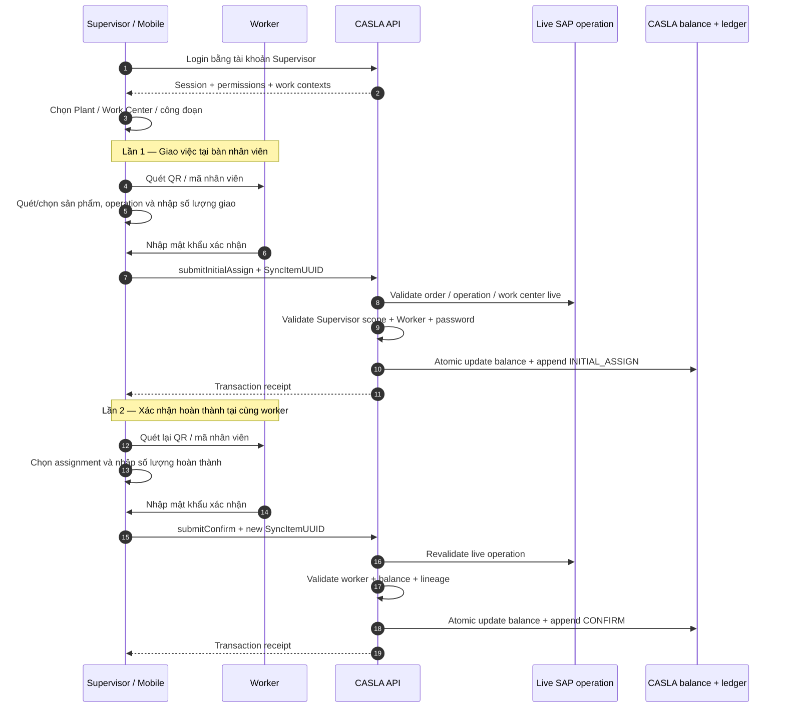
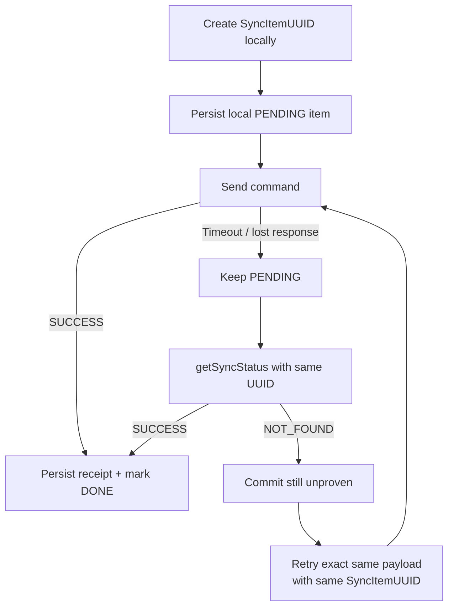
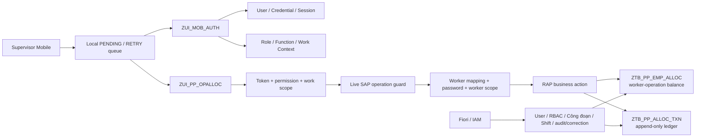
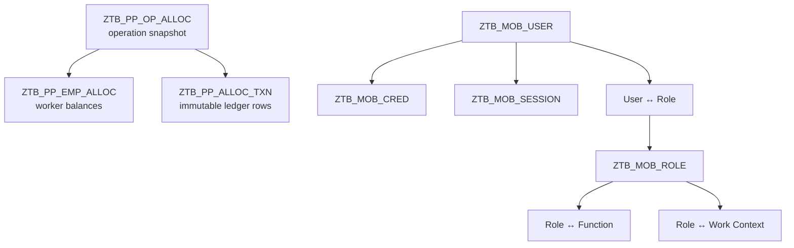

# CASLA Mobile Production Allocation

Backend **ABAP Cloud RAP + OData V4** cho ứng dụng CASLA Mobile, phục vụ giao việc theo công đoạn sản xuất, ghi nhận sản lượng hoàn thành, đồng bộ offline và truy vết lịch sử.

> **Flow nghiệp vụ chuẩn của mobile:** Supervisor là người đăng nhập và cầm thiết bị. Công nhân không đăng nhập/đăng xuất trên thiết bị; công nhân được nhận diện bằng QR/mã nhân viên và xác nhận hành động bằng mật khẩu tại bàn làm việc.

> **Ranh giới nghiệp vụ quan trọng:** hệ thống ghi nhận **CASLA allocation ledger** trong các bảng `Z*`. Flow hiện tại **không tạo SAP Production Confirmation chuẩn**, không tạo material document và không được hiểu là đã post một chứng từ sản xuất chuẩn của SAP.

## 1. Canonical shop-floor flow

Luồng mobile chính được hiểu theo mô hình **hai lần Supervisor quay lại bàn nhân viên**.



### Identity phải tách rõ

| Identity | Vai trò |
| --- | --- |
| **Supervisor / Actor** | Login, giữ session/token, có RBAC + work scope, thao tác trên mobile |
| **Worker** | Người được giao việc / phát sinh sản lượng; được xác minh bằng WorkerID + password |

Không được suy luận `Supervisor = Worker`. Ledger lưu riêng `ActorUserUUID` và `VerifiedWorkerUserUUID` để audit được **ai thao tác** và **công nhân nào xác nhận**.

### Core flow và supporting flow

**Core shop-floor flow:**

```text
LOGIN -> SELECT CONTEXT -> SCAN WORKER -> ASSIGN ->
WORKER PASSWORD -> RECEIPT ->
SCAN SAME WORKER AGAIN -> CONFIRM -> WORKER PASSWORD -> RECEIPT
```

Các action sau **đã có trong domain**, nhưng là supporting/exception flow chứ không nên làm mobile happy path khó hiểu:

- `submitTransfer`: chuyển phần còn lại từ worker A sang worker B;
- `submitRecall`: thu hồi phần chưa làm;
- `submitReverse`: đảo một CONFIRM đã post;
- `correctConfirm`: correction có kiểm soát phía Fiori/IAM.

UI mobile nên làm Assign và Confirm nổi bật trước; transfer/recall/reverse chỉ xuất hiện theo permission và ngữ cảnh cần thiết.

## 2. Nguyên tắc xử lý command

1. **Server authoritative:** client không tự quyết định actor, permission, work scope, worker validity hoặc trạng thái SAP operation.
2. Mobile gọi **business action**, không CRUD trực tiếp balance/ledger.
3. Worker password là bước **business authorization của worker**, không thay thế session của Supervisor.
4. `ZTB_PP_ALLOC_TXN` là append-only ledger; reverse/correction tạo dòng bù thay vì sửa lịch sử gốc.
5. Balance và ledger phải được thay đổi trong **cùng RAP transactional unit**.
6. Mobile tạo `SyncItemUUID` **trước first send** và giữ nguyên UUID cho mọi retry của cùng business attempt.
7. Timeout là trạng thái **unknown outcome**, không phải bằng chứng request đã fail.
8. Pending/retry queue nằm trên mobile; SAP không duy trì một mobile queue song song.
9. Mỗi lần Assign và Confirm là **hai business attempts khác nhau**, do đó phải dùng hai `SyncItemUUID` khác nhau.

## 3. Offline / retry contract



Nếu receipt đã tồn tại và payload retry khớp, backend phải trả cùng business result và **không tạo transaction thứ hai**. Nếu cùng `SyncItemUUID` nhưng business payload khác, backend fail closed với `IDEMPOTENCY_KEY_REUSED`.

Mobile không được tự đổi quantity/worker/operation rồi tái sử dụng UUID cũ.

## 4. Architecture



## 5. Domain model



Balance của từng worker trên từng operation phải thỏa:

```text
RemainingQuantity
  = InitialAssignedQuantity
  + TransferredInQuantity
  - TransferredOutQuantity
  - RecalledQuantity
  - CompletedQuantity
```

Balance hiện tại là **worker-operation based**, không partition theo shift. Shift là snapshot của từng event.

## 6. Mobile API surface

| Action | Vai trò |
| --- | --- |
| `submitInitialAssign` | **Core:** Supervisor giao số lượng cho worker sau khi worker xác nhận mật khẩu |
| `submitConfirm` | **Core:** Supervisor ghi nhận worker hoàn thành một phần/toàn bộ số lượng |
| `submitTransfer` | Supporting: chuyển remaining quantity từ worker A sang worker B |
| `submitRecall` | Supporting: thu hồi phần chưa làm |
| `submitReverse` | Exception: đảo một CONFIRM đã post |
| `getSyncStatus` | Reconcile request có outcome chưa chắc chắn |
| `getWorkHistory` | Summary + ledger history theo scope |

Các bound action `initialAssign`, `transfer`, `recall`, `confirm`, `reverse` là lớp domain nội bộ RAP. Mobile chỉ dùng static facade để backend luôn thực hiện authentication, authorization và live validation.

## 7. Shift-aware event

Client mới nên gửi cùng lúc:

```json
{
  "ShiftID": "DAY",
  "ExecutedAt": "2026-09-08T02:00:00Z",
  "ExecutionDate": "2026-09-08"
}
```

Backend dùng `ExecutedAt` + shift/timezone config để tính `WorkDate`. Nếu client gửi `ExecutionDate`, ngày này phải khớp với ngày nghiệp vụ backend resolve.

Compatibility mode vẫn chấp nhận request cũ bỏ cả `ShiftID` và `ExecutedAt` khi có `ExecutionDate`; không gửi chỉ một trong hai field shift-aware.

## 8. Production risks / blockers cần đóng trước go-live

Implementation đã có phần lớn contract, nhưng các điểm sau **không nên coi là đã an toàn production chỉ vì happy case chạy được**.

### P0 — Idempotency/concurrency chưa có DB uniqueness rõ ràng

Code hiện kiểm tra receipt trước khi append ledger. Trong serialization hiện tại, primary key của ledger là `TransactionUUID`; `SyncItemUUID` không phải key. Tương tự, balance có key UUID riêng và chưa thấy database-level unique constraint cho `(OperationUUID, WorkerID)`.

Rủi ro khi hai request concurrent:

```text
Request A: SELECT no receipt
Request B: SELECT no receipt
Request A: CREATE balance/ledger
Request B: CREATE balance/ledger
```

Cần xác nhận/enforce strategy chống duplicate ở tenant: unique secondary index/constraint phù hợp hoặc cơ chế serialization/locking tương đương, kèm integration test concurrent first-create và same-SyncItemUUID.

### P0 — Confirm lineage chưa khóa quantity theo source transaction

`submitConfirm`/`confirm` hiện kiểm tra tổng `RemainingQuantity` của worker và kiểm tra `OriginalTransactionUUID` có phải INITIAL_ASSIGN/TRANSFER hợp lệ cho worker. Cần bổ sung/kiểm chứng invariant:

```text
confirmed quantity attributed to one source transaction
<= effective quantity still available from that source transaction
```

Nếu không, một worker có nhiều assignment có thể dùng lineage của một transaction nhỏ để confirm lượng lấy từ balance tổng. Balance có thể vẫn đúng nhưng audit lineage sai.

### P1 — Worker password verification cần anti-brute-force riêng

Worker password được verify trực tiếp từ credential. Cần có rate-limit/failed-attempt/temporary lock policy cho **worker verification path**, không chỉ login của Supervisor. Đồng thời cần audit các lần verify thất bại mà không log raw password.

### P1 — Stale prototype không phải source of truth

`wf_flow_redesign_prototype.html` phản ánh một giai đoạn cũ và còn đánh dấu một số chức năng hiện đã implement là “chưa có”. Không dùng file này để quyết định trạng thái implementation.

### P1 — E2E timeout/retry và tenant activation vẫn phải test

Repository không chứng minh được:

- OData V4 action chạy đúng trên target Public Cloud release;
- released SAP CDS/API fields đúng trên tenant;
- behavior khi response bị mất sau commit;
- retry đồng thời từ nhiều worker/device;
- ca qua ngày/timezone boundary;
- IAM/binding/communication arrangement trên tenant thật.

## 9. Test matrix tối thiểu trước production

| Case | Expected |
| --- | --- |
| Assign 1 lần | 1 balance delta + 1 ledger row |
| Retry cùng payload + cùng SyncItemUUID | Same receipt, không cộng lại quantity |
| Cùng SyncItemUUID nhưng đổi quantity/worker | `IDEMPOTENCY_KEY_REUSED` |
| Hai request concurrent cùng SyncItemUUID | Chỉ một business transaction được commit |
| Hai first-assign concurrent cho cùng worker/operation | Chỉ một balance row canonical |
| Confirm > worker remaining | Reject |
| Confirm sai worker | Reject |
| Confirm source transaction không thuộc worker | Reject |
| Confirm vượt available quantity của source lineage | Reject |
| Worker password sai lặp lại | Rate-limit/lock theo policy |
| Timeout sau commit | `getSyncStatus` trả receipt |
| Timeout trước commit | NOT_FOUND rồi retry same UUID an toàn |
| Supervisor mất permission/work scope | Reject server-side dù UI còn cache |
| Overnight shift | WorkDate + shift snapshot chính xác |

## 10. Service map

| Service definition | Mục đích |
| --- | --- |
| `ZUI_MOB_AUTH` | Mobile login / logout / refresh / change password |
| `ZUI_PP_OPALLOC` | Mobile assignment, confirmation, supporting allocation actions, sync status, history |
| `ZUI_MOB_USER_ADM` | Fiori user administration |
| `ZUI_MOB_RBAC_ADM` | Role / function / work-context administration |
| `ZUI_MD_CONGDOAN_ADM` | Công đoạn master administration |
| `ZUI_PP_ALLOC_ADM` | Allocation audit + controlled confirmation correction |
| `ZUI_PP_SHIFT_ADM` | Managed-draft shift configuration |

## 11. Repository documentation

| Tài liệu | Dùng khi |
| --- | --- |
| [`docs/TECHNICAL_DOCUMENTATION.md`](docs/TECHNICAL_DOCUMENTATION.md) | Kiến trúc, data model, security, RAP action, shift, history, deployment |
| [`docs/FLOWS_AND_HAPPY_CASES.md`](docs/FLOWS_AND_HAPPY_CASES.md) | Payload và scenario chi tiết; lưu ý file này mô tả cả supporting allocation flows |
| [`docs/WORKING_SHIFTS.md`](docs/WORKING_SHIFTS.md) | Cấu hình shift và ca qua ngày |
| [`docs/FIORI_ELEMENTS_ADMIN.md`](docs/FIORI_ELEMENTS_ADMIN.md) | Fiori Elements / admin |
| [`IMPLEMENTATION_STATUS.md`](IMPLEMENTATION_STATUS.md) | Snapshot trạng thái implementation và các phần chưa chứng minh trên tenant |
| [`wf_flow_redesign_prototype.html`](wf_flow_redesign_prototype.html) | **Historical prototype only; không dùng làm source of truth** |

Khi tài liệu và code mâu thuẫn, ưu tiên:

```text
ABAP implementation / behavior hiện tại
        > CDS action contract hiện tại
        > TECHNICAL_DOCUMENTATION.md
        > README overview
        > plan / audit / prototype lịch sử
```

## 12. Trước khi chạy trên tenant

- Cấu hình secret bắt buộc như `PASSWORD_PEPPER`/token secret theo implementation hiện tại.
- Tạo Supervisor role/function/work context thật và kiểm tra cùng-role scope semantics.
- Map WorkerID ↔ account/credential/reference đúng với Plant + Work Center.
- Cấu hình shift theo plant/timezone và test boundary ca qua ngày.
- Thiết lập Application Job REASSIGN lúc 04:00 theo [hướng dẫn chuyển tồn hàng ngày](docs/DAILY_REASSIGN_JOB.md).
- Dùng UoM hợp lệ trên tenant; `ST` trong docs chỉ là sample.
- Publish OData V4 bindings và cấu hình IAM/communication arrangement.
- Chạy ABAP Unit, ATC, repository checks và integration tests, đặc biệt các case concurrency/idempotency phía trên.

---

**Tóm tắt mental model:** Supervisor giữ session và thực hiện thao tác; worker được scan và xác nhận bằng password; Assign và Confirm là hai lần tương tác vật lý độc lập; mọi command phải server-validate, idempotent và để lại ledger có thể audit.
