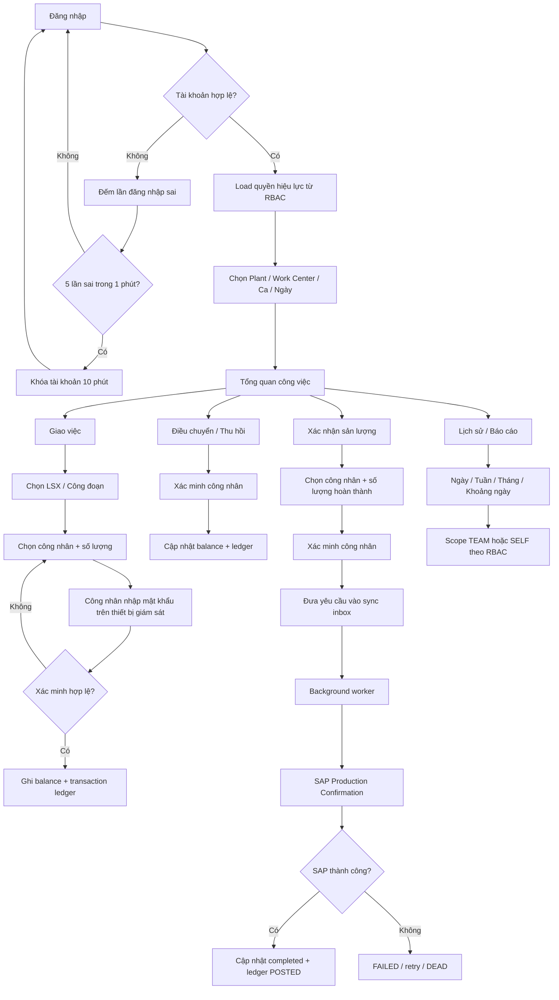

# CASLA Mobile Production Allocation – ABAP RAP Backend

Backend ABAP RAP cho **CASLA Mobile**, phục vụ luồng giám sát sản xuất từ đăng nhập, phân quyền, chọn ngữ cảnh làm việc, giao sản lượng cho công nhân, điều chuyển/thu hồi, xác minh công nhân, tra cứu lịch sử và chuẩn bị đồng bộ xác nhận sản lượng về SAP.

Repository này được xây theo nguyên tắc **ledger-first + fail-closed**: mọi thay đổi số lượng sản xuất phải có nguồn gốc giao dịch rõ ràng, có idempotency, có audit người thao tác/người được xác minh và không được ghi trạng thái thành công nếu SAP/backend chưa thực sự xử lý thành công.

> **Target platform**
>
> - SAP S/4HANA Cloud Public Edition
> - ABAP for Cloud Development
> - Managed RAP, non-draft
> - OData V4
> - abapGit source nằm trong `serialized/`

---

## 1. Flow nghiệp vụ chuẩn

Luồng nghiệp vụ chính được chuẩn hóa từ `WF.vsdx` theo thứ tự sau:



### Nguyên tắc quan trọng của flow

1. **Username không phải UserUUID.** Backend resolve account trước rồi mới dùng `UserUUID` cho credential, session, role và audit.
2. **Quyền không lấy từ client.** Client chỉ dùng `_Permissions` để render menu; backend luôn kiểm tra lại quyền từ database.
3. **Actor không được client tự khai.** Người thao tác được suy ra từ access token/session.
4. **Công nhân phải được xác minh tại thời điểm thao tác** bằng `WorkerID + password`, đồng thời phải còn hiệu lực tại Plant, Work Center và ngày thực hiện.
5. **Số lượng không được âm và không được vượt balance còn lại.**
6. **Mỗi transaction phải idempotent.** Một `SyncItemUUID` không được tạo hai ledger rows.
7. **Không trộn Unit of Measure.** Balance và báo cáo được giữ theo UoM.
8. **Xác nhận SAP phải fail-closed.** Không được ghi production confirmation thành công ở local ledger nếu adapter SAP chưa thực sự thành công.

---

## 2. Authentication và lockout

Mobile login đi qua service `ZUI_MOB_AUTH`.

### Login

Backend thực hiện:

1. Normalize username.
2. Tìm duy nhất một account + credential active.
3. Verify password bằng password KDF dùng chung.
4. Nếu sai:
   - đếm các lần sai trong cửa sổ **1 phút**;
   - đủ **5 lần** thì khóa account **10 phút**;
   - lưu `FAILED_LOGIN_COUNT`, `LAST_FAIL_AT`, `LOCKED_UNTIL`.
5. Nếu đúng:
   - reset failed-login state;
   - revoke session cũ trên cùng device;
   - giới hạn số active sessions;
   - phát access token + refresh token;
   - trả effective permissions cho app.

Token plaintext **không được lưu trong database**. Backend chỉ lưu hash.

### Session

- Access token có thời hạn ngắn.
- Refresh token được rotate khi refresh.
- Logout revoke session.
- Đổi mật khẩu revoke toàn bộ active sessions của user.
- Token luôn gắn với `DeviceID`; token hợp lệ nhưng device không khớp vẫn bị từ chối.

---

## 3. RBAC và menu mobile

RBAC được lưu bằng các bảng:

```text
ZTB_MOB_USER
    |
    +-- ZTB_MOB_USR_ROL
            |
            +-- ZTB_MOB_ROLE
                    |
                    +-- ZTB_MOB_ROL_FNC
                            |
                            +-- ZTB_MOB_FUNC
```

Login/refresh trả `_Permissions` để mobile biết màn hình nào cần hiển thị.

**Danh sách này chỉ là display data.** Mọi operation protected ở backend phải gọi lại `ZCL_MOB_TOKEN_VALIDATOR` để xác minh token và quyền hiệu lực. Client sửa payload hoặc giả permission không làm tăng quyền trên backend.

Các quyền lịch sử hiện được dùng rõ ràng:

| Function | Ý nghĩa |
| --- | --- |
| `PP_HIST_TEAM` | Supervisor xem phạm vi giao việc của mình và các transaction hậu duệ |
| `PP_HIST_SELF` | Công nhân chỉ xem lịch sử liên quan tới chính mình |

Admin quản lý account/role/function qua các service Fiori riêng, không expose các thao tác quản trị đó cho mobile API.

---

## 4. Work context

Sau login và load quyền, flow yêu cầu người dùng chọn ngữ cảnh làm việc:

- Plant
- Work Center
- Ca làm việc
- Ngày thực hiện

Ngữ cảnh này quyết định tập công đoạn và công nhân hợp lệ cho màn hình giao việc.

### Trạng thái hiện tại

Plant, Work Center và Execution Date đã được dùng trong worker validation và operation allocation.

**Shift master / thời điểm kết thúc ca chưa có authoritative source trong repository.** Vì vậy rule trong WF:

> Chỉ cho phép đổi người thực hiện khi thời gian còn lại của ca >= 60 phút

chưa được implement. Không được tự suy đoán giờ ca hoặc hard-code thời gian cho đến khi có source/contract chính thức.

---

## 5. Giao việc – Initial Assignment

Mục tiêu nghiệp vụ: giám sát giao một phần hoặc toàn bộ sản lượng của công đoạn cho công nhân.

Input chính:

- Operation
- Worker
- Quantity
- Unit of Measure
- Execution Date
- Access Token + Device ID
- Worker Password
- Sync Item UUID

Backend kiểm tra:

1. Session/token hợp lệ.
2. User có quyền tương ứng với operation contract khi được expose qua mobile sync path.
3. Operation tồn tại và có quantity hợp lệ.
4. UoM khớp operation.
5. Worker active đúng Plant / Work Center / Execution Date.
6. Worker password đúng.
7. `SyncItemUUID` chưa được xử lý.
8. Tổng lượng initial assignment không vượt operation quantity.
9. Balance `(OperationUUID, WorkerID)` không bị duplicate.

Nếu hợp lệ:

```text
InitialAssignedQuantity += Quantity
RemainingQuantity       += Quantity
```

và tạo transaction `INITIAL_ASSIGN`.

Audit transaction ghi:

- `ActorUserUUID`
- `VerifiedWorkerUserUUID`
- `WorkerVerifiedAt`
- `InitiatorSessionID`
- `DeviceID`
- `VerificationMethod`

`ActorUserUUID` được lấy từ token, **không nhận từ client**.

---

## 6. Điều chuyển sản lượng – Transfer

Transfer chuyển quantity còn lại từ công nhân A sang công nhân B.

Điều kiện:

- From worker khác To worker.
- Source balance tồn tại.
- Source remaining >= quantity transfer.
- Receiver worker active đúng Plant / Work Center / ngày.
- Receiver xác minh password thành công.
- UoM phải khớp.
- `SyncItemUUID` phải idempotent.

Ledger/balance:

```text
Source:
TransferredOutQuantity += Quantity
RemainingQuantity      -= Quantity

Target:
TransferredInQuantity  += Quantity
RemainingQuantity      += Quantity
```

Transaction type: `TRANSFER`.

Backend dùng user từ access token làm actor; mobile không được gửi `ActorUserUUID`.

---

## 7. Thu hồi sản lượng – Recall

Recall lấy lại phần sản lượng chưa hoàn thành khỏi worker.

Backend chỉ cho recall khi:

- transaction gốc thuộc `INITIAL_ASSIGN` hoặc `TRANSFER`;
- transaction gốc thuộc đúng operation;
- worker balance tồn tại duy nhất;
- remaining >= quantity recall;
- UoM khớp;
- worker password hợp lệ;
- request idempotent.

Balance:

```text
RecalledQuantity  += Quantity
RemainingQuantity -= Quantity
```

Transaction mới giữ `OriginalTransactionUUID` để duy trì lineage.

---

## 8. Công thức balance

`ZTB_PP_EMP_ALLOC` là current balance theo worker + operation.

Invariant:

```text
Remaining
= InitialAssigned
+ TransferredIn
- TransferredOut
- Recalled
- Completed
```

RAP validation `validateBalance` từ chối save nếu:

- remaining < 0; hoặc
- persisted remaining không bằng công thức trên.

`ZTB_PP_EMP_ALLOC` là snapshot phục vụ đọc nhanh. **Nguồn audit chính là transaction ledger `ZTB_PP_ALLOC_TXN`.**

---

## 9. Xác nhận sản lượng – Confirm

Flow nghiệp vụ mong muốn:

1. Supervisor chọn worker.
2. Nhập quantity hoàn thành.
3. Quantity không vượt remaining.
4. Worker nhập password trên thiết bị supervisor.
5. Backend verify worker.
6. Request được đưa vào sync inbox.
7. Background worker gọi SAP Production Confirmation API.
8. Chỉ khi SAP thành công mới:
   - tăng `CompletedQuantity`;
   - giảm `RemainingQuantity`;
   - ghi transaction `CONFIRM` ở trạng thái `POSTED`;
   - lưu SAP confirmation reference.

### Trạng thái hiện tại

`confirm` **đang fail-closed có chủ đích** vì repository chưa có SAP Production Confirmation adapter/API đã được xác minh trên tenant đích.

Không được thay bằng implementation chỉ cập nhật local balance. Làm vậy sẽ tạo trạng thái “mobile báo hoàn thành nhưng SAP chưa được confirmation”.

`reverse` cũng giữ fail-closed cho đến khi reversal contract với SAP được xác định.

---

## 10. Sync inbox và xử lý nền

Persistence đã có:

- `ZTB_PP_SYNC_H` – sync header
- `ZTB_PP_SYNC_I` – sync items

Contract dự kiến:

```text
Mobile
  |
  | submitSync
  v
ZTB_PP_SYNC_H / ZTB_PP_SYNC_I
  |
  | QUEUED
  v
Background worker
  |
  +--> validate token / idempotency / worker / balance
  |
  +--> internal EML on ZR_PP_OpAlloc
  |
  +--> SAP confirmation adapter when required
  v
SUCCESS / PARTIAL / FAILED / DEAD
```

Header statuses:

| Status | Meaning |
| --- | --- |
| `QUEUED` | Đã nhận và persist, chưa xử lý |
| `IN_PROCESS` | Worker đang giữ job |
| `SUCCESS` | Tất cả item thành công |
| `PARTIAL` | Một phần thành công |
| `FAILED` | Không item nào được apply |
| `DEAD` | Hết retry budget, cần xử lý thủ công |

Item statuses: `QUEUED`, `SUCCESS`, `FAILED`, `DEAD`.

Transient error có thể retry; business validation error phải fail ngay.

### Trạng thái hiện tại

Sync tables và status contract đã có, nhưng **submitSync + background processing pipeline chưa hoàn thiện/expose**. Vì vậy mobile mutation surface vẫn được giữ đóng ở projection layer.

Internal domain actions `initialAssign`, `transfer`, `recall` đã có validation và ledger logic, nhưng không được mở trực tiếp cho device để bypass sync/security boundary.

---

## 11. Lịch sử và báo cáo

`getWorkHistory` được expose qua `ZUI_PP_OPALLOC`.

Nguồn dữ liệu:

```text
ZTB_PP_ALLOC_TXN
      +
ZTB_PP_OP_ALLOC
```

Chỉ transaction có `TransactionStatus = POSTED` được tính.

### Range

| RangeCode | Khoảng thời gian |
| --- | --- |
| `D` | Hôm nay |
| `W` | 7 ngày gần nhất |
| `M` | 30 ngày gần nhất |
| `C` | Custom range, tối đa 92 ngày mỗi request |

### Scope

**TEAM**

Supervisor chỉ thấy assignment/transfer do chính account đó tạo và các transaction hậu duệ có lineage hợp lệ qua `OriginalTransactionUUID`.

**SELF**

Worker chỉ thấy transaction mà mình là worker/source/target theo account mapping.

Master công nhân `ZTB_KB_NHANCONG` chỉ dùng để enrich tên hiển thị. Master hiện tại **không được dùng để quyết định lịch sử thuộc về ai**, vì worker có thể chuyển Work Center sau khi transaction đã phát sinh.

---

## 12. Worker master dependency

Repository phụ thuộc bảng ngoài:

| Object | Ownership | Rule |
| --- | --- | --- |
| `ZTB_KB_NHANCONG` | Package đối tác | Read-only; không sửa structure/index từ repo này |

Mọi truy cập phải đi qua:

```text
ZI_PP_WORKERREF
```

Không class/CDS khác được tham chiếu trực tiếp bảng đối tác.

Worker validation xét:

- Worker ID
- Plant
- Work Center
- Valid From
- Valid To
- Execution Date

---

## 13. Service boundaries

| Service | Audience | Chức năng |
| --- | --- | --- |
| `ZUI_MOB_AUTH` | Mobile | login, refresh, logout, changePassword |
| `ZUI_PP_OPALLOC` | Mobile | operation read + getWorkHistory |
| `ZUI_MOB_USER_ADM` | Fiori Admin | create account + assign role |
| `ZUI_MOB_RBAC_ADM` | Fiori Admin | role/function/role-function maintenance |

### Boundary bắt buộc

Mobile không được gọi trực tiếp:

- create/update user
- role assignment
- role/function maintenance
- raw create/update allocation entity
- internal allocation actions để bypass sync processing

Projection layer phải tiếp tục giữ boundary này.

---

## 14. Persistence model

### Production allocation

| Table | Vai trò |
| --- | --- |
| `ZTB_PP_OP_ALLOC` | Header công đoạn / operation snapshot |
| `ZTB_PP_EMP_ALLOC` | Current balance theo operation + worker |
| `ZTB_PP_ALLOC_TXN` | Immutable-style transaction ledger / audit |
| `ZTB_PP_SYNC_H` | Sync request header |
| `ZTB_PP_SYNC_I` | Sync request items |

### Mobile identity

| Table | Vai trò |
| --- | --- |
| `ZTB_MOB_USER` | Mobile account |
| `ZTB_MOB_CRED` | Password credential |
| `ZTB_MOB_SESSION` | Token/session state |
| `ZTB_MOB_FUNC` | Function catalog |
| `ZTB_MOB_ROLE` | Role catalog |
| `ZTB_MOB_ROL_FNC` | Role → Function |
| `ZTB_MOB_USR_ROL` | User → Role |
| `ZTB_MOB_CONFIG` | Environment/security configuration |

---

## 15. RAP architecture

```text
Mobile / Fiori
      |
      v
Projection CDS + Projection BDEF
      |
      v
Interface / Root CDS
      |
      v
Managed RAP Behavior
      |
      +--> ZBP_I_MOB_USER
      |
      +--> ZBP_R_PP_OPALLOC
      |
      v
Domain services / validators
      |
      +--> ZCL_MOB_TOKEN_VALIDATOR
      +--> ZCL_PP_WORKER_VALIDATOR
      +--> ZCL_PP_WORK_HISTORY
      |
      v
Persistence tables
```

Allocation composition:

```text
ZR_PP_OpAlloc
  |
  +-- _Employees     -> ZR_PP_EmpAlloc
  |
  +-- _Transactions  -> ZR_PP_AllocTxn
```

Managed locking và ETag được dùng để bảo vệ concurrent updates trong RAP LUW.

---

## 16. Security invariants

Những rule sau không được phá khi mở rộng hệ thống:

- Không lưu plaintext access/refresh token.
- Không nhận ActorUserUUID từ mobile cho authenticated operation.
- Không dùng `_Permissions` do client gửi lại làm authorization source.
- Không expose credential/session entity để mobile đọc trực tiếp.
- Không trả thông tin phân biệt “username tồn tại” và “password sai” trên login path.
- Password comparison dùng constant-time comparison.
- Worker password verification dùng implementation dùng chung, không copy hash logic sang behavior khác.
- Mutation phải idempotent.
- Duplicate balance hoặc duplicate sync item phải fail-closed, không `SELECT SINGLE` ngẫu nhiên.
- Confirmation/reversal không được local-success trước SAP-success.

---

## 17. Database indexes cần có trên tenant

Các secondary index quan trọng nên được tạo trên object thuộc repo:

```text
ZTB_MOB_USER
  UNIQUE (MANDT, NORMALIZED_USERNAME)

ZTB_MOB_SESSION
  UNIQUE (MANDT, ACCESS_TOKEN_HASH)
  UNIQUE (MANDT, REFRESH_TOKEN_HASH)
  (MANDT, USER_UUID, STATUS, LOGIN_AT)

ZTB_PP_SYNC_H
  UNIQUE (MANDT, DEVICE_ID, EXTERNAL_ID)

ZTB_PP_SYNC_I
  UNIQUE (MANDT, SYNC_UUID, EXTERNAL_ITEM_ID)

ZTB_PP_OP_ALLOC
  UNIQUE (MANDT, PRODUCTION_ORDER, OPERATION_NO)

ZTB_PP_ALLOC_TXN
  UNIQUE (MANDT, SYNC_ITEM_UUID)   # exclude initial/empty values as appropriate
  (MANDT, ACTOR_USER_UUID, TRANSACTION_TYPE, TRANSACTION_STATUS, EXECUTION_DATE)
  (MANDT, OPERATION_UUID, WORKER_ID, EXECUTION_DATE, TRANSACTION_STATUS)
```

Application-level idempotency không thay thế database unique constraint vì hai worker concurrent vẫn có race window.

---

## 18. Trạng thái triển khai hiện tại

| Area | Status |
| --- | --- |
| Login / logout / refresh | ✅ Implemented |
| Failed-login lockout | ✅ Implemented – 5 lần / 1 phút → khóa 10 phút |
| Change password | ✅ Implemented |
| RBAC admin | ✅ Implemented |
| Token + device validation | ✅ Implemented |
| Worker master validation | ✅ Implemented |
| Worker password verification | ✅ Implemented |
| Initial assignment domain logic | ✅ Implemented internally |
| Transfer domain logic | ✅ Implemented internally |
| Recall domain logic | ✅ Implemented internally |
| Worker verification audit trail | ✅ Implemented |
| Work history D/W/M/C | ✅ Implemented |
| TEAM / SELF history scope | ✅ Implemented |
| submitSync API | 🟡 Contract/persistence ready, pipeline not complete |
| Background sync worker | 🟡 Not complete |
| SAP production confirmation adapter | ❌ Not configured |
| Confirm | 🔒 Fail-closed |
| Reverse | 🔒 Fail-closed |
| Shift/end-time >= 60 minute rule | ⏸ Waiting for authoritative shift source |

`initialAssign`, `transfer`, `recall` là **internal domain operations**. Việc “implemented” không có nghĩa mobile được phép gọi trực tiếp; external mutation vẫn phải đi qua sync boundary khi pipeline đó hoàn thiện.

---

## 19. Validation hiện tại

Repository sử dụng `abaplint.json` với:

- ABAP Language Version: **Cloud**
- parser/check syntax
- DDIC checks
- host-variable SQL checks
- uncaught checked exception checks
- `SELECT SINGLE` full-key rule
- complexity/method-length rules

Branch flow-alignment gần nhất đã được chạy bằng:

```text
@abaplint/cli 2.120.35
ABAP language version: Cloud
0 issue(s) found
168 file(s) analyzed
```

abaplint không thay thế compiler/activation trên tenant SAP. Trước transport/deploy vẫn phải activate toàn bộ object bằng ADT trên hệ đích.

---

## 20. Import bằng abapGit

1. Tạo/dùng package `ZPK_XNSL_SM_BACKEND` trên DEV.
2. Bảo đảm external dependency `ZTB_KB_NHANCONG` tồn tại và accessible.
3. Link package với repository.
4. Pull source.
5. Activate theo dependency order:

```text
Tables / table indexes
    ↓
Abstract entities + interface CDS
    ↓
Projection CDS
    ↓
Behavior definitions
    ↓
Behavior pools / utility classes
    ↓
Service definitions
    ↓
OData V4 service bindings
```

6. Chạy ATC/Cloud readiness checks trên tenant.
7. Test auth/session/RBAC trước.
8. Test allocation EML trong isolated test data trước khi nối mobile mutation pipeline.
9. Chỉ enable SAP confirmation sau khi adapter thật được integration-tested.

---

## 21. Repository layout

```text
.
├── .abapgit.xml
├── README.md
├── IMPLEMENTATION_STATUS.md
├── SECURITY_PERFORMANCE_REVIEW.md
├── REVIEW_REMEDIATION_STATUS.md
├── abaplint.json
├── docs/
└── serialized/
    ├── *.tabl.xml
    ├── *.ddls.asddls
    ├── *.bdef.asbdef
    ├── *.clas.abap
    └── object metadata files
```

`.abapgit.xml` dùng `/serialized/` làm `STARTING_FOLDER`. `serialized/` là source of truth cho object được import bằng abapGit.

---

## 22. Những việc còn lại để hoàn thiện toàn flow

Ưu tiên theo nghiệp vụ:

1. Xác định source chính thức cho **shift + shift end time**.
2. Hoàn thiện `submitSync` accept-only API.
3. Hoàn thiện sync background worker và retry/dead-letter handling.
4. Chốt canonical RBAC function IDs cho từng mobile mutation operation.
5. Chọn released SAP Production Confirmation API phù hợp tenant.
6. Implement confirmation adapter với idempotency + SAP reference persistence.
7. Enable `confirm` sau integration test.
8. Implement `reverse` dựa trên transaction gốc + SAP reversal contract.
9. Bổ sung ABAP Unit/integration tests cho balance transitions, duplicate sync, authorization và retry.
10. Activate/ATC/test toàn bộ flow trên tenant đích trước production rollout.

---

## 23. Design rule khi phát triển tiếp

Khi bổ sung tính năng mới, ưu tiên theo thứ tự:

```text
Business invariant
    ↓
Authorization / identity
    ↓
Idempotency
    ↓
RAP transaction consistency
    ↓
Audit / lineage
    ↓
External SAP integration
    ↓
UI convenience
```

Không mở service hoặc ghi dữ liệu chỉ để làm UI “chạy được” nếu backend chưa bảo đảm invariant nghiệp vụ.
