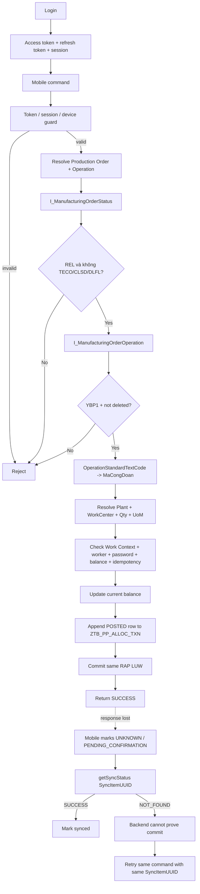

# CASLA Mobile Production Allocation – ABAP RAP Backend

Backend ABAP RAP cho **CASLA Mobile Production Allocation** trên SAP S/4HANA Cloud Public Edition / ABAP Cloud.

Repository này quản lý authentication/session, RBAC + Work Context, giao/điều chuyển/thu hồi sản lượng, xác nhận sản lượng, lịch sử giao dịch, điều chỉnh có audit trên Fiori và master Công đoạn.

> **Quan trọng:** trong dự án này, “ghi nhận về SAP” nghĩa là **ghi nhận nghiệp vụ CASLA vào custom Z tables chạy trên SAP thông qua custom RAP/OData APIs**. Không tạo SAP Production Confirmation chuẩn, material document hay business document chuẩn khác.

## Nguyên tắc kiến trúc

- **Server authoritative:** actor, session, permission và Work Context luôn được backend đọc lại.
- **Session guard:** mọi mobile API sau login phải kiểm tra access token + session + device.
- **Ledger first:** mọi mutation sản lượng tạo transaction bất biến trong `ZTB_PP_ALLOC_TXN`.
- **Controlled correction:** Fiori không được update balance/ledger trực tiếp; chỉ dùng action nghiệp vụ có sẵn và luôn append log.
- **Idempotent mobile commands:** mobile sinh `SyncItemUUID` trước khi gửi và reuse đúng ID khi retry.
- **Timeout != failure:** mất HTTP response không được kết luận nghiệp vụ thất bại.
- **No SAP-side queue:** request pending/offline được mobile quản lý; SAP xử lý command trực tiếp trong RAP LUW.
- **No shift constraint:** assignment có thể tồn tại nhiều ngày hoặc nhiều tuần; không có rule “ca còn ≥60 phút”.

## 1. Luồng mobile hiện tại



`getSyncStatus = NOT_FOUND` **không phải business FAILED**. Nó chỉ có nghĩa backend chưa tìm thấy một ledger receipt phù hợp với actor + `SyncItemUUID`.

## 2. Mobile API surface

Service Definition: `ZUI_PP_OPALLOC`

Mobile không CRUD trực tiếp `ZTB_PP_EMP_ALLOC` hoặc `ZTB_PP_ALLOC_TXN`. Projection chỉ expose command facade:

- `submitInitialAssign`
- `submitTransfer`
- `submitRecall`
- `submitConfirm`
- `submitReverse`
- `getSyncStatus`
- `getWorkHistory`

Mỗi mutation nhận `ProductionOrder + Operation` thay vì bắt mobile biết `OperationUUID`. Backend tự resolve operation SAP và custom snapshot.

### Session middleware rule

Các command/status/history API đều phải đi qua token/session/device validation. `ActorUserUUID` không nhận từ payload mà được derive từ session đã xác thực.

## 3. Live Production Order / Operation guard

`ZCL_PP_OPERATION_GUARD` kiểm tra dữ liệu live trước khi mutation:

1. `I_ManufacturingOrderStatus`
   - phải có `REL` (`I0002`);
   - chặn `TECO` (`I0045`), `CLSD` (`I0046`), `DLFL` (`I0076`).
2. `I_ManufacturingOrderOperation`
   - match `ManufacturingOrder + ManufacturingOrderOperation_2`;
   - `OperationControlProfile = 'YBP1'`;
   - operation không bị đánh dấu delete;
   - lấy `OperationStandardTextCode` làm `MaCongDoan`;
   - lấy quantity/UoM/Plant/WorkCenter internal ID.
3. `I_WorkCenter`
   - resolve Work Center code từ internal ID + Plant.

Kết quả được snapshot vào `ZTB_PP_OP_ALLOC`. `MaCongDoan` chỉ là mã công đoạn nghiệp vụ phục vụ enrichment/master data; không dùng để thay thế kiểm tra Production Order/Operation live.

## 4. Production allocation domain

### `ZTB_PP_OP_ALLOC`

Snapshot operation được backend quản lý:

- `OPERATION_UUID`
- `PRODUCTION_ORDER`
- `OPERATION_NO`
- `MA_CONGDOAN`
- `PLANT`
- `WORK_CENTER`
- `OPERATION_QTY`
- `UOM`
- `OPERATION_STATUS`
- audit fields

### `ZTB_PP_EMP_ALLOC`

Current balance theo Operation + Worker:

```text
Remaining
= InitialAssigned
+ TransferredIn
- TransferredOut
- Recalled
- Completed
```

Balance âm hoặc lệch invariant bị reject.

### `ZTB_PP_ALLOC_TXN`

Append-only ledger cho:

- `INITIAL_ASSIGN`
- `TRANSFER`
- `RECALL`
- `CONFIRM`
- `REVERSE`
- `CORRECTION`

Ledger lưu lineage (`OriginalTransactionUUID`), `SyncItemUUID`, actor/session/device, worker verification, quantity/UoM/date, reason/source và audit timestamps.

Các field legacy `SAP_CONFIRMATION_*` / `SAP_ERROR_*` hiện vẫn tồn tại để tránh DDIC migration phá vỡ không cần thiết nhưng **không còn đại diện cho integration với SAP standard Production Confirmation** và không được dùng trong flow mới.

## 5. Nghiệp vụ mutation

### Initial Assign

- validate session/device;
- live operation guard;
- Work Context `Plant + WorkCenter`;
- worker active + password verification;
- UoM/quantity;
- total assignment không vượt operation quantity;
- idempotency theo `SyncItemUUID`;
- update worker balance;
- append `INITIAL_ASSIGN` ledger.

### Transfer

- validate source/target worker;
- source remaining phải đủ;
- worker nhận việc được verify;
- giảm source / tăng target;
- append `TRANSFER` ledger.

Assignment không phụ thuộc ca làm việc và có thể kéo dài nhiều ngày/tuần.

### Recall

- chỉ thu hồi trên lineage giao việc hợp lệ;
- không vượt remaining balance;
- append `RECALL` ledger.

### Confirm

`CONFIRM` là nghiệp vụ CASLA local, không gọi standard SAP confirmation adapter:

```text
Completed += Quantity
Remaining -= Quantity
append CONFIRM POSTED ledger
```

Worker/password, work scope, UoM, quantity và idempotency đều được kiểm tra trước khi ghi.

### Reverse

Hiện `REVERSE` đảo một `CONFIRM` POSTED hợp lệ:

- không sửa/xóa transaction gốc;
- không cho reverse lần hai;
- tính effective confirmed quantity sau các `CORRECTION` đã có;
- restore `Completed/Remaining`;
- append `REVERSE` ledger liên kết transaction gốc.

## 6. Xử lý timeout và request chưa xác nhận

SAP không giữ `ZTB_PP_SYNC_H/I` hoặc server background queue nữa.

Mobile sinh `SyncItemUUID` ổn định **trước khi gửi**. Nếu HTTP timeout:

```text
Do not mark FAILED
       ↓
UNKNOWN / PENDING_CONFIRMATION
       ↓
getSyncStatus(AccessToken, DeviceID, SyncItemUUID)
       ↓
SUCCESS  -> transaction đã commit
NOT_FOUND -> chưa chứng minh commit; retry cùng SyncItemUUID khi phù hợp
```

Nếu cùng `SyncItemUUID` được gửi lại với payload nghiệp vụ khác, backend reject `IDEMPOTENCY_KEY_REUSED`.

Ledger là receipt cuối cùng cho một mobile command đã commit.

## 7. Fiori controlled correction + audit

Service: `ZUI_PP_ALLOC_ADM`

OData V4 binding: `ZUI_PP_ALLOC_ADM_O4`

Entity sets:

- `OperationAllocations`: operation snapshot + action `correctConfirm`;
- `AllocationTransactions`: read-only ledger cho audit/đối chiếu.

User Fiori **không được update trực tiếp** current balance hoặc ledger. Để sửa một CONFIRM nhập nhầm:

```text
Select operation / identify CONFIRM transaction
        ↓
correctConfirm(TransactionUUID, NewQuantity, UoM, ReasonCode, ReasonText)
        ↓
validate effective quantity + balance
        ↓
update current balance
        +
append CORRECTION ledger row
```

`CORRECTION.Quantity` là delta có dấu so với effective confirmed quantity hiện tại. Transaction gốc giữ nguyên để audit đầy đủ.

## 8. Master Công đoạn

Persistence: `ZTB_MD_CONGDOAN`

Business version key:

```text
CLIENT + MA_CONGDOAN + VALID_FROM
```

Fields chính:

- `MA_CONGDOAN`
- `TEN_CONGDOAN`
- `BO_PHAN`
- `DONGIA_XM`
- `DONGIA_GC`
- `VALID_FROM`
- `VALID_TO`
- audit fields

`MA_CONGDOAN` tương ứng `OperationStandardTextCode` của operation SAP. Master này dùng để enrich thông tin như tên/bộ phận/đơn giá và phục vụ tính lương sau này; nó **không phải điều kiện thay thế live operation guard**.

Validation:

- mã/tên/ValidFrom bắt buộc;
- ValidTo không nhỏ hơn ValidFrom;
- đơn giá không âm;
- cùng mã không được overlap validity interval;
- hard delete bị chặn.

Fiori service: `ZUI_MD_CONGDOAN_ADM`

OData V4 binding: `ZUI_MD_CONGDOAN_ADM_O4`

## 9. Identity, RBAC và Work Context

```text
ZTB_MOB_USER
  +-- ZTB_MOB_CRED
  +-- ZTB_MOB_SESSION
  +-- ZTB_MOB_USR_ROL --> ZTB_MOB_ROLE
                            +-- ZTB_MOB_ROL_FNC --> ZTB_MOB_FUNC
                            +-- ZTB_MOB_ROL_WRK --> ZTB_MOB_WORK
```

Login/refresh trả effective permissions + Work Contexts. Client dùng chúng để render UX, nhưng backend luôn re-read RBAC khi thực thi protected operation.

Login lockout theo workflow:

```text
5 password failures trong 1 phút -> lock 10 phút
```

## 10. Fiori administration services

| Service | Binding | Mục đích |
| --- | --- | --- |
| `ZUI_MOB_USER_ADM` | `ZUI_MOB_USER_ADM_O4` | User + initial/additional Roles |
| `ZUI_MOB_RBAC_ADM` | `ZUI_MOB_RBAC_ADM_O4` | Roles + Functions + Work Context |
| `ZUI_MD_CONGDOAN_ADM` | `ZUI_MD_CONGDOAN_ADM_O4` | Master Công đoạn/versioned đơn giá |
| `ZUI_PP_ALLOC_ADM` | `ZUI_PP_ALLOC_ADM_O4` | Điều chỉnh CONFIRM có ledger + audit |

Các admin bindings phải được bảo vệ bằng IAM/business catalog trên tenant và không đưa vào mobile communication scenario.

## 11. Data model

Sơ đồ draw.io cập nhật nằm tại:

`docs/CASLA_DATA_MODEL.drawio`

File có cả ERD custom tables và flow mobile command/reconciliation/Fiori correction.

## 12. Validation/deployment

Repository có GitHub Actions quality gate:

```text
.github/workflows/abaplint.yml
@abaplint/cli 2.120.35
ABAP language version: Cloud
```

`abaplint` không thay thế target-system activation. Trước production cần:

1. deserialize/activate DDIC -> CDS -> BDEF -> behavior classes -> services/bindings bằng ADT;
2. chạy ATC/ABAP Cloud checks trên tenant;
3. xác nhận release thực tế của các SAP CDS fields dùng trong `ZCL_PP_OPERATION_GUARD` trên release tenant;
4. publish/bảo vệ các OData V4 admin bindings bằng IAM;
5. test concurrency/idempotency và HTTP-response-loss scenario;
6. test Fiori correction/reverse lineage và balance invariant.
