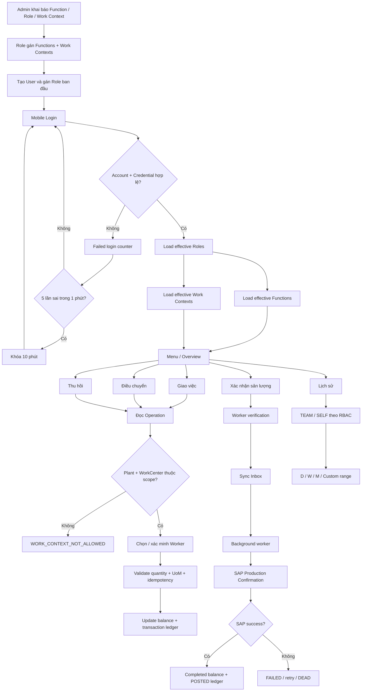

# CASLA Mobile Production Allocation – ABAP RAP Backend

Backend ABAP RAP cho **CASLA Mobile**, phục vụ luồng giám sát sản xuất từ quản trị tài khoản/phân quyền đến giao việc, điều chuyển, thu hồi, xác minh công nhân, lịch sử thực hiện và chuẩn bị đồng bộ xác nhận sản lượng về SAP.

Thiết kế của repository bám theo các nguyên tắc:

- **server-authoritative**: quyền, actor và Work Context luôn được backend đọc lại;
- **ledger-first**: mọi thay đổi sản lượng phải có transaction/audit rõ ràng;
- **fail-closed**: phần tích hợp SAP chưa hoàn tất thì không giả lập success;
- **composition-first**: User → Role và Role → Function/Work được quản trị ngay trên Object Page cha, không tách thành nhiều app nhỏ;
- **ABAP Cloud / RAP strict(2)**: các BO mới dùng managed RAP, validation backend và service boundary rõ ràng.

> **Target**
>
> - SAP S/4HANA Cloud Public Edition / ABAP Cloud
> - Managed RAP, non-draft
> - OData V4
> - Fiori Elements cho admin
> - abapGit source: `serialized/`

---

## 1. Luồng nghiệp vụ tổng thể



### Các invariant bắt buộc

1. **Username không phải UserUUID.** Sau khi resolve account, credential/session/RBAC/audit đều dùng `UserUUID`.
2. **Actor không đến từ payload.** `ActorUserUUID` được suy ra từ access token/session.
3. **Permission client chỉ dùng để render UI.** Backend luôn re-read RBAC trước thao tác cần bảo vệ.
4. **Work Context là authorization scope.** Mobile không được tự mở Plant/Work Center ngoài Role được cấp.
5. **Worker phải được xác minh tại thời điểm mutation.**
6. **Quantity và UoM phải nhất quán.** Không được âm, vượt balance hoặc cộng chéo đơn vị.
7. **SyncItemUUID phải idempotent.** Duplicate/race không được chọn ngẫu nhiên một record để tiếp tục.
8. **Confirm/Reverse chỉ được success khi SAP thực sự success.**

---

## 2. Trạng thái triển khai theo flow

| Khối nghiệp vụ | Trạng thái |
| --- | --- |
| User / Credential / Session | ✅ Implemented |
| Login / Refresh / Logout / Change Password | ✅ Implemented |
| Failed login: 5 lần / 1 phút → lock 10 phút | ✅ Implemented |
| Function / Role / UserRole | ✅ Implemented |
| Work Context / RoleWork | ✅ Implemented |
| Fiori User Administration | ✅ Backend RAP + OData V4 binding |
| Fiori RBAC & Work Administration | ✅ Backend RAP + OData V4 binding |
| Login trả Permissions + Work Contexts | ✅ Implemented |
| Server-side Plant + WorkCenter scope | ✅ Implemented |
| `initialAssign` | ✅ Internal domain logic |
| `transfer` | ✅ Internal domain logic |
| `recall` | ✅ Internal domain logic |
| `getWorkHistory` | ✅ Mobile read API |
| `submitSync` accept-only API | ⏳ Chưa hoàn thiện |
| Background sync worker | ⏳ Chưa hoàn thiện |
| SAP Production Confirmation adapter | ⏳ Chưa có adapter đã verify trên tenant |
| `confirm` | 🔒 Fail-closed |
| `reverse` | 🔒 Fail-closed |
| Rule đổi người khi ca còn ≥ 60 phút | ⏳ Chưa có authoritative shift source |

> **Quan trọng:** “internal domain logic đã implement” không có nghĩa mobile được gọi trực tiếp. Mutation surface vẫn phải đi qua sync/security boundary khi pipeline đó hoàn thiện.

---

## 3. Mô hình Identity, RBAC và Work Context

```text
ZTB_MOB_USER
    |
    +-- ZTB_MOB_USR_ROL
            |
            +-- ZTB_MOB_ROLE
                    |
                    +-- ZTB_MOB_ROL_FNC --> ZTB_MOB_FUNC
                    |
                    +-- ZTB_MOB_ROL_WRK --> ZTB_MOB_WORK
```

### Ý nghĩa

- **User → Role**: một tài khoản có thể có nhiều chức danh/quyền nghiệp vụ.
- **Role → Function**: quyết định các chức năng mobile được phép dùng.
- **Role → Work Context**: quyết định Plant + Work Center mà actor được phép thao tác.
- Role `Status = 'I'` mất hiệu lực ngay mà không cần xóa mapping.
- Work `IsActive = 'I'` mất hiệu lực runtime ngay mà không cần xóa RoleWork.

### Function master – `ZTB_MOB_FUNC`

| Field | Ý nghĩa |
| --- | --- |
| `FUNC_ID` | ID chức năng ổn định dùng cho RBAC |
| `FUNC_NAME` | Tên chức năng |
| `APP_MODULE` | Module/menu nghiệp vụ trên ứng dụng |

CDS/RAP field tương ứng là **`AppModule`**. Không sử dụng `MODULE` vì đây là reserved word trong ABAP DDL.

`FuncID` là business key và không được đổi sau create. Backend validate `FuncID`/`FuncName` trước save. Hard delete Function bị deny để tránh orphan permission contract.

### Role master – `ZTB_MOB_ROLE`

Role có:

- `RoleID`
- `RoleName`
- `Status = 'A' | 'I'`

`RoleID` không được đổi sau create. Backend validate Role ID/name/status. Hard delete Role bị deny; ngừng sử dụng bằng `Status = 'I'`.

### Work master – `ZTB_MOB_WORK`

| Field | Ý nghĩa |
| --- | --- |
| `WORK_ID` | ID phạm vi/vị trí làm việc |
| `WORK_NAME` | Tên vị trí |
| `PLANT` | Nhà máy |
| `WORKCENTER` | Work Center / tổ |
| `BO_PHAN` | Bộ phận |
| `LOCATION` | Mô tả vị trí |
| `IS_ACTIVE` | `A` active / `I` inactive |

`WorkID` không được đổi sau create. Backend bắt buộc WorkID, WorkName, Plant, WorkCenter và trạng thái hợp lệ. Hard delete Work bị deny; dùng `IsActive = 'I'` khi retire.

### Các mapping N:M

```text
ZTB_MOB_USR_ROL  = UserUUID + RoleID
ZTB_MOB_ROL_FNC  = RoleID  + FuncID
ZTB_MOB_ROL_WRK  = RoleID  + WorkID
```

Đây là **assignment records**, nên nghiệp vụ đúng là:

```text
add assignment    = CREATE
remove assignment = DELETE
```

Không expose `UPDATE` để “đổi key” một mapping. Muốn đổi Role/Function/Work thì xóa assignment cũ và tạo assignment mới.

Backend validation:

- UserRole chỉ nhận Role tồn tại và đang active;
- RoleFunction chỉ nhận Function thực sự tồn tại;
- RoleWork chỉ nhận Work Context tồn tại và đang active.

Value help chỉ hỗ trợ UX; direct OData/EML request vẫn bị backend validate.

---

## 4. Hai Fiori Elements admin apps

Thiết kế cố ý chỉ có **2 admin apps**, không tạo app riêng cho từng mapping table.

### 4.1 User Administration

- Service Definition: `ZUI_MOB_USER_ADM`
- OData V4 Binding: `ZUI_MOB_USER_ADM_O4`
- Main Entity Set: `SupervisorAccounts`
- UI pattern: **List Report + Object Page**

#### Tạo User

Action `createUser` nhận:

- Username
- Password
- FullName
- Email
- WorkerID
- **RoleID ban đầu**

Backend validate Role active rồi deep-create trong **một RAP LUW**:

```text
User
 + Credential
 + Initial UserRole
```

Không tạo User trước rồi yêu cầu admin sang app khác gán Role.

#### User Object Page

Có hai phần chính:

1. **Thông tin tài khoản**
2. **Chức danh** (`_Roles`)

Tại `_Roles`, admin có thể add/remove Role ngay trên cùng Object Page.

### 4.2 RBAC & Work Administration

- Service Definition: `ZUI_MOB_RBAC_ADM`
- OData V4 Binding: `ZUI_MOB_RBAC_ADM_O4`
- Main Entity Set: `Roles`
- UI pattern: **List Report + Object Page**

#### Role Object Page

Có ba phần:

1. **Thông tin chức danh**
2. **Quyền chức năng** (`_Functions`)
3. **Vị trí làm việc** (`_WorkAssignments`)

`_Functions` hiển thị:

- FuncID
- FuncName
- **AppModule**

`_WorkAssignments` hiển thị:

- WorkID
- WorkName
- Plant
- WorkCenter
- Bộ phận
- Location

#### Function và Work master

Cùng service `ZUI_MOB_RBAC_ADM` expose:

- `Functions`
- `WorkContexts`

Chúng là master-data pages/secondary routes trong **cùng RBAC & Work app**, không tạo thêm Launchpad tile chỉ để maintain Function hoặc Work.

Chi tiết triển khai frontend: [`docs/FIORI_ELEMENTS_ADMIN.md`](docs/FIORI_ELEMENTS_ADMIN.md).

> Repository này là ABAP backend. UI5 app shell, semantic object, catalog, space/page, destination và runtime OData URL phải được generate/publish trên tenant thật; không hard-code endpoint giả vào Git.

---

## 5. Login, lockout và effective context

Mobile authentication đi qua `ZUI_MOB_AUTH`.

### Login flow

1. Normalize username.
2. Resolve duy nhất User + Credential active.
3. Verify password bằng KDF dùng chung.
4. Nếu sai:
   - failure ngoài cửa sổ cũ → counter reset về 1;
   - failure trong cùng cửa sổ 1 phút → increment;
   - đủ 5 lần → `LockedUntil = now + 10 phút`.
5. Nếu đúng:
   - reset failed-login state;
   - revoke session cũ cùng device;
   - enforce active-session limit;
   - phát access token + refresh token;
   - trả `_Permissions`;
   - trả `_WorkContexts`.

Persistence liên quan:

```text
ZTB_MOB_USER
ZTB_MOB_CRED
ZTB_MOB_SESSION
```

Plaintext token không được lưu DB; chỉ lưu token hash. Refresh token được rotate. Đổi password revoke active sessions để buộc login lại.

### Permissions trả về mobile

`_Permissions` được resolve từ:

```text
UserRole
 -> active Role
 -> RoleFunction
 -> Function
```

Mỗi permission có:

- FuncID
- FuncName
- AppModule

Danh sách này dùng để dựng menu/UI, nhưng **không thay thế server authorization**.

### Work Contexts trả về mobile

`_WorkContexts` được resolve từ:

```text
UserRole
 -> active Role
 -> RoleWork
 -> active Work
```

Nếu nhiều Role cùng cấp một WorkID, kết quả được deduplicate.

---

## 6. Work Context authorization tại runtime

`ZCL_MOB_TOKEN_VALIDATOR` là source dùng chung cho:

- access-token/session validation;
- effective permission lookup;
- effective Work Context lookup;
- Function check;
- Plant + WorkCenter scope check;
- worker-password verification utilities.

Các mutation đã implement nội bộ đều re-check operation scope:

```text
Authenticated actor
        ↓
Operation.Plant + Operation.WorkCenter
        ↓
UserRole -> active Role -> RoleWork -> active Work
        ↓
allowed ? continue : WORK_CONTEXT_NOT_ALLOWED
```

Client không được gửi một WorkID rồi yêu cầu backend tin WorkID đó là authorized.

Hiện scope check áp dụng cho:

- `initialAssign`
- `transfer`
- `recall`

---

## 7. Production allocation domain

Persistence chính:

| Table | Vai trò |
| --- | --- |
| `ZTB_PP_OP_ALLOC` | Operation allocation header/snapshot |
| `ZTB_PP_EMP_ALLOC` | Current balance theo Operation + Worker |
| `ZTB_PP_ALLOC_TXN` | Transaction ledger, audit và lineage |
| `ZTB_PP_SYNC_H` | Sync Inbox header |
| `ZTB_PP_SYNC_I` | Sync Inbox item |

### Balance invariant

```text
Remaining
= InitialAssigned
+ TransferredIn
- TransferredOut
- Recalled
- Completed
```

Không được save balance âm hoặc balance không khớp ledger transition.

### 7.1 Initial Assignment

Backend kiểm tra tối thiểu:

1. access token + device;
2. operation tồn tại;
3. authenticated actor có Work Context chứa Plant + WorkCenter của operation;
4. quantity/UoM hợp lệ;
5. worker hợp lệ tại ngày thực hiện;
6. worker password đúng;
7. `SyncItemUUID` chưa được xử lý hoặc là idempotent replay hợp lệ;
8. tổng assignment không vượt operation quantity;
9. worker balance không bị duplicate.

### 7.2 Transfer

Actor được derive từ token, không nhận `ActorUserUUID` từ client.

Transfer kiểm tra:

- source/target balance;
- quantity/UoM;
- idempotency;
- worker verification;
- Work Context của actor;
- transaction lineage/audit.

### 7.3 Recall

Recall áp cùng security/balance pattern:

- actor từ token;
- Work Context server-side;
- worker verification;
- original transaction lookup;
- quantity/UoM;
- idempotency;
- fail-closed nếu balance/lineage không nhất quán.

### Audit worker verification

Transaction ledger lưu:

- `ActorUserUUID`
- `VerifiedWorkerUserUUID`
- `WorkerVerifiedAt`
- `InitiatorSessionID`
- `DeviceID`
- `VerificationMethod`

---

## 8. Mobile mutation boundary và Sync Inbox

Dù `initialAssign`, `transfer`, `recall` đã có domain implementation, chúng vẫn **không được mở trực tiếp cho mobile**.

Target boundary:

```text
Mobile
   ↓
submitSync
   ↓
ZTB_PP_SYNC_H / ZTB_PP_SYNC_I = QUEUED
   ↓
Background worker
   ↓
Auth + Permission + WorkScope + Worker + Idempotency
   ↓
Internal EML vào domain BO
   ↓
SAP confirmation khi operation type yêu cầu
   ↓
SUCCESS / PARTIAL / FAILED / DEAD
```

### Sync status contract

Header:

- `QUEUED`
- `IN_PROCESS`
- `SUCCESS`
- `PARTIAL`
- `FAILED`
- `DEAD`

Item:

- `QUEUED`
- `SUCCESS`
- `FAILED`
- `DEAD`

Transient infrastructure error có thể retry. Permanent business-validation error phải fail ngay. Hết retry budget thì chuyển `DEAD`.

`submitSync` và background worker hiện **chưa hoàn thiện**, vì vậy mobile mutation surface vẫn đóng.

---

## 9. Confirm và Reverse

`confirm` và `reverse` hiện **fail-closed có chủ đích**.

Lý do: repository chưa có SAP Production Confirmation / reversal adapter đã được xác minh trên target tenant.

Không được làm theo kiểu:

```text
local CompletedQuantity += x
local ledger = POSTED
SAP chưa success
```

vì như vậy sẽ tạo hai nguồn sự thật khác nhau giữa mobile backend và SAP.

Flow đúng phải là:

```text
Validate local request
    ↓
Call released SAP confirmation API
    ↓
SAP success
    ↓
Persist local completed balance + POSTED ledger
```

Reverse cũng phải tuân cùng nguyên tắc.

---

## 10. Rule ca còn ít nhất 60 phút

Flow nghiệp vụ có rule: chỉ được đổi/ngắt người nhận việc khi thời gian còn lại của ca đạt ngưỡng yêu cầu, hiện được hiểu là **≥ 60 phút**.

Rule này **chưa implement** vì repository chưa có authoritative source cho:

- shift ID;
- shift start/end time;
- lịch làm việc theo Plant/Work Center/ngày.

Không hard-code giờ ca vào behavior implementation. Cần xác định nguồn ca chuẩn trước khi bật rule này.

---

## 11. Work History

`getWorkHistory` được expose qua `ZUI_PP_OPALLOC` dưới dạng read-only, token-scoped action.

### Scope RBAC

| Function | Scope |
| --- | --- |
| `PP_HIST_TEAM` | Supervisor assignment roots + valid transaction descendants |
| `PP_HIST_SELF` | Các row liên quan authenticated worker |

### Time range

| RangeCode | Ý nghĩa |
| --- | --- |
| `D` | Hôm nay |
| `W` | 7 ngày gần nhất |
| `M` | 30 ngày gần nhất |
| `C` | Custom range, tối đa 92 ngày/request |

Nguồn số liệu là `POSTED` transaction ledger trong `ZTB_PP_ALLOC_TXN` kết hợp operation header.

`ZTB_KB_NHANCONG` chỉ enrich thông tin worker; không quyết định ownership lịch sử.

---

## 12. External Worker Master

Repository phụ thuộc external master:

| Object | Ownership | Rule |
| --- | --- | --- |
| `ZTB_KB_NHANCONG` | Package/hệ thống đối tác | Read-only từ repo này |

Access nghiệp vụ đi qua `ZI_PP_WorkerRef`.

Worker validation xét các yếu tố phù hợp với flow như:

- WorkerID;
- Plant;
- Work Center;
- ValidFrom / ValidTo;
- ExecutionDate.

Không tự ý thay structure/index của external master từ repository này.

---

## 13. Service boundaries

| Service | Audience | Surface |
| --- | --- | --- |
| `ZUI_MOB_AUTH` | Mobile | login / refresh / logout / changePassword |
| `ZUI_PP_OPALLOC` | Mobile | operation read + `getWorkHistory`; mutation projection vẫn đóng |
| `ZUI_MOB_USER_ADM` | Fiori Admin | User + UserRole administration |
| `ZUI_MOB_RBAC_ADM` | Fiori Admin | Role + Function + Work Context administration |

Admin OData V4 bindings:

```text
ZUI_MOB_USER_ADM_O4 -> ZUI_MOB_USER_ADM
ZUI_MOB_RBAC_ADM_O4 -> ZUI_MOB_RBAC_ADM
```

Hai admin bindings không được đưa vào mobile communication scenario.

---

## 14. RAP/Fiori composition model

```text
ZI_MOB_User
  +-- _Roles -> ZI_MOB_UsrRol

ZI_MOB_Role
  +-- _Functions       -> ZI_MOB_RolFunc
  +-- _WorkAssignments -> ZI_MOB_RolWork

ZI_MOB_Func
ZI_MOB_Work
```

Projection admin:

```text
ZC_MOB_User_Adm
  +-- _Roles -> ZC_MOB_UsrRol_Adm

ZC_MOB_Role_Adm
  +-- _Functions       -> ZC_MOB_RolFunc_Adm
  +-- _WorkAssignments -> ZC_MOB_RolWork_Adm
```

Các child projection dùng `redirected to parent` **không khai báo** `provider contract transactional_query`. Provider contract nằm ở transactional root projection.

---

## 15. CDS access-control convention

| Layer | Authorization check | Ghi chú |
| --- | --- | --- |
| Interface root/child `ZI_*` | thường `#NOT_REQUIRED` | domain/internal layer |
| Admin root projection `ZC_*_Adm` | `#MANDATORY` | IAM/Fiori boundary |
| Admin composition child | `#NOT_REQUIRED` | đi qua root composition |

Deliberate auth exception:

- mobile account data không được expose thành read surface cho communication user;
- Fiori admin projection là đường quản trị riêng, được bảo vệ bằng IAM/business catalog.

---

## 16. Security checklist

- Không lưu plaintext access/refresh token.
- Không nhận authenticated actor UUID từ request.
- Không tin permission list hoặc Work Context do client gửi lại.
- Worker verification phải được audit.
- Password change revoke active sessions.
- Role/Function/Work IDs là stable business keys, không update sau create.
- RoleFunction/UserRole/RoleWork là create/delete assignments.
- Master-data hard delete bị hạn chế; ưu tiên deactivate để giữ reference/audit.
- Duplicate balance/ledger lookup phải fail-closed.
- Production confirmation không được local-success trước SAP success.

---

## 17. Activation / deployment order

Sau abapGit pull, nên activate theo dependency thay vì activate ngẫu nhiên:

1. Persistence tables.
2. Interface CDS (`ZI_*`).
3. Interface BDEF + behavior pool.
4. Projection CDS (`ZC_*`).
5. Projection BDEF.
6. Metadata extensions / DCL.
7. Service Definitions.
8. OData V4 Service Bindings.
9. Preview/test service.
10. Generate/publish đúng **2 Fiori Elements admin apps**.

Đặc biệt kiểm tra:

- `ZTB_MOB_WORK`
- `ZTB_MOB_ROL_WRK`
- Role/User/Function/Work RAP objects
- `ZUI_MOB_USER_ADM_O4`
- `ZUI_MOB_RBAC_ADM_O4`

---

## 18. Validation hiện tại

Latest post-merge audit:

```text
@abaplint/cli 2.120.35
ABAP language version: Cloud
0 issue(s) found, 207 file(s) analyzed
```

Audit bổ sung đã kiểm tra:

- không còn DDIC field reserved `MODULE`;
- child projection có `redirected to parent` không còn `transactional_query` provider contract;
- Role / Function / UserRole / RoleFunction validations tồn tại;
- UserRole và RoleFunction không expose update cho composite-key assignment;
- Work Context flow và service/value-help contracts vẫn còn nguyên.

`abaplint` **không thay thế** RAP Designtime compiler/ADT activation trên target system. Trước deploy vẫn phải:

- activate trong ADT;
- chạy ATC/Cloud checks;
- preview OData V4 bindings;
- test Fiori create/add/remove flows;
- test login/refresh context;
- test PP mutation ngoài scope bị reject.

---

## 19. Test nghiệp vụ tối thiểu trước go-live

1. Tạo Function master.
2. Tạo Role `A`.
3. Gán Function cho Role.
4. Tạo Work Context `A` với Plant + WorkCenter.
5. Gán Work Context cho Role.
6. Tạo User và chọn Role ban đầu ngay trong create dialog.
7. Add/remove Role bổ sung trên User Object Page.
8. Login và xác nhận `_Permissions` + `_WorkContexts` đúng.
9. Deactivate Role → quyền/work scope phải mất hiệu lực ngay.
10. Reactivate Role, deactivate Work → Work scope phải mất hiệu lực.
11. `initialAssign` trong scope → được đi tiếp nếu các validation khác pass.
12. `initialAssign` ngoài scope → `WORK_CONTEXT_NOT_ALLOWED`.
13. Lặp lại scope test cho `transfer` và `recall`.
14. Duplicate `SyncItemUUID` → idempotent/fail-closed đúng thiết kế.
15. `confirm`/`reverse` vẫn phải từ chối cho tới khi SAP adapter thật được bật.

---

## 20. Next implementation slice

Theo đúng flow, thứ tự nên tiếp tục là:

1. Xác định authoritative shift/end-time source để implement rule ≥60 phút.
2. Hoàn thiện `submitSync` accept-only API.
3. Hoàn thiện background worker + retry/dead-letter.
4. Chốt canonical Function IDs cho các external mutation permissions, không tự đoán tên.
5. Chọn released SAP Production Confirmation API phù hợp target tenant.
6. Implement confirmation/reversal adapter.
7. Thêm ABAP Unit/integration tests cho:
   - UserRole/RoleFunction/RoleWork validation;
   - permission/work-scope resolution;
   - balance transition;
   - duplicate sync;
   - worker verification;
   - SAP confirmation success/failure boundary.

---

## Tài liệu liên quan

- [`IMPLEMENTATION_STATUS.md`](IMPLEMENTATION_STATUS.md) – trạng thái implementation chi tiết.
- [`docs/FIORI_ELEMENTS_ADMIN.md`](docs/FIORI_ELEMENTS_ADMIN.md) – thiết kế 2 Fiori Elements admin apps.
- [`AUTHORIZATION_SETUP.md`](AUTHORIZATION_SETUP.md) – authorization/IAM setup.

README này mô tả **flow nghiệp vụ chuẩn và trạng thái repository hiện tại**. Nếu một bước trong flow chưa có authoritative dependency hoặc SAP adapter thật, repository phải tiếp tục **fail-closed** thay vì mô phỏng success.