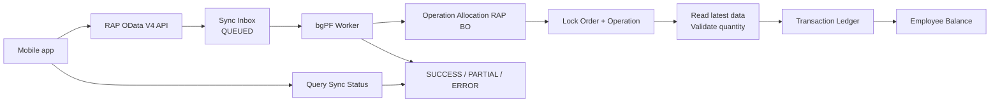

# Kế hoạch xây dựng ABAP RAP đồng bộ sản lượng từ Mobile App

## 1. Mục tiêu

Xây dựng giải pháp ABAP RAP để:

- Nhận dữ liệu phân bổ và sản lượng từ mobile app.
- Hỗ trợ xử lý bất đồng bộ.
- Không ghi nhận trùng khi mobile retry.
- Không phân bổ hoặc xác nhận vượt số lượng công đoạn.
- Không xảy ra double allocation khi nhiều thiết bị xử lý đồng thời.
- Có lịch sử giao dịch, retry, monitoring và audit đầy đủ.

Giải pháp sử dụng bốn lớp bảo vệ chính:

```text
RAP root lock theo Production Order + Operation
+ database idempotency key
+ immutable transaction ledger
+ async inbox/bgPF
```

### 1.1. Phạm vi nền tảng

- Target: SAP S/4HANA Cloud Public Edition, ABAP for Cloud Development.
- Chỉ sử dụng object/API được release trong đúng release của tenant.
- Tên CDS/BO interface chuẩn phải được kiểm tra bằng ADT Released Objects và SAP Business Accelerator Hub trước khi code.
- Managed RAP, non-draft cho cả domain BO và sync BO.

### 1.2. Các decision gate phải chốt trước khi code

1. `CONFIRMATION` chỉ ghi nhận ledger custom hay phải post Production Order Confirmation thật vào SAP.
2. Nguồn live của `OperationQuantity`, UoM và system status của order/operation.
3. Business key/idempotency scope của một request và một item.
4. Batch xử lý partial success hay all-or-nothing.
5. Chính sách reverse: chỉ reverse ledger hay đồng thời cancel confirmation chuẩn.
6. Quy tắc ngày hiệu lực và chống overlap cho employee master `ZTB_KB_NHANCONG`.

Khuyến nghị thiết kế mặc định của tài liệu này:

- `CONFIRMATION` phải post confirmation chuẩn vào SAP; custom ledger chỉ là audit/orchestration, không phải sổ sản lượng authoritative.
- Worker luôn đọc live quantity, UoM và status từ released SAP BO interface/CDS/API.
- UoM phải trùng UoM công đoạn; phiên bản đầu không quy đổi.
- Mỗi sync item là một đơn vị xử lý độc lập; batch được phép `PARTIAL`.
- Reverse confirmation phải cancel chứng từ confirmation chuẩn trước khi cập nhật ledger local.
- `ZTB_KB_NHANCONG` là nguồn authoritative để kiểm tra nhân công của phiên bản đầu.

---

## 2. Quy tắc nghiệp vụ

### 2.1. Các khái niệm

- **SL công đoạn**: tổng sản lượng tối đa của một `Lệnh sản xuất + Công đoạn`.
- **SL dải chuyền**: số lượng đang giao cho một nhân viên hoặc tổ thực hiện.
- **SL hoàn thành**: số lượng nhân viên đã hoàn thành.
- **SL còn lại**: số lượng nhân viên vẫn còn quyền thực hiện.

Không lưu giá trị như `15470 CHC` trong một field. Phải tách thành:

```text
OperationQuantity = 15470
UnitOfMeasure     = CHC
```

### 2.2. Số lượng còn lại của nhân viên

```text
EmployeeRemainingQuantity =
    InitialAssignedQuantity
  + TransferredInQuantity
  - TransferredOutQuantity
  - CompletedQuantity
```

Luôn phải đảm bảo:

```text
EmployeeRemainingQuantity >= 0
```

### 2.3. Giới hạn ở cấp công đoạn

```text
TotalCompletedQuantity
+ TotalEmployeeRemainingQuantity
<= OperationQuantity
```

### 2.4. Phân bổ mới

Phân bổ mới lấy từ phần công đoạn chưa được giao:

```text
UnallocatedQuantity =
    OperationQuantity
  - TotalCompletedQuantity
  - TotalEmployeeRemainingQuantity
```

Điều kiện:

```text
NewAssignedQuantity <= UnallocatedQuantity
```

Ví dụ:

```text
SL công đoạn                 = 15.470
CL00001 đang giữ             = 15.000
CL00001 đã hoàn thành        =      0
SL chưa phân bổ              =    470
SL muốn phân bổ cho CL00002  =  3.000
```

Kết quả: không hợp lệ vì `3.000 > 470`.

### 2.5. Chuyển phân bổ

Chuyển phân bổ là chuyển phần còn lại từ nhân viên hiện tại sang nhân viên khác:

```text
TransferQuantity <= FromEmployeeRemainingQuantity
```

Ví dụ:

```text
CL00001 được giao       = 15.000
CL00001 đã hoàn thành   = 10.000
CL00001 còn lại         =  5.000
Chuyển sang CL00002     =  3.000
```

Kết quả: hợp lệ vì `3.000 <= 5.000`.

Sau khi chuyển:

| Nhân viên | Đã hoàn thành | Còn được thực hiện |
|---|---:|---:|
| CL00001 | 10.000 | 2.000 |
| CL00002 | 0 | 3.000 |

Tổng số lượng vẫn không thay đổi:

```text
10.000 + 2.000 + 3.000 = 15.000 <= 15.470
```

Không được thêm 3.000 cho CL00002 nhưng vẫn để CL00001 còn 5.000. Nếu làm vậy sẽ phát sinh double allocation.

### 2.6. Ghi nhận hoàn thành

Điều kiện:

```text
ConfirmationQuantity <= EmployeeRemainingQuantity
```

Sau khi thành công:

```text
Employee.CompletedQuantity += ConfirmationQuantity
Employee.RemainingQuantity -= ConfirmationQuantity
```

---

## 3. Các loại giao dịch từ mobile

Mobile phải chỉ rõ một trong ba loại giao dịch:

```text
INITIAL_ASSIGNMENT
TRANSFER
CONFIRMATION
```

### 3.1. INITIAL_ASSIGNMENT

Phân bổ phần chưa được giao của công đoạn cho nhân viên:

```text
ProductionOrder
Operation
ToEmployee
Quantity
UnitOfMeasure
```

### 3.2. TRANSFER

Chuyển phần còn lại giữa hai nhân viên:

```text
ProductionOrder
Operation
FromEmployee
ToEmployee
Quantity
UnitOfMeasure
```

### 3.3. CONFIRMATION

Ghi nhận sản lượng hoàn thành:

```text
ProductionOrder
Operation
Employee
CompletedQuantity
ExecutionDate
UnitOfMeasure
```

---

## 4. Kiến trúc tổng thể



Giải pháp gồm hai RAP Business Object:

1. **Mobile Sync BO**: nhận payload, chống trùng, quản lý trạng thái async.
2. **Operation Allocation BO**: thực hiện phân bổ, chuyển giao và xác nhận sản lượng.

---

## 5. Mô hình database

### 5.1. `ZTB_PP_OP_ALLOC` — Root công đoạn

Một record cho mỗi `Production Order + Operation`.

| Field | Ý nghĩa |
|---|---|
| `OPERATION_UUID` | UUID |
| `PRODUCTION_ORDER` | Lệnh sản xuất |
| `OPERATION` | Công đoạn |
| `DEPARTMENT_ID` | Bộ phận |
| `OPERATION_QTY` | SL công đoạn |
| `UOM` | Đơn vị |
| `STATUS` | OPEN/CLOSED/BLOCKED |
| `LAST_CHANGED_AT` | ETag |
| `LAST_CHANGED_BY` | Người thay đổi |

Unique key:

```text
ProductionOrder + Operation
```

### 5.2. `ZTB_PP_EMP_ALLOC` — Số dư nhân viên

Một record cho mỗi nhân viên trong công đoạn.

Employee master authoritative là bảng hiện có `ZTB_KB_NHANCONG`:

```abap
define table ztb_kb_nhancong {
  key client        : abap.clnt not null;
  key uuid_nhancong : sysuuid_x16 not null;
  work_center       : arbpl not null;
  plant             : werks_d not null;
  worker_id         : abap.char(8) not null;
  worker_name       : abap.char(255) not null;
  from_date         : datum not null;
  to_date           : datum not null;
  createdbyuser     : abp_creation_user;
  createddate       : abp_creation_tstmpl;
  changedbyuser     : abp_lastchange_user;
  changeddate       : abp_lastchange_tstmpl;
}
```

Quy ước mapping:

- `worker_id` là mã nhân công như `CL00001` và là identity nghiệp vụ; `worker_name` chỉ để hiển thị.
- Cột “Bộ phận” trên mobile map sang `work_center`. Worker ưu tiên derive `plant + work_center` live từ order/operation; nếu mobile gửi hai giá trị này thì chỉ dùng để cross-check, không làm nguồn authoritative.
- Worker hợp lệ khi khớp chính xác `plant + work_center + worker_id` và `execution_date BETWEEN from_date AND to_date`.
- Dùng `execution_date`, không dùng ngày worker đang xử lý request, để hỗ trợ mobile offline đồng bộ dữ liệu lịch sử.
- `ZTB_PP_EMP_ALLOC` lưu `worker_id`; tên có thể derive từ master hoặc snapshot vào ledger nếu cần audit tên tại thời điểm giao dịch.

Validation bắt buộc cho employee master:

- `from_date <= to_date`.
- Không có hai validity intervals overlap cho cùng `plant + work_center + worker_id`.
- Nên tạo secondary index cho `client + plant + work_center + worker_id + from_date` để tối ưu lookup.
- Nếu một worker được phép thuộc nhiều work center đồng thời, mỗi assignment là một record riêng và validation luôn theo đúng work center của operation.

Nếu bảng này được expose bằng Managed RAP để bảo trì, nên cân nhắc dùng một field kiểu `abp_locinst_lastchange_tstmpl` làm local ETag. `changeddate : abp_lastchange_tstmpl` hiện tại vẫn dùng được cho audit timestamp, nhưng cần khai báo semantics/ETag nhất quán với BO bảo trì thực tế.

CDS validation view đề xuất:

```abap
@AccessControl.authorizationCheck: #NOT_REQUIRED
@EndUserText.label: 'Tham chiếu nhân công để kiểm tra'
define view entity ZI_PP_WorkerRef
  as select from ztb_kb_nhancong
{
  key uuid_nhancong as WorkerUUID,
      worker_id     as WorkerID,
      from_date     as ValidFrom,
      to_date       as ValidTo,
      work_center   as WorkCenter,
      plant         as Plant,
      worker_name   as WorkerName
}
```

Không dùng riêng `WorkerID + ValidFrom` làm CDS key vì cùng worker có thể có record ở nhiều Plant/Work Center. UUID phản ánh đúng uniqueness vật lý; các field nghiệp vụ vẫn dùng trong điều kiện lookup. `#NOT_REQUIRED` phù hợp cho internal validation view, nhưng view này không được expose trực tiếp ra service công khai nếu chưa có authorization design riêng.

| Field | Ý nghĩa |
|---|---|
| `EMP_ALLOC_UUID` | UUID |
| `OPERATION_UUID` | Root UUID |
| `EMPLOYEE_ID` | Mã nhân viên |
| `DEPARTMENT_ID` | Bộ phận |
| `INITIAL_ASSIGNED_QTY` | Phân bổ ban đầu |
| `TRANSFERRED_IN_QTY` | Nhận chuyển vào |
| `TRANSFERRED_OUT_QTY` | Chuyển ra |
| `COMPLETED_QTY` | Đã hoàn thành |
| `REMAINING_QTY` | Còn được thực hiện |
| `UOM` | Đơn vị |
| `LAST_EXECUTION_DATE` | Ngày thực hiện cuối |
| `LAST_SYNC_AT` | Ngày đồng bộ cuối |
| `LAST_CHANGED_AT` | ETag |

Unique key:

```text
OperationUUID + EmployeeID
```

`REMAINING_QTY` có thể được lưu để đọc nhanh, nhưng chỉ SAP được tính và cập nhật.

Quy tắc chống drift:

- Cập nhật `REMAINING_QTY` và ghi `ZTB_PP_ALLOC_TXN` trong cùng một RAP LUW.
- Không `UPDATE SQL` trực tiếp vào balance từ worker.
- Có APJ reconciliation job định kỳ tính lại số dư từ ledger và cảnh báo chênh lệch.
- Không tự động sửa chênh lệch nếu chưa lưu application log và nguyên nhân.

### 5.3. `ZTB_PP_ALLOC_TXN` — Sổ giao dịch

Bảng immutable, không sửa hoặc xóa giao dịch đã post.

| Field | Ý nghĩa |
|---|---|
| `TRANSACTION_UUID` | UUID |
| `OPERATION_UUID` | Root UUID |
| `TRANSACTION_TYPE` | INITIAL_ASSIGNMENT/TRANSFER/CONFIRMATION |
| `FROM_EMPLOYEE` | Người chuyển |
| `TO_EMPLOYEE` | Người nhận |
| `EMPLOYEE_ID` | Người hoàn thành |
| `QUANTITY` | Số lượng |
| `UOM` | Đơn vị |
| `EXECUTION_DATE` | Ngày thực hiện |
| `SYNC_ITEM_UUID` | Truy vết request |
| `STATUS` | Trạng thái theo loại transaction, xem state matrix bên dưới |
| `SAP_CONFIRMATION_GROUP` | Confirmation group chuẩn SAP |
| `SAP_CONFIRMATION_COUNT` | Confirmation counter chuẩn SAP |
| `SAP_ERROR_CODE` | Mã lỗi khi post/cancel SAP |
| `SAP_ERROR_TEXT` | Nội dung lỗi khi post/cancel SAP |
| `CREATED_AT` | Thời gian tạo |
| `CREATED_BY` | Người tạo |

Bảng dùng cho audit, đối soát, rebuild số dư và đảo giao dịch.

Với `CONFIRMATION`, ledger custom không được coi là đã `POSTED` cho đến khi confirmation chuẩn trong SAP thành công.

State matrix:

| Transaction type | Trạng thái hợp lệ |
|---|---|
| `INITIAL_ASSIGNMENT` | POSTED/REVERSE_PENDING/REVERSED/ERROR |
| `TRANSFER` | POSTED/REVERSE_PENDING/REVERSED/ERROR |
| `CONFIRMATION` | PENDING_SAP/SAP_POSTED/POSTED/REVERSE_PENDING/REVERSED/ERROR |

`PENDING_SAP` và `SAP_POSTED` chỉ áp dụng cho `CONFIRMATION`; worker không chạy hai trạng thái này cho assignment hoặc transfer.

### 5.4. `ZTB_PP_SYNC_H` — Sync inbox header

| Field | Ý nghĩa |
|---|---|
| `SYNC_UUID` | UUID SAP |
| `EXTERNAL_ID` | ID request từ mobile |
| `DEVICE_ID` | Thiết bị |
| `STATUS` | RECEIVED/QUEUED/PROCESSING/SUCCESS/PARTIAL/ERROR |
| `TOTAL_ITEMS` | Tổng dòng |
| `SUCCESS_ITEMS` | Số dòng thành công |
| `ERROR_ITEMS` | Số dòng lỗi |
| `RETRY_COUNT` | Số lần retry |
| `NEXT_RETRY_AT` | Thời điểm APJ được phép retry tiếp |
| `ERROR_TEXT` | Lỗi tổng |
| `RECEIVED_AT` | Thời điểm nhận |
| `PROCESS_STARTED_AT` | Bắt đầu xử lý |
| `PROCESSED_AT` | Kết thúc |
| `LAST_CHANGED_AT` | ETag |

Idempotency unique key:

```text
DeviceID + ExternalID
```

### 5.5. `ZTB_PP_SYNC_I` — Sync inbox item

| Field | Ý nghĩa |
|---|---|
| `SYNC_ITEM_UUID` | UUID |
| `SYNC_UUID` | Header UUID |
| `EXTERNAL_ITEM_ID` | ID dòng mobile |
| `TRANSACTION_TYPE` | Loại giao dịch |
| `PRODUCTION_ORDER` | Lệnh sản xuất |
| `OPERATION` | Công đoạn |
| `FROM_EMPLOYEE` | Người chuyển |
| `TO_EMPLOYEE` | Người nhận |
| `EMPLOYEE_ID` | Người hoàn thành |
| `QUANTITY` | Số lượng |
| `UOM` | Đơn vị |
| `EXECUTION_DATE` | Ngày thực hiện |
| `MOBILE_CHANGED_AT` | Timestamp mobile |
| `STATUS` | NEW/PROCESSING/SUCCESS/BUSINESS_ERROR/TECHNICAL_ERROR |
| `ERROR_CODE` | Mã lỗi |
| `ERROR_TEXT` | Nội dung lỗi |
| `RETRY_COUNT` | Số lần retry của riêng item |
| `NEXT_RETRY_AT` | Thời điểm item đủ điều kiện retry tiếp |
| `PROCESSED_AT` | Thời điểm xử lý |

Unique key:

```text
SyncUUID + ExternalItemID
```

---

## 6. RAP Business Object nghiệp vụ

Cấu trúc:

```text
ZR_PP_OperationAllocation
 ├── ZR_PP_EmployeeAllocation
 └── ZR_PP_AllocationTransaction
```

Sử dụng Managed RAP, non-draft. Root là công đoạn vì tất cả nhân viên cùng chia sẻ giới hạn SL công đoạn.

Định hướng BDEF:

```abap
managed implementation in class zbp_r_pp_op_alloc unique;
strict ( 2 );

define behavior for ZR_PP_OperationAllocation
alias OperationAllocation
persistent table ztb_pp_op_alloc
lock master
etag master LastChangedAt
authorization master ( instance )
{
  create;
  update;

  field ( numbering : managed, readonly ) OperationUUID;
  field ( readonly )
    ProductionOrder,
    Operation,
    OperationQuantity,
    UnitOfMeasure,
    LastChangedAt;

  association _Employees { create; }
  association _Transactions { create; }

  action initialAssign
    parameter ZA_PP_InitialAssign
    result [1] $self;

  action transfer
    parameter ZA_PP_Transfer
    result [1] $self;

  action confirm
    parameter ZA_PP_Confirm
    result [1] $self;

  action reverse
    parameter ZA_PP_Reverse
    result [1] $self;

  validation validateOperation on save { create; update; }
}
```

Employee và transaction là lock dependent:

```abap
lock dependent by _OperationAllocation
authorization dependent by _OperationAllocation
```

Mobile không CRUD trực tiếp số dư. Mọi thay đổi phải đi qua action:

- `initialAssign`
- `transfer`
- `confirm`
- `reverse`

Các action parameter phải là CDS abstract entity, không dùng DDIC structure làm RAP action parameter:

```abap
@EndUserText.label: 'Tham số phân bổ mới'
define abstract entity ZA_PP_InitialAssign
{
  ToEmployee    : abap.char( 12 );
  @Semantics.quantity.unitOfMeasure: 'UnitOfMeasure'
  Quantity      : abap.quan( 15, 3 );
  UnitOfMeasure : abap.unit( 3 );
}
```

Tạo tương tự `ZA_PP_Transfer`, `ZA_PP_Confirm`, `ZA_PP_Reverse`. Nếu parameter là deep structure thì dùng abstract entity kết hợp abstract BDEF.

---

## 7. RAP Business Object nhận đồng bộ

Cấu trúc:

```text
ZR_PP_MobileSync
 └── ZR_PP_MobileSyncItem
```

Định hướng BDEF:

```abap
managed implementation in class zbp_r_pp_mobile_sync unique;
strict ( 2 );

define behavior for ZR_PP_MobileSync
alias Sync
persistent table ztb_pp_sync_h
lock master
etag master LastChangedAt
authorization master ( global )
with additional save
{
  static action submitSync
    deep parameter ZA_PP_SubmitSync
    result [1] ZA_PP_SubmitSyncResult;

  field ( numbering : managed, readonly ) SyncUUID;
  field ( readonly )
    Status,
    SuccessItems,
    ErrorItems,
    RetryCount,
    ErrorText,
    ReceivedAt,
    ProcessStartedAt,
    ProcessedAt,
    LastChangedAt;

  action ( features : instance ) retry result [1] $self;
}
```

`retry` trả lại đúng một Sync header (`result [1] $self`). Implement `get_instance_features` để chỉ enable action khi header là `ERROR` hoặc `PARTIAL`; handler vẫn phải hard-check trạng thái để chống client gọi action trực tiếp khi bị disable ở UI.

Không expose managed `create` trực tiếp cho mobile. `submitSync` thực hiện:

1. Chuẩn hóa `DeviceID + ExternalID` thành idempotency key.
2. Lấy custom enqueue lock trên idempotency key.
3. Lookup request hiện có.
4. Nếu đã có, trả lại `SyncUUID` và status hiện tại.
5. Nếu chưa có, tạo header/items bằng EML và trả `QUEUED`.
6. Unique secondary index vẫn được giữ làm lớp phòng thủ cuối.

Chỉ lookup trong static action mà không khóa idempotency key vẫn có race condition. Hai request có thể cùng lookup thấy “chưa tồn tại” rồi cùng create; unique index khi đó chỉ phát hiện muộn trong save sequence và có thể biến thành lỗi kỹ thuật thay vì response graceful.

Mobile được phép:

- Gọi static action `submitSync` với deep abstract parameter.
- Đọc trạng thái request và item.
- Query theo `ExternalID`.
- Retry nếu được phân quyền.

Mobile không được phép:

- Sửa status.
- Sửa payload sau khi request đã được nhận.
- Xóa request.
- Gửi hoặc sửa `RemainingQuantity`.

---

## 8. Payload mobile

Ví dụ chuyển 3.000 từ CL00001 sang CL00002:

```json
{
  "externalId": "SYNC-DEVICE01-20260815-00001",
  "deviceId": "DEVICE01",
  "items": [
    {
      "externalItemId": "ITEM-001",
      "transactionType": "TRANSFER",
      "productionOrder": "10140001137",
      "operation": "10",
      "fromEmployee": "CL00001",
      "toEmployee": "CL00002",
      "quantity": 3000,
      "unit": "CHC",
      "executionDate": "2026-08-15",
      "mobileChangedAt": "2026-08-15T08:30:00+07:00"
    }
  ]
}
```

Response sau khi nhận:

```json
{
  "syncUuid": "...",
  "externalId": "SYNC-DEVICE01-20260815-00001",
  "status": "QUEUED"
}
```

Mobile dùng `SyncUUID` hoặc `ExternalID` để query kết quả.

---

## 9. Xử lý async bằng bgPF

Luồng xử lý:

```text
Mobile
  -> RAP Sync BO
  -> Lưu inbox
  -> Đăng ký bgPF
  -> Commit
  -> Trả QUEUED
  -> bgPF worker
  -> Xử lý từng item
  -> Cập nhật SUCCESS/PARTIAL/ERROR
```

### 9.1. Save sequence

Trong `additional save`:

1. Lưu sync header và items.
2. Đăng ký bgPF unit.
3. Chỉ kích hoạt xử lý nền khi RAP transaction commit thành công.
4. Không xử lý nghiệp vụ nền trước commit.

### 9.2. Worker

Đây là flow logic nếu PoC chọn **per-header worker**. Worker nhận `SyncUUID`, sau đó:

1. Đọc sync header từ database.
2. Nếu đã `SUCCESS`, kết thúc để tránh xử lý trùng.
3. Chuyển header/item sang `PROCESSING` bằng EML.
4. Đọc các item chưa thành công.
5. Sắp xếp theo `ProductionOrder + Operation`.
6. Xử lý tuần tự các item cùng công đoạn.
7. Gọi Operation Allocation BO bằng EML `PRIVILEGED`.
8. Cập nhật kết quả từng item qua EML `PRIVILEGED`, không `UPDATE SQL` trực tiếp.
9. Tổng hợp trạng thái header.
10. Kết thúc/save từng item theo transaction contract đã chọn trong PoC; không tự ý `COMMIT WORK` trong controlled transaction.

Trạng thái cuối:

```text
SUCCESS : tất cả item thành công
PARTIAL : có cả item thành công và item lỗi
ERROR   : tất cả item thất bại
```

### 9.3. Transaction model của bgPF

Phải chọn variant bằng proof-of-concept trước khi hoàn thiện worker:

- **Transactional controlled**: phù hợp khi mỗi operation chạy trong một controlled SAP LUW và framework sở hữu save/commit. Implementation không tự commit.
- **Transactional uncontrolled**: chỉ chọn khi orchestration thực sự cần tự quản lý transaction boundary và contract của toàn bộ API được gọi cho phép.

Không chốt cứng worker granularity trước PoC. So sánh hai phương án:

| Phương án | Flow | Ưu điểm | Trade-off |
|---|---|---|---|
| Per-header | `submitSync` enqueue một operation nhận `SyncUUID`, worker loop items | Đơn giản, có thể group/sort theo order-operation, ít lock contention | Phải chứng minh cách save độc lập từng item và partial success phù hợp transaction contract |
| Per-item | `submitSync` hoặc dispatcher enqueue N operation, mỗi operation nhận `SyncItemUUID` | Transaction boundary rõ, retry từng item tự nhiên | Item cùng công đoạn có thể chạy song song, cạnh tranh lock nhiều hơn; header aggregation phức tạp hơn |

Với payload thường có nhiều item cùng `ProductionOrder + Operation`, giả thuyết ưu tiên cho PoC là **per-header worker**. Chỉ chọn phương án này sau khi chứng minh mỗi item có thể thực hiện EML modify/save độc lập đúng contract. Nếu không, chuyển sang per-item dispatcher.

Nếu chọn per-item:

1. `submitSync` commit inbox trước.
2. Dispatcher đăng ký N bgPF operations.
3. Mỗi operation nhận đúng một `SyncItemUUID`.
4. Operation đọc lại item, lấy lock công đoạn, xử lý và cập nhật status.
5. Header được aggregate bằng logic có lock hoặc reconciliation job.

### 9.4. EML authorization trong worker

- `IN LOCAL MODE` chỉ dùng khi BO tự consume chính nó trong behavior pool của BO đó.
- Worker là external consumer của Domain BO và Sync BO, vì vậy không dùng `IN LOCAL MODE` như một cách bypass authorization.
- Khai báo BO provider hỗ trợ `with privileged mode` và worker gọi EML với `PRIVILEGED`.
- Authorization đầu vào được kiểm tra tại `submitSync`; worker chỉ tiếp tục request đã được chấp nhận và vẫn ghi audit user/device gốc.

### 9.5. Post Production Order Confirmation chuẩn

Ưu tiên theo thứ tự:

1. Nếu `I_ProductionOrdConfirmationTP` được release và hỗ trợ operation cần dùng trong tenant, consume BO interface này bằng EML để tận dụng cùng transactional model.
2. Nếu không đáp ứng, gọi OData API `API_PROD_ORDER_CONFIRMATION_2_SRV`, API hỗ trợ create/cancel production order confirmations.

Nếu gọi OData từ worker thì local RAP LUW và remote API không phải một atomic transaction. Phải dùng saga/outbox state machine:

```text
RECEIVED
-> VALIDATED
-> PENDING_SAP
-> SAP_POSTED
-> POSTED
```

Các tình huống phục hồi:

- SAP reject: ledger/item thành `BUSINESS_ERROR`, không trừ local balance.
- Timeout chưa rõ kết quả: không post lại ngay; query SAP bằng confirmation key/reference trước.
- SAP đã post nhưng worker chết trước local update: reconciliation job tìm confirmation và hoàn tất `SAP_POSTED -> POSTED`.
- Local update fail sau khi SAP post: giữ trạng thái phục hồi, tuyệt đối không tạo confirmation mới mù quáng.

Phải lưu confirmation group/counter do SAP trả về để query và cancel chính xác.

---

## 10. Locking và concurrency

### 10.1. Phạm vi khóa

Khóa root theo:

```text
ProductionOrder + Operation
```

Đây là phạm vi an toàn vì tất cả nhân viên cùng dùng chung giới hạn của công đoạn.

### 10.2. Xử lý hai mobile đồng thời

Giả sử CL00001 còn 5.000 và hai thiết bị cùng chuyển 3.000:

1. Worker A khóa công đoạn.
2. Worker A đọc lại số dư 5.000.
3. Worker A chuyển 3.000, số dư còn 2.000.
4. Worker A commit và nhả lock.
5. Worker B lấy lock.
6. Worker B đọc lại số dư 2.000.
7. Request 3.000 của Worker B bị từ chối.

Worker luôn phải đọc lại dữ liệu SAP sau khi có lock. Không dùng `RemainingQuantity` do mobile gửi làm nguồn sự thật.

### 10.3. ETag

Sử dụng:

```abap
etag master LastChangedAt
```

ETag ngăn client update dựa trên version cũ nhưng không thay thế:

- Idempotency key.
- Database unique constraint.
- Lock khi tính số dư.
- Việc đọc lại dữ liệu trong worker.

### 10.4. Chống request trùng

RAP lock không đủ để chống hai request create đồng thời. Database phải có unique constraint:

```text
DeviceID + ExternalID
```

Nếu nhận lại cùng request:

- Không tạo sync request mới.
- Trả lại `SyncUUID` và trạng thái hiện tại.
- Không post giao dịch lần thứ hai.

Response graceful chỉ được bảo đảm khi `submitSync` khóa idempotency key trước lookup/create. Unique index là safety net, không phải flow xử lý duplicate chính.

### 10.5. Dữ liệu live của Production Order

Trong worker, sau khi lấy lock và trước khi tính số lượng, phải đọc live từ released SAP object:

- Operation planned/target quantity.
- Operation UoM.
- Order/operation system status, gồm TECO, CLSD, deletion/lock và các status cấm confirmation.
- Sequence/operation identity cần cho confirmation.

Không coi `ZTB_PP_OP_ALLOC-OPERATION_QTY` là nguồn authoritative. Field này chỉ là snapshot/cache phục vụ hiển thị và audit. Ưu tiên released BO interface/CDS/API có sẵn trong đúng tenant, ví dụ Production Order BO interface/API; tên cụ thể như `I_ManufacturingOrderOperationV2` phải được xác nhận là released trong release đích bằng ADT trước khi hard-code.

---

## 11. Validation

### 11.1. Validation chung

- Production order tồn tại.
- Operation thuộc production order.
- Công đoạn đang mở.
- Employee tồn tại và có hiệu lực trong `ZTB_KB_NHANCONG` tại `ExecutionDate`.
- `Plant + WorkCenter` của employee khớp công đoạn.
- Quantity lớn hơn 0.
- UoM hợp lệ và phải trùng UoM live của công đoạn.
- Phiên bản đầu không thực hiện UoM conversion; request khác UoM bị từ chối.
- Execution date hợp lệ.
- External ID và External Item ID không rỗng.

Nguồn authoritative phiên bản đầu là `ZTB_KB_NHANCONG`. Nếu sau này tích hợp HCM/Workforce, HCM chỉ cập nhật/replicate master này hoặc phải thay thế nguồn authoritative bằng một quyết định kiến trúc riêng; không đọc song song hai nguồn với rule mơ hồ.

Validation trong domain service/behavior handler:

```abap
SELECT SINGLE FROM zi_pp_workerref
  FIELDS @abap_true
  WHERE WorkerID   = @ls_item-employee_id
    AND Plant      = @lv_operation_plant
    AND WorkCenter = @lv_operation_work_center
    AND ValidFrom <= @ls_item-execution_date
    AND ValidTo   >= @ls_item-execution_date
  INTO @DATA(lv_worker_active).

IF lv_worker_active <> abap_true.
  " EMPLOYEE_NOT_ACTIVE_OR_NOT_ASSIGNED
ENDIF.
```

`lv_operation_plant` và `lv_operation_work_center` phải được derive từ operation live. Không chỉ validate `WorkerID + validity date`, vì worker hợp lệ ở một xưởng khác không được phép pass cho công đoạn hiện tại. Nếu cần thông báo lỗi chi tiết, thực hiện lookup theo hai bước để phân biệt `EMPLOYEE_NOT_ACTIVE` với `EMPLOYEE_WRONG_WORKCENTER`.

### 11.2. INITIAL_ASSIGNMENT

```text
NewAssignedQuantity <= UnallocatedQuantity
```

Mã lỗi:

```text
ALLOC_EXCEEDS_UNALLOCATED
```

### 11.3. TRANSFER

```text
TransferQuantity <= FromEmployeeRemainingQuantity
FromEmployee <> ToEmployee
```

Sau khi thành công:

```text
FromEmployee.TransferredOutQuantity += TransferQuantity
ToEmployee.TransferredInQuantity    += TransferQuantity
```

### 11.4. CONFIRMATION

```text
ConfirmationQuantity <= EmployeeRemainingQuantity
```

Sau khi thành công:

```text
Employee.CompletedQuantity += ConfirmationQuantity
Employee.RemainingQuantity -= ConfirmationQuantity
```

Nếu nghiệp vụ chọn post confirmation chuẩn, chỉ cập nhật `CompletedQuantity` sau khi SAP confirmation thành công hoặc trong cùng RAP LUW nếu consume được released transactional BO interface.

### 11.5. REVERSE

Reverse không sửa hoặc xóa ledger cũ. Hệ thống tạo reversal transaction mới và liên kết transaction gốc.

Điều kiện tối thiểu:

- Giao dịch gốc đang `POSTED` và chưa reverse.
- Nếu là production confirmation chuẩn, cancel confirmation SAP trước hoặc trong cùng transactional BO interface.
- Sau reverse, mọi employee balance và operation invariant vẫn hợp lệ.
- Reverse transfer chỉ hợp lệ nếu người nhận còn đủ số lượng để trả lại; không làm số dư người nhận âm.
- Reverse initial assignment chỉ hợp lệ nếu phần được giao chưa bị complete hoặc transfer tiếp vượt quá phần có thể thu hồi.

### 11.6. Invariant trước save

```text
Mọi EmployeeRemainingQuantity >= 0
```

và:

```text
TotalCompletedQuantity + TotalRemainingQuantity <= OperationQuantity
```

Nếu invariant sai, rollback toàn bộ item đang xử lý.

---

## 12. Error code chuẩn

```text
DUPLICATE_REQUEST
INVALID_TRANSACTION_TYPE
ORDER_NOT_FOUND
OPERATION_NOT_FOUND
OPERATION_CLOSED
EMPLOYEE_NOT_FOUND
EMPLOYEE_NOT_ASSIGNED
EMPLOYEE_NOT_ACTIVE
EMPLOYEE_WRONG_WORKCENTER
INVALID_DEPARTMENT
INVALID_QUANTITY
INVALID_UOM
INVALID_EXECUTION_DATE
ALLOC_EXCEEDS_UNALLOCATED
TRANSFER_EXCEEDS_REMAINING
CONFIRM_EXCEEDS_REMAINING
REVERSE_NOT_ALLOWED
SAP_CONFIRMATION_FAILED
SAP_CONFIRMATION_RESULT_UNKNOWN
ORDER_TECO
ORDER_CLSD
SAME_SOURCE_AND_TARGET
LOCK_CONFLICT
TEMPORARY_PROCESSING_ERROR
INTERNAL_ERROR
```

Mobile hiển thị `ErrorText`, nhưng xử lý logic theo `ErrorCode`.

---

## 13. Retry

### 13.1. Retry tự động

Chỉ retry lỗi kỹ thuật:

- Lock conflict.
- Timeout.
- Service tạm ngừng.
- Lỗi tài nguyên tạm thời.

bgPF sử dụng retry/restart mechanism của framework cho lỗi operation. Không giả định lịch backoff nghiệp vụ là tính năng mặc định của bgPF.

APJ recovery job chạy định kỳ, khuyến nghị mỗi 5 phút, quét:

- `TECHNICAL_ERROR` đã đến `NEXT_RETRY_AT`.
- `PROCESSING` quá timeout.
- `PENDING_SAP` hoặc `SAP_POSTED` chưa hoàn tất.

Backoff được lưu bằng `RETRY_COUNT` và `NEXT_RETRY_AT`, ví dụ:

```text
Retry 1: lần quét kế tiếp
Retry 2: sau 5 phút
Retry 3: sau 15 phút
```

### 13.2. Không retry tự động

- Vượt số lượng còn lại.
- Lệnh đã đóng.
- Nhân viên không tồn tại.
- Sai UoM.
- Sai công đoạn.
- Sai ngày thực hiện.

Các item này có trạng thái `BUSINESS_ERROR`.

### 13.3. Manual retry action

Action `retry` chỉ hợp lệ khi header đang `ERROR` hoặc `PARTIAL`.

Khi thực thi:

1. Đọc lại các item của header bằng EML.
2. Chỉ chọn item đang `TECHNICAL_ERROR` và không vượt `MAX_RETRY_COUNT`.
3. Reset item được chọn về `NEW` hoặc `QUEUED`, tăng `RETRY_COUNT`, xóa lỗi kỹ thuật tạm thời và re-dispatch bgPF theo worker granularity đã chọn.
4. Không thay đổi item `SUCCESS`.
5. Không retry item `BUSINESS_ERROR`; muốn xử lý lại phải sửa nguyên nhân nghiệp vụ và submit một request/item mới có idempotency key mới, hoặc dùng một admin reprocess flow riêng có audit.
6. Nếu không có item đủ điều kiện, action trả business message và không thay đổi header.

Instance feature control chỉ giúp disable action trên UI; handler phải kiểm tra lại toàn bộ precondition vì API client vẫn có thể gọi action trực tiếp.

---

## 14. Authorization

Phân quyền tối thiểu theo:

- Plant.
- Department.
- Production order type.
- Loại giao dịch.
- Người dùng kỹ thuật mobile.
- Quyền retry/reprocess.

Nhóm quyền đề xuất:

```text
Mobile technical user
- Create sync
- Read own sync result

Supervisor/Admin
- Read all sync requests
- Retry
- Reverse
- Monitor
```

Domain BO vẫn giữ `authorization master ( instance )` cho consumer thông thường. Worker background gọi EML `PRIVILEGED` trên BO đã khai báo privileged mode; không phụ thuộc authorization context ngầm của background user. Việc bypass chỉ dành cho class worker được kiểm soát và phải giữ audit identity của request gốc.

---

## 15. Monitoring

Xây CDS/Fiori Elements List Report với các cột:

| Cột | Nội dung |
|---|---|
| Sync UUID | Request SAP |
| External ID | ID mobile |
| Device | Thiết bị |
| Status | Trạng thái |
| Total/Success/Error | Kết quả |
| Retry Count | Số retry |
| Received At | Thời điểm nhận |
| Processed At | Thời điểm xử lý |
| Error Code/Text | Chi tiết lỗi |

Application log phải tra cứu được theo:

```text
SyncUUID
ExternalID
ProductionOrder
Operation
```

---

## 16. Danh sách ABAP artifacts

### 16.1. Dictionary

```text
ZTB_PP_OP_ALLOC
ZTB_PP_EMP_ALLOC
ZTB_PP_ALLOC_TXN
ZTB_PP_SYNC_H
ZTB_PP_SYNC_I
ZTB_KB_NHANCONG (employee master hiện có)

Status domains
Transaction type domain
Error code domain
CDS abstract entities và abstract BDEF cho action parameters
Lock object nếu cần custom serialization
```

### 16.2. CDS

```text
ZR_PP_OPERATION_ALLOCATION
ZR_PP_EMPLOYEE_ALLOCATION
ZR_PP_ALLOCATION_TRANSACTION

ZR_PP_MOBILE_SYNC
ZR_PP_MOBILE_SYNC_ITEM
ZI_PP_WORKERREF

ZC_PP_OPERATION_ALLOCATION
ZC_PP_EMPLOYEE_ALLOCATION
ZC_PP_ALLOCATION_TRANSACTION

ZC_PP_MOBILE_SYNC
ZC_PP_MOBILE_SYNC_ITEM
```

### 16.3. RAP

```text
Interface BDEF cho Operation Allocation
Behavior pool cho Operation Allocation
Projection BDEF

Interface BDEF cho Mobile Sync
Behavior pool cho Mobile Sync
Projection BDEF

Actions:
- submitSync
- initialAssign
- transfer
- confirm
- reverse
- retry

Validations
Determinations
Authorization handlers
Additional saver
```

### 16.4. Async

```text
bgPF operation class
Sync orchestration class
Allocation domain service
APJ retry/reconciliation service
Stale-processing and SAP-confirmation recovery job
Application log helper
```

### 16.5. Service

```text
Service definition
OData V4 service binding
Communication scenario
Communication system
Communication arrangement
OAuth/client authentication
```

---

## 17. Kế hoạch triển khai

### Phase 1 — Chốt nghiệp vụ

- Chốt ba loại transaction.
- Chốt `CONFIRMATION` có post confirmation chuẩn vào Production Order hay chỉ ghi ledger custom. Khuyến nghị: post chuẩn.
- Xác nhận `I_ProductionOrdConfirmationTP` hoặc `API_PROD_ORDER_CONFIRMATION_2_SRV` trong tenant và test create/cancel.
- Chốt UoM phải trùng công đoạn, không quy đổi ở phiên bản đầu.
- Chốt released BO interface/CDS/API dùng để đọc live quantity, UoM và status công đoạn.
- Chốt `ZTB_KB_NHANCONG` là employee master authoritative; xác nhận mapping Bộ phận = Work Center và cách derive Plant/Work Center live từ operation.
- Chốt rule validity interval, overlap và trường hợp một worker thuộc nhiều work center.
- Chốt quyền phân bổ/chuyển.
- Chốt rule reverse/cancel confirmation.
- Chốt cách xử lý batch.

Khuyến nghị: mỗi item là một transaction độc lập; batch có thể có trạng thái `PARTIAL`.

### Phase 2 — Database và CDS

- Tạo năm bảng.
- Tạo unique indexes.
- Tạo idempotency lock object/locking service.
- Tạo root/child CDS.
- Tạo internal validation view `ZI_PP_WorkerRef` với UUID làm CDS key.
- Tạo query CDS cho mobile và monitoring.
- Tạo audit transaction view.

### Phase 3 — Domain RAP BO

- Tạo Managed RAP BO, non-draft.
- Root lock theo công đoạn.
- Xây bốn action nghiệp vụ, gồm `reverse`.
- Xây calculation service.
- Xây validations và invariant checks.
- Test bằng EML đồng bộ trước.

### Phase 4 — Sync RAP BO

- Static action `submitSync` với deep abstract parameter/result.
- Idempotency lock + lookup + create/return-existing flow.
- Status determination.
- Read status API.
- Authorization cho technical user.

### Phase 5 — Async

- Đăng ký bgPF trong save sequence.
- PoC controlled/uncontrolled transaction contract.
- PoC so sánh per-header với per-item worker; đo lock contention, throughput, partial-save và recovery trước khi chốt.
- Giả thuyết ưu tiên: per-header nếu bảo đảm được save độc lập từng item đúng contract; fallback per-item dispatcher.
- Worker đọc inbox và dữ liệu Production Order live.
- Worker gọi domain BO bằng EML `PRIVILEGED`.
- Worker cập nhật item/header qua EML, không direct SQL.
- Tích hợp Production Order Confirmation chuẩn và saga/reconciliation nếu dùng OData.
- APJ retry lỗi kỹ thuật và phục hồi trạng thái treo.

### Phase 6 — Monitoring và vận hành

- Fiori Elements List Report.
- Application log.
- Retry action.
- Job phục hồi request treo.
- Job đối soát balance với ledger và confirmation chuẩn.
- Thống kê thời gian xử lý và tỷ lệ lỗi.

### Phase 7 — Mobile integration

- Generate OData client.
- Lưu `ExternalID` offline.
- Không đổi ID khi retry.
- Poll trạng thái.
- Hiển thị lỗi từng item.
- Chỉ đánh dấu local synced khi SAP trả `SUCCESS`.

---

## 18. Acceptance test bắt buộc

| Test | Kết quả mong đợi |
|---|---|
| Công đoạn 15.470, CL00001 giữ 15.000, hoàn thành 0, phân bổ mới 3.000 | Lỗi |
| Công đoạn 15.470, đang phân bổ 15.000, phân bổ mới 470 | Thành công |
| CL00001 còn 5.000, chuyển 3.000 cho CL00002 | Thành công |
| CL00001 còn 5.000, chuyển 5.001 | Lỗi |
| Sau chuyển 3.000, CL00001 còn 2.000, CL00002 còn 3.000 | Đúng |
| CL00002 còn 3.000, confirm 1.000 | Thành công, còn 2.000 |
| CL00002 còn 3.000, confirm 4.000 | Lỗi |
| Hai mobile đồng thời chuyển 3.000 từ số dư 5.000 | Chỉ một request thành công |
| Gửi cùng `ExternalID` hai lần | Chỉ post một lần |
| bgPF lỗi tạm thời | Retry, không duplicate |
| Một item sai trong batch | Header PARTIAL, item khác vẫn thành công |
| Lệnh đóng trong lúc request chờ | BUSINESS_ERROR |
| Mobile gửi RemainingQuantity sai | SAP bỏ qua và tự tính lại |
| TRANSFER sang nhân viên chưa có `ZTB_PP_EMP_ALLOC` | Auto-create child và nhận đúng số lượng |
| Order chuyển TECO khi item còn QUEUED | BUSINESS_ERROR `ORDER_TECO`, không post ledger/balance |
| Order chuyển CLSD khi item còn QUEUED | BUSINESS_ERROR `ORDER_CLSD`, không post ledger/balance |
| Hai request cùng `DeviceID + ExternalID` đến đồng thời | Cùng trả một `SyncUUID`, chỉ tạo một inbox |
| SAP confirmation reject | Không trừ local balance; lưu lỗi SAP |
| SAP post thành công nhưng worker chết trước local update | Reconciliation tìm lại confirmation và hoàn tất local state |
| Reverse transfer khi người nhận đã dùng hết số lượng | `REVERSE_NOT_ALLOWED` |
| Reverse production confirmation | Cancel SAP thành công rồi mới đánh dấu ledger REVERSED |
| Ledger và `REMAINING_QTY` bị lệch có chủ đích trong test | Reconciliation phát hiện và ghi application log |
| Manual retry khi header SUCCESS/PROCESSING | Action bị disable và handler từ chối |
| Manual retry header PARTIAL gồm SUCCESS, BUSINESS_ERROR, TECHNICAL_ERROR | Chỉ TECHNICAL_ERROR được re-dispatch |
| Manual retry không còn item đủ điều kiện | Không thay đổi dữ liệu, trả business message |
| Employee đích không tồn tại hoặc inactive theo nguồn authoritative | BUSINESS_ERROR |
| Worker tồn tại nhưng ExecutionDate nằm ngoài FromDate/ToDate | BUSINESS_ERROR |
| Worker đúng mã nhưng sai Plant hoặc Work Center | BUSINESS_ERROR |
| Hai validity intervals overlap cho cùng Plant + Work Center + Worker | Employee master validation từ chối save |
| INITIAL_ASSIGNMENT/TRANSFER được post | Không đi qua PENDING_SAP/SAP_POSTED |
| Per-header và per-item PoC với nhiều item cùng công đoạn | Ghi nhận throughput, lock conflict, recovery và chọn phương án |

---

## 19. Kết luận

Rule trung tâm của hệ thống:

```text
EmployeeRemainingQuantity =
    InitialAssignedQuantity
  + TransferredInQuantity
  - TransferredOutQuantity
  - CompletedQuantity
```

và:

```text
TotalCompletedQuantity
+ TotalEmployeeRemainingQuantity
<= OperationQuantity
```

Trường hợp CL00001 còn 5.000 và chuyển 3.000 cho CL00002 phải được ghi nhận là giao dịch `TRANSFER`, không phải `INITIAL_ASSIGNMENT`. Sau giao dịch, CL00001 chỉ còn 2.000 và CL00002 có 3.000. Đây là điều kiện cốt lõi để không cộng trùng số lượng khi hệ thống xử lý bất đồng bộ.

---

## 20. Tài liệu SAP tham chiếu

- [Production Order Confirmation API (`API_PROD_ORDER_CONFIRMATION_2_SRV`)](https://help.sap.com/docs/SAP_S4HANA_CLOUD/d35113ee62644d3abee1aaec148291d9/e77b762e243b4045ad1f1f048f6aab87.html)
- [Developer Extensibility for Production Planning — `I_ProductionOrdConfirmationTP`](https://help.sap.com/docs/SAP_S4HANA_CLOUD/2bba750d1e124e1ea2a039bb1cd9b6c5/eb381da44986470cadfa80891d81fe6d.html)
- [RAP Abstract Entities](https://help.sap.com/docs/ABAP_Cloud/aaae421481034feab3e71dd9e0f643bf/cds-abstract-entities)
- [RAP Action Definition](https://help.sap.com/docs/abap-cloud/abap-rap/action-definition)
- [EML `IN LOCAL MODE` và `PRIVILEGED`](https://help.sap.com/docs/ABAP_Cloud/f055b8bf582d4f34b91da667bc1fcce6/af7782de6b9140e29a24eae607bf4138.html)
- [Background Processing Framework](https://help.sap.com/docs/sap-btp-abap-environment/abap-environment/background-processing-framework)
- [Controlled SAP LUW](https://help.sap.com/docs/abap-cloud/abap-concepts/controlled-sap-luw)
- [Application Job API `CL_APJ_RT_API`](https://help.sap.com/docs/ABAP_PLATFORM_NEW/b5670aaaa2364a29935f40b16499972d/1491e6c075c04e7c9a485a2e24b82653.html)

---

## 21. Xác thực mobile tự quản lý gắn với đồng bộ

### 21.1. Kiến trúc

```text
Mobile -- custom Bearer --> Proxy tự host
Proxy  -- SAP technical authentication --> RAP OData V4
RAP    --> validate session --> Sync Inbox --> bgPF/APJ
```

Technical credential chỉ nằm trên proxy, không nhúng trong mobile. Ba bảng hiện
có giữ vai trò authoritative: `ZTB_MOB_USER` quản lý user,
`ZTB_MOB_CRED` quản lý credential và `ZTB_MOB_SESSION` quản lý hash token,
expiry, device và revoke. Custom token là authorization ứng dụng sau lớp
authentication của SAP Gateway.

### 21.2. Bộ bảng xác thực mobile mới

| Bảng | Trách nhiệm |
|---|---|
| `ZTB_MOB_USER` | Hồ sơ, trạng thái và khóa đăng nhập |
| `ZTB_MOB_CRED` | Password hash, salt, thuật toán và iterations |
| `ZTB_MOB_SESSION` | Hash access/refresh token, expiry, device và revoke |

Không sử dụng `ZTB_USER_QR`, `ZTB_USER_CRED_QR` hoặc `ZTB_SESSION_QR`.

### 21.3. Nhân công và người thực hiện giao dịch

Không mapping tài khoản mobile với nhân công. `ZTB_KB_NHANCONG` chỉ là master
để kiểm tra nhân công nhận sản lượng tồn tại, còn hiệu lực và thuộc đúng
Plant/Work Center tại `ExecutionDate`.

Quản lý thực hiện giao dịch lấy từ authenticated session và được lưu tại
`ZTB_PP_ALLOC_TXN-ACTOR_USER_UUID`. `CREATED_BY` chỉ là SAP technical user nên
không được dùng thay identity của quản lý mobile.

### 21.4. Mở rộng `ZTB_PP_SYNC_H`

| Field | Ý nghĩa |
|---|---|
| `USER_UUID` | Người đã xác thực |
| `SESSION_ID` | Session dùng để submit |
| `AUTHENTICATED_AT` | Thời điểm kiểm tra token |
| `REQUEST_HASH` | Hash canonical payload |
| `DEVICE_ID` | Tăng lên 120, khớp bảng session |

Không lưu raw access/refresh token vào inbox. Async worker chỉ dùng identity
snapshot để audit và không kiểm tra lại token có thể đã hết hạn.

Idempotency:

```text
Unique DeviceID + ExternalID
Cùng key, cùng REQUEST_HASH: trả SyncUUID cũ
Cùng key, khác REQUEST_HASH: IDEMPOTENCY_PAYLOAD_CONFLICT
```

### 21.5. Luồng sync khi nhận request

1. Validate access token, session `A`, expiry và DeviceID.
2. Validate user/session active; không kiểm tra mapping user-worker.
3. Canonicalize payload, tính `REQUEST_HASH`.
4. Lock `DeviceID + ExternalID`, xử lý idempotency.
5. Tạo header/items `QUEUED`, lưu identity snapshot.
6. Trả SyncUUID ngay; không chạy nghiệp vụ nặng trong HTTP request.

### 21.6. Luồng async worker

1. Nhận UUID inbox, không nhận raw token.
2. Lock ProductionOrder + Operation.
3. Đọc live quantity, UoM, Plant, WorkCenter và status.
4. Validate nhân công nhận/chuyển/hoàn thành bằng `ZTB_KB_NHANCONG` theo ExecutionDate.
5. Gọi domain BO bằng EML; ghi balance và ledger cùng LUW.
6. Cập nhật item/header qua EML privileged.
7. Chỉ retry `TECHNICAL_ERROR`.

### 21.7. Index bắt buộc

```text
ZTB_MOB_USER: UNIQUE NORMALIZED_USERNAME
ZTB_MOB_SESSION: ACCESS_TOKEN_HASH; REFRESH_TOKEN_HASH; USER_UUID + STATUS
ZTB_PP_SYNC_H: UNIQUE DEVICE_ID + EXTERNAL_ID; USER_UUID + RECEIVED_AT
ZTB_PP_SYNC_I: UNIQUE SYNC_UUID + EXTERNAL_ITEM_ID; ITEM_STATUS + NEXT_RETRY_AT
ZTB_PP_ALLOC_TXN: SYNC_ITEM_UUID; OPERATION_UUID + CREATED_AT
```

Failed login, refresh, revoke và đổi mật khẩu ghi Application Log. Chỉ tạo
bảng audit riêng nếu retention/reporting không đáp ứng được bằng Application Log.

### 21.8. Thứ tự triển khai

1. Activate phần mở rộng sync header và ledger `ACTOR_USER_UUID`.
2. Tạo indexes và xác nhận dữ liệu `ZTB_KB_NHANCONG`.
3. Hoàn thiện token validator và sửa password/token hashing.
4. Xây Sync RAP BO, `submitSync deep parameter`, status query và retry.
5. Expose projection trong `ZUI_PP_OPALLOC`, republish V4 Web API.
6. Xây proxy tự host giữ technical credential.
7. Hoàn thiện bgPF/APJ, reconciliation, monitoring và acceptance tests.

### 21.9. Cấu hình secret tự quản lý

`ZTB_MOB_CONFIG` chỉ được quản trị trực tiếp, không expose qua CDS/OData. Sau
khi activate, tạo hai record active với giá trị ngẫu nhiên khác nhau, tối thiểu
32 bytes entropy:

```text
PASSWORD_PEPPER = <secret riêng để hash mật khẩu>
TOKEN_SECRET    = <secret riêng để hash access/refresh token>
```

Không commit secret lên Git. DEV/QAS/PRD dùng secret khác nhau. Đổi
`PASSWORD_PEPPER` cần migration password; đổi `TOKEN_SECRET` vô hiệu hóa mọi
session và buộc đăng nhập lại.
# Bổ sung: cấp tài khoản giám sát qua Fiori

- Chỉ ứng dụng Fiori quản trị sử dụng service `ZUI_MOB_USER_ADM` được expose action `createUser`.
- Service mobile không expose `createUser`; người dùng không thể tự đăng ký.
- Người vận hành Fiori phải có authorization object `Z_MOB_USR`, `ACTVT = 01`.
- Khi tạo tài khoản, hệ thống luôn đặt `PASSWORD_CHANGE_REQUIRED = 'X'`.
- Lần đăng nhập đầu vẫn cấp token giới hạn và trả `Status = 'P'`; token này chỉ được dùng để gọi `changePassword`.
- Sau khi đổi mật khẩu thành công, hệ thống đặt `PASSWORD_CHANGE_REQUIRED = space`; token mới có thể dùng cho đồng bộ sản lượng.
- Mỗi tài khoản có salt ngẫu nhiên riêng tại `ZTB_MOB_CRED-PASSWORD_SALT`. Salt không phải bí mật và được lưu cùng password hash.
- `PASSWORD_PEPPER` là bí mật dùng chung, lưu trong `ZTB_MOB_CONFIG`; không trả ra CDS/OData và không ghi log.
