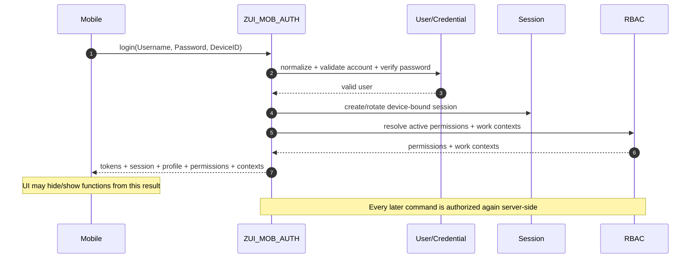
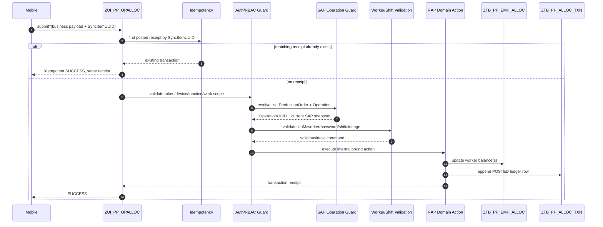
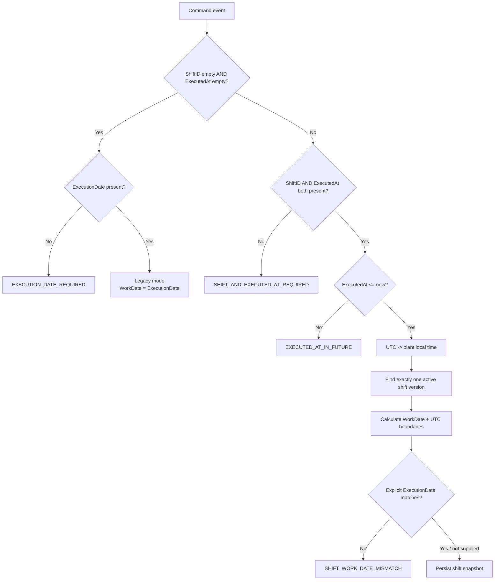
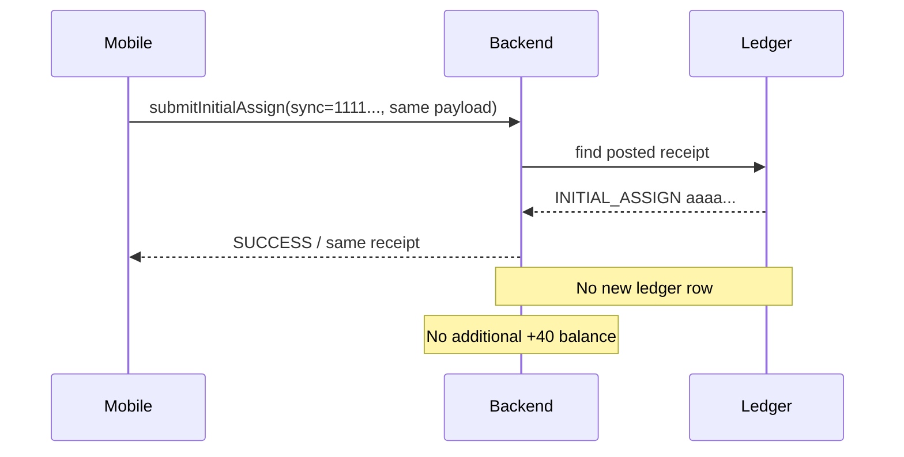
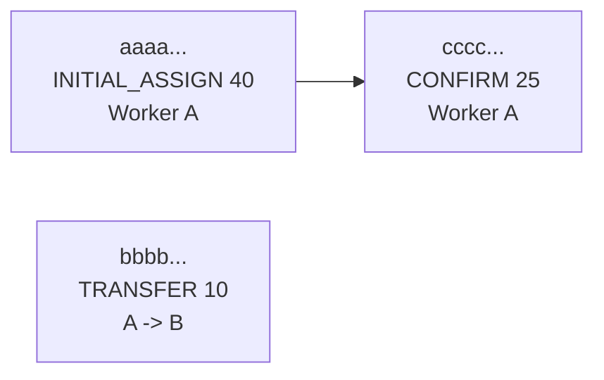
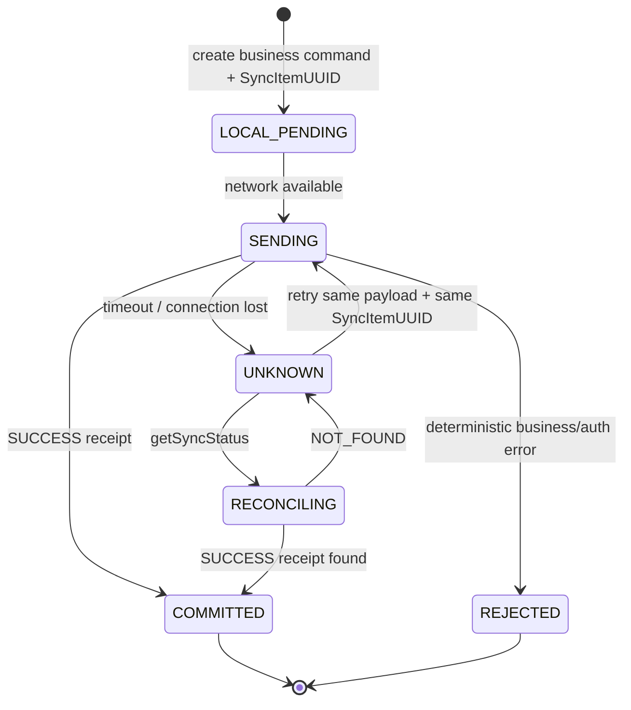

# CASLA Mobile — Flows & Happy Cases

**Mục tiêu:** cung cấp một tài liệu có thể dùng chung cho mobile, backend và QA để hiểu luồng end-to-end bằng sơ đồ Mermaid, payload minh họa và expected state sau từng bước.

> Các giá trị trong file này là **illustrative test data**, không phải master data mặc định của production tenant. Khi chạy integration test, hãy thay Plant/Work Center/Shift/UoM bằng dữ liệu thật nhưng giữ nguyên quan hệ, quantity và lineage của scenario.

---

## 1. Canonical dataset

Toàn bộ happy case phía dưới dùng **cùng một dataset**, để expected balance và ledger không mâu thuẫn giữa các ví dụ.

### 1.1 Operation và context

| Field | Value | Ghi chú |
| --- | --- | --- |
| Plant | `1000` | Minh họa |
| Work Center | `WC000001` | Minh họa |
| Production Order | `100000000001` | 12 ký tự |
| Operation | `0010` | 4 ký tự |
| Operation Quantity | `100 ST` | `ST` phải được map sang UoM hợp lệ trên tenant thật |
| MaCongDoan | `CD00001` | Giá trị minh họa |
| Actor | `lead.pp01` | Supervisor/account mobile |
| Device | `CASLA-ANDROID-001` | Giữ ổn định trong cùng session |
| Worker A | `HD000001` | Worker nhận initial assignment |
| Worker B | `HD000002` | Worker nhận transfer |

### 1.2 Shift minh họa

Happy case ban ngày giả định tenant có config tương đương:

```text
ShiftID       DAY
Local time    06:00 -> 14:00
EndDayOffset  0
WorkDate      2026-09-08
```

Overnight case giả định thêm:

```text
ShiftID       NIGHT
Local time    22:00 -> 06:00 next day
EndDayOffset  1
```

Tên SAP timezone key là tenant-specific; ví dụ overnight bên dưới dùng **UTC+07 chỉ để diễn giải timestamp**.

### 1.3 Stable IDs dùng xuyên suốt

| Business event | SyncItemUUID (client-generated) | TransactionUUID sau commit (server receipt, minh họa) |
| --- | --- | --- |
| Initial assign | `11111111-1111-4111-8111-111111111111` | `aaaaaaaa-aaaa-4aaa-8aaa-aaaaaaaaaaaa` |
| Transfer | `22222222-2222-4222-8222-222222222222` | `bbbbbbbb-bbbb-4bbb-8bbb-bbbbbbbbbbbb` |
| Confirm | `33333333-3333-4333-8333-333333333333` | `cccccccc-cccc-4ccc-8ccc-cccccccccccc` |
| Recall | `44444444-4444-4444-8444-444444444444` | `dddddddd-dddd-4ddd-8ddd-dddddddddddd` |
| Reverse example | `55555555-5555-4555-8555-555555555555` | server-generated |
| Overnight confirm | `66666666-6666-4666-8666-666666666666` | server-generated |

**Không nhầm hai UUID:**

- `SyncItemUUID`: mobile tạo **trước first send**, giữ nguyên khi retry.
- `TransactionUUID`: receipt/ledger identity được backend tạo sau khi command commit.

---

## 2. Flow A — Login và dựng capability UI



### Happy Case HC-00 — Login thành công

**Input payload:**

```json
{
  "Username": "lead.pp01",
  "Password": "<actor-password>",
  "DeviceID": "CASLA-ANDROID-001"
}
```

**Expected:**

- trả `UserUUID`, `SessionID`, `AccessToken`, `RefreshToken`, `ExpiresAt`, profile,
- trả `_Permissions` và `_WorkContexts`,
- mobile lưu token/session an toàn,
- subsequent PP command vẫn phải qua token/function/work-scope validation ở backend.

Ví dụ capability tối thiểu cho full scenario:

```text
PP_INITIAL_ASSIGN
PP_TRANSFER
PP_RECALL
PP_CONFIRM
PP_HIST_TEAM
```

Không coi list permission trong login response là authorization proof mà client có thể gửi ngược lại.

---

## 3. Flow B — Generic mobile command



### Failure boundary cần nhớ

```text
HTTP timeout
  != backend business failure
  != permission failure
  != validation failure
```

Nếu client không nhận được response, nó phải reconcile bằng stable `SyncItemUUID`.

---

## 4. Flow C — Shift resolution



Retry có một rule mạnh hơn: nếu `SyncItemUUID` đã có receipt, resolver ưu tiên snapshot đã persist; shift/time của retry phải khớp event cũ, nếu không sẽ bị `IDEMPOTENCY_KEY_REUSED`.

---

# 5. Happy Case HC-01 — Initial assign 40 ST + idempotent retry

## 5.1 Preconditions

- Actor login thành công trên `CASLA-ANDROID-001`.
- Actor có `PP_INITIAL_ASSIGN` và work context cho `1000/WC000001`.
- Production order `100000000001`, operation `0010` live validation pass.
- Operation quantity = `100 ST`.
- Worker A `HD000001` active/valid và worker password đúng.
- `DAY` config cover event `2026-09-08T02:00:00Z` trong timezone tenant tương ứng.
- Chưa có balance cho Worker A trên operation này.

## 5.2 First request

```json
{
  "ProductionOrder": "100000000001",
  "Operation": "0010",
  "ToWorkerID": "HD000001",
  "Quantity": 40,
  "UnitOfMeasure": "ST",
  "ShiftID": "DAY",
  "ExecutionDate": "2026-09-08",
  "ExecutedAt": "2026-09-08T02:00:00Z",
  "AccessToken": "<access-token>",
  "DeviceID": "CASLA-ANDROID-001",
  "WorkerPassword": "<worker-A-password>",
  "SyncItemUUID": "11111111-1111-4111-8111-111111111111"
}
```

## 5.3 Expected commit

`ZA_PP_CommandResult` về logic sẽ có:

```json
{
  "Status": "SUCCESS",
  "SyncItemUUID": "11111111-1111-4111-8111-111111111111",
  "TransactionUUID": "aaaaaaaa-aaaa-4aaa-8aaa-aaaaaaaaaaaa",
  "ProductionOrder": "100000000001",
  "Operation": "0010",
  "MaCongDoan": "CD00001",
  "ErrorCode": "",
  "Message": "<success-message>"
}
```

Transaction UUID trên là ID minh họa để các case sau tham chiếu.

### Balance sau HC-01

| Worker | Initial | In | Out | Recall | Completed | Remaining |
| --- | ---: | ---: | ---: | ---: | ---: | ---: |
| `HD000001` | 40 | 0 | 0 | 0 | 0 | **40** |
| `HD000002` | 0 | 0 | 0 | 0 | 0 | 0 |

Check invariant Worker A:

```text
40 + 0 - 0 - 0 - 0 = 40
```

### Ledger sau HC-01

| Txn | Type | Worker/To | Qty | Original | Sync |
| --- | --- | --- | ---: | --- | --- |
| `aaaa...` | `INITIAL_ASSIGN` | `HD000001` | 40 ST | — | `1111...` |

## 5.4 Retry cùng request

Giả sử mobile gửi lại **đúng payload trên** với cùng `SyncItemUUID`.



Expected sau retry:

```text
Ledger count vẫn = 1
Worker A Remaining vẫn = 40
TransactionUUID trả lại = aaaa...
```

Nếu client đổi `Quantity` từ `40` thành `41` nhưng giữ sync `1111...`, expected là `IDEMPOTENCY_KEY_REUSED`, không phải một initial assignment mới.

---

# 6. Happy Case HC-02 — Transfer 10 ST từ Worker A sang Worker B

## 6.1 Preconditions

HC-01 đã commit.

Worker A đang có:

```text
Remaining = 40 ST
```

Worker B active/valid và password đúng.

## 6.2 Request

```json
{
  "ProductionOrder": "100000000001",
  "Operation": "0010",
  "FromWorkerID": "HD000001",
  "ToWorkerID": "HD000002",
  "Quantity": 10,
  "UnitOfMeasure": "ST",
  "ShiftID": "DAY",
  "ExecutionDate": "2026-09-08",
  "ExecutedAt": "2026-09-08T02:30:00Z",
  "AccessToken": "<access-token>",
  "DeviceID": "CASLA-ANDROID-001",
  "WorkerPassword": "<worker-B-password>",
  "SyncItemUUID": "22222222-2222-4222-8222-222222222222"
}
```

Một chi tiết dễ viết sai trong client docs: implementation transfer xác minh **target worker** bằng `WorkerPassword`.

## 6.3 Expected state

### Balance

| Worker | Initial | In | Out | Recall | Completed | Remaining |
| --- | ---: | ---: | ---: | ---: | ---: | ---: |
| `HD000001` | 40 | 0 | 10 | 0 | 0 | **30** |
| `HD000002` | 0 | 10 | 0 | 0 | 0 | **10** |

Invariants:

```text
Worker A: 40 + 0 - 10 - 0 - 0 = 30
Worker B:  0 +10 -  0 - 0 - 0 = 10
```

### Ledger

| Txn | Type | From | To | Qty | Sync |
| --- | --- | --- | --- | ---: | --- |
| `aaaa...` | `INITIAL_ASSIGN` | — | `HD000001` | 40 ST | `1111...` |
| `bbbb...` | `TRANSFER` | `HD000001` | `HD000002` | 10 ST | `2222...` |

Expected transaction receipt của transfer trong các case tiếp theo:

```text
TransactionUUID = bbbbbbbb-bbbb-4bbb-8bbb-bbbbbbbbbbbb
```

---

# 7. Happy Case HC-03 — Worker A confirm 25 ST có lineage đúng

## 7.1 Preconditions

Sau HC-02:

```text
Worker A Remaining = 30 ST
```

Confirmation phải tham chiếu transaction đã cấp quantity hợp lệ cho Worker A. Ta dùng initial assignment `aaaa...`.

## 7.2 Request

```json
{
  "ProductionOrder": "100000000001",
  "Operation": "0010",
  "WorkerID": "HD000001",
  "Quantity": 25,
  "UnitOfMeasure": "ST",
  "ExecutionDate": "2026-09-08",
  "OriginalTransactionUUID": "aaaaaaaa-aaaa-4aaa-8aaa-aaaaaaaaaaaa",
  "AccessToken": "<access-token>",
  "DeviceID": "CASLA-ANDROID-001",
  "WorkerPassword": "<worker-A-password>",
  "SyncItemUUID": "33333333-3333-4333-8333-333333333333",
  "ShiftID": "DAY",
  "ExecutedAt": "2026-09-08T03:00:00Z"
}
```

## 7.3 Expected state

### Balance

| Worker | Initial | In | Out | Recall | Completed | Remaining |
| --- | ---: | ---: | ---: | ---: | ---: | ---: |
| `HD000001` | 40 | 0 | 10 | 0 | **25** | **5** |
| `HD000002` | 0 | 10 | 0 | 0 | 0 | 10 |

Invariant Worker A:

```text
40 + 0 - 10 - 0 - 25 = 5
```

### Ledger lineage



`CONFIRM` stores:

```text
OriginalTransactionUUID = aaaaaaaa-aaaa-4aaa-8aaa-aaaaaaaaaaaa
```

### Important semantic

Success này chỉ chứng minh **CASLA ledger** đã ghi `CONFIRM` và balance đã thay đổi. Nó không chứng minh một standard SAP Production Confirmation đã được tạo.

---

# 8. Happy Case HC-04 — Recall 5 ST, response bị mất, reconcile bằng getSyncStatus

Case này vừa kiểm tra recall vừa kiểm tra offline/timeout semantics.

## 8.1 Preconditions

Sau HC-03:

```text
Worker B Remaining = 10 ST
```

Worker B nhận 10 ST từ transfer `bbbb...`, nên recall 5 ST tham chiếu transaction này là hợp lệ.

## 8.2 Recall request

```json
{
  "ProductionOrder": "100000000001",
  "Operation": "0010",
  "WorkerID": "HD000002",
  "Quantity": 5,
  "UnitOfMeasure": "ST",
  "ShiftID": "DAY",
  "ExecutionDate": "2026-09-08",
  "ExecutedAt": "2026-09-08T03:15:00Z",
  "OriginalTransactionUUID": "bbbbbbbb-bbbb-4bbb-8bbb-bbbbbbbbbbbb",
  "AccessToken": "<access-token>",
  "DeviceID": "CASLA-ANDROID-001",
  "WorkerPassword": "<worker-B-password>",
  "SyncItemUUID": "44444444-4444-4444-8444-444444444444"
}
```

Giả định backend commit thành công thành transaction `dddd...`, nhưng HTTP response bị mất.

```mermaid
sequenceDiagram
    autonumber
    participant M as Mobile
    participant P as PP Service
    participant L as Ledger

    M->>P: submitRecall(sync=4444...)
    P->>L: append RECALL dddd...
    L-->>P: committed
    P--xM: response lost / timeout
    Note over M: Keep item PENDING; do not create a new UUID
    M->>P: getSyncStatus(sync=4444...)
    P->>L: lookup posted receipt
    L-->>P: RECALL dddd...
    P-->>M: SUCCESS + transaction details
    Note over M: Mark local item COMMITTED
```

## 8.3 `getSyncStatus` request

```json
{
  "AccessToken": "<access-token>",
  "DeviceID": "CASLA-ANDROID-001",
  "SyncItemUUID": "44444444-4444-4444-8444-444444444444"
}
```

Expected: `SUCCESS`, receipt trỏ về recall transaction `dddd...`.

## 8.4 Final balance after HC-01 -> HC-04

| Worker | Initial | In | Out | Recall | Completed | Remaining |
| --- | ---: | ---: | ---: | ---: | ---: | ---: |
| `HD000001` | 40 | 0 | 10 | 0 | 25 | **5** |
| `HD000002` | 0 | 10 | 0 | 5 | 0 | **5** |

Checks:

```text
Worker A: 40 + 0 - 10 - 0 - 25 = 5
Worker B:  0 +10 -  0 - 5 -  0 = 5

Initial quantity introduced = 40
Current remaining total    = 10
Completed total            = 25
Recalled total             = 5
40 = 10 + 25 + 5
```

### Final ledger

| Order | Txn | Type | Worker / From -> To | Qty | Original | Sync |
| ---: | --- | --- | --- | ---: | --- | --- |
| 1 | `aaaa...` | `INITIAL_ASSIGN` | -> `HD000001` | 40 | — | `1111...` |
| 2 | `bbbb...` | `TRANSFER` | `HD000001` -> `HD000002` | 10 | — | `2222...` |
| 3 | `cccc...` | `CONFIRM` | `HD000001` | 25 | `aaaa...` | `3333...` |
| 4 | `dddd...` | `RECALL` | `HD000002` | 5 | `bbbb...` | `4444...` |

---

# 9. Happy Case HC-05 — Team history reconciles with the same dataset

Giả định actor `lead.pp01` có `PP_HIST_TEAM` và chính actor đã tạo các transaction trên.

## 9.1 Request

```json
{
  "AccessToken": "<access-token>",
  "DeviceID": "CASLA-ANDROID-001",
  "RangeCode": "C",
  "DateFrom": "2026-09-08",
  "DateTo": "2026-09-08",
  "WorkerID": "",
  "ShiftID": "DAY",
  "SummaryOnly": false
}
```

## 9.2 Expected scope/result

- scope = team,
- history contains the relevant lineage rows created by actor in range/scope,
- no duplicate row caused by HC-01 retry,
- `IsTruncated = false` với dataset nhỏ này,
- entries giữ transaction type/quantity/UoM/business date/shift snapshot.

### Expected worker summary for these four rows

History summarization tính transfer hai phía theo `report_worker_id`:

| Worker | Assigned | Completed | Remaining | Cách ra số |
| --- | ---: | ---: | ---: | --- |
| `HD000001` | **30** | **25** | **5** | `+40 INITIAL_ASSIGN -10 TRANSFER_OUT`; completed `+25 CONFIRM` |
| `HD000002` | **5** | **0** | **5** | `+10 TRANSFER_IN -5 RECALL` |

Đây là một case mà **period history remaining** trùng current balance vì toàn bộ source events nằm cùng selected period. Không được suy rộng rằng hai số luôn bằng nhau ở mọi range.

---

# 10. Happy Case HC-06 — Overnight confirm vẫn dùng assignment cũ

Case này minh họa hai fact cùng lúc:

1. `WorkDate` của ca đêm có thể là ngày bắt đầu ca, dù event xảy ra sau midnight.
2. Balance là worker-operation based, không partition theo shift.

## 10.1 Preconditions

Sau HC-04, Worker A còn `5 ST`.

Giả sử operation/worker vẫn live-valid và config tenant:

```text
Shift NIGHT: 22:00 -> 06:00 next day
Timezone illustration: UTC+07
```

Event local `2026-09-09 02:30` tương ứng UTC `2026-09-08T19:30:00Z`.

Calculated:

```text
Calendar local date = 2026-09-09
WorkDate            = 2026-09-08
ShiftID             = NIGHT
```

## 10.2 Confirm 1 ST

```json
{
  "ProductionOrder": "100000000001",
  "Operation": "0010",
  "WorkerID": "HD000001",
  "Quantity": 1,
  "UnitOfMeasure": "ST",
  "ExecutionDate": "2026-09-08",
  "OriginalTransactionUUID": "aaaaaaaa-aaaa-4aaa-8aaa-aaaaaaaaaaaa",
  "AccessToken": "<access-token>",
  "DeviceID": "CASLA-ANDROID-001",
  "WorkerPassword": "<worker-A-password>",
  "SyncItemUUID": "66666666-6666-4666-8666-666666666666",
  "ShiftID": "NIGHT",
  "ExecutedAt": "2026-09-08T19:30:00Z"
}
```

Expected:

```text
Worker A Completed = 26
Worker A Remaining = 4
Ledger event ShiftID = NIGHT
Ledger event WorkDate = 2026-09-08
ExecutionDate compatibility value = 2026-09-08
```

Assignment gốc `aaaa...` ở `DAY` vẫn có thể là lineage của event sau nếu quantity còn lại và toàn bộ live validation vẫn pass. Không có requirement rằng assignment và confirm phải cùng shift.

### Boundary check

Với shift `[22:00, 06:00)`:

```text
05:59:59 -> NIGHT
06:00:00 -> NOT NIGHT; phải resolve sang shift kế tiếp nếu có
```

---

# 11. Happy Case HC-07 — Reverse confirmation

Dùng confirmation `cccc...` từ HC-03 làm target.

## Request

```json
{
  "ProductionOrder": "100000000001",
  "Operation": "0010",
  "TransactionUUID": "cccccccc-cccc-4ccc-8ccc-cccccccccccc",
  "Reason": "Nhập nhầm sản lượng",
  "AccessToken": "<access-token>",
  "DeviceID": "CASLA-ANDROID-001",
  "SyncItemUUID": "55555555-5555-4555-8555-555555555555"
}
```

Preconditions:

- actor có `PP_REVERSE`,
- target là posted `CONFIRM`,
- cùng operation,
- chưa có reverse hợp lệ trước đó.

Expected domain behavior:

```text
append REVERSE linked to cccc...
compensate effective confirmation quantity in balance
keep original CONFIRM immutable
keep audit lineage
```

Nếu confirmation đã có correction trước reverse, reverse phải dựa trên **effective confirmation quantity** theo implementation, không được client tự tính quantity reverse rồi gửi lên.

---

## 12. Negative checks tối thiểu quanh các happy case

Các case dưới đây không phải happy path, nhưng QA nên chạy cạnh happy case vì chúng bắt được sai contract phổ biến:

| Case | Expected |
| --- | --- |
| Retry HC-01 với cùng sync nhưng Quantity = 41 | `IDEMPOTENCY_KEY_REUSED` |
| New request có `ShiftID=DAY` nhưng thiếu `ExecutedAt` | `SHIFT_AND_EXECUTED_AT_REQUIRED` |
| Legacy request không có shift/time và không có ExecutionDate | `EXECUTION_DATE_REQUIRED` |
| Confirm 31 ST khi Worker A chỉ còn 30 | `CONFIRM_QUANTITY_EXCEEDED` |
| Confirm Worker B nhưng OriginalTransactionUUID = initial assignment của A | `CONFIRM_ORIGINAL_TRANSACTION_INVALID` |
| Transfer 31 ST từ A khi A chỉ còn 30 | `SOURCE_BALANCE_INSUFFICIENT` |
| Recall lớn hơn Worker B remaining | reject recall |
| Same sync key có >1 persisted receipt | `SYNC_RECEIPT_DUPLICATE` |
| getSyncStatus không thấy receipt | `NOT_FOUND`, **không tự động coi là FAILED** |
| ExecutedAt ở tương lai | `EXECUTED_AT_IN_FUTURE` |
| Explicit ExecutionDate khác shift-calculated WorkDate | `SHIFT_WORK_DATE_MISMATCH` |

---

## 13. Mobile state machine đề xuất để bám backend contract



Không nên có transition:

```text
timeout -> FAILED -> create new SyncItemUUID
```

vì nó phá idempotency và có thể tạo double posting nếu first request thực ra đã commit.

---

## 14. Acceptance checklist dùng cho PR/QA

- [ ] Mermaid render được trên GitHub cho architecture, command, shift và sync flows.
- [ ] Cùng một ProductionOrder/Operation/Worker set được dùng xuyên suốt happy cases.
- [ ] HC-01 initial assign ra balance 40 cho A.
- [ ] Retry HC-01 không tạo transaction thứ hai.
- [ ] HC-02 transfer 10 làm A=30, B=10.
- [ ] HC-03 confirm 25 làm A Remaining=5 và lineage về `aaaa...`.
- [ ] HC-04 recall 5 làm B Remaining=5.
- [ ] Lost response + `getSyncStatus` trả receipt thay vì resend bằng UUID mới.
- [ ] Team-history summary của canonical four-row dataset: A `30/25/5`, B `5/0/5` cho Assigned/Completed/Remaining.
- [ ] Overnight event sau midnight vẫn có WorkDate của ngày bắt đầu shift.
- [ ] Reverse append compensating row, không sửa original confirm.
- [ ] UoM/Plant/WorkCenter/Shift IDs trong integration test được thay bằng tenant-valid data.
- [ ] Không log token/password trong test evidence.

---

## 15. Traceability về source objects

| Concept trong flow | Source chính |
| --- | --- |
| Login contract | `ZA_MOB_Login`, `ZA_MOB_LoginResult`, `ZC_MOB_User` behavior projection |
| PP action surface | `ZR_PP_OpAlloc` behavior + `ZC_PP_OpAlloc` projection |
| Action payloads | `ZA_PP_InitialAssign`, `ZA_PP_Transfer`, `ZA_PP_Recall`, `ZA_PP_Confirm`, `ZA_PP_Reverse` |
| Command result | `ZA_PP_CommandResult` |
| Shift resolution | `ZCL_PP_SHIFT_RESOLVER` |
| Live operation validation | `ZCL_PP_OPERATION_GUARD` |
| Worker validation | `ZCL_PP_WORKER_VALIDATOR` + token/password services |
| Idempotency | `ZBP_R_PP_OPALLOC` submit/internal action implementation |
| Sync reconciliation | `ZA_PP_SyncStatusQuery` + `getSyncStatus` |
| History | `ZA_PP_HistQuery` + `ZCL_PP_WORK_HISTORY` |
| Current balance | `ZTB_PP_EMP_ALLOC` |
| Audit ledger | `ZTB_PP_ALLOC_TXN` |

Khi một source object thay đổi contract, update file này cùng `TECHNICAL_DOCUMENTATION.md` trong cùng PR để flow examples không drift khỏi implementation.
