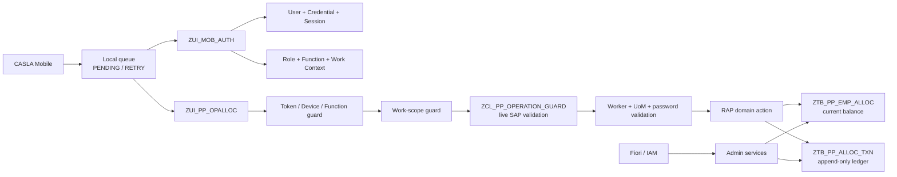
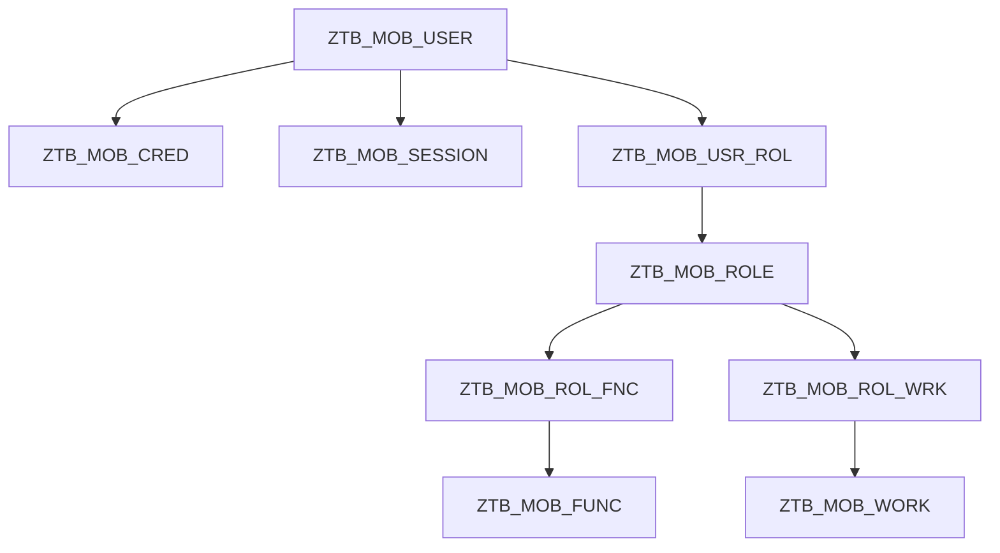
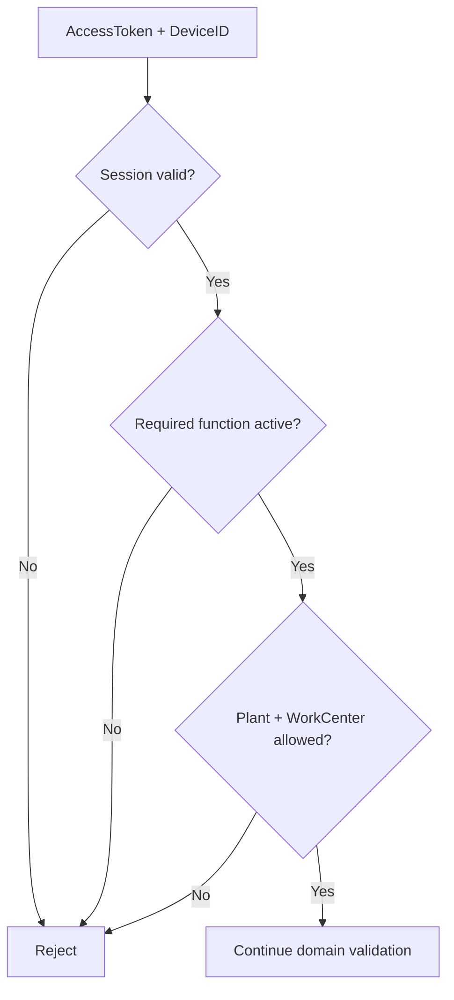
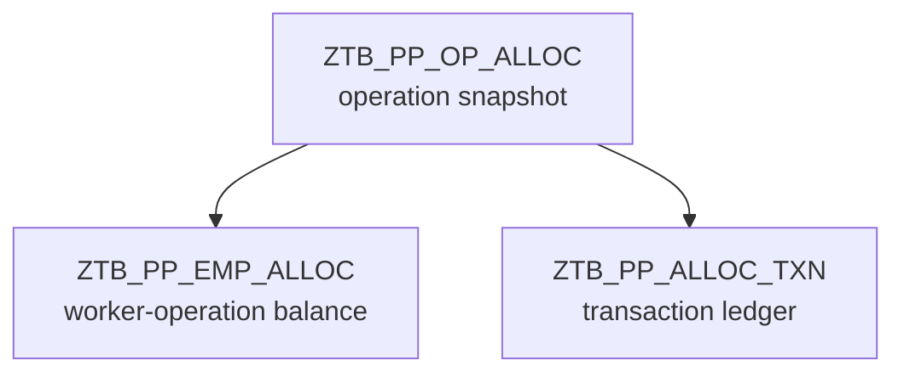
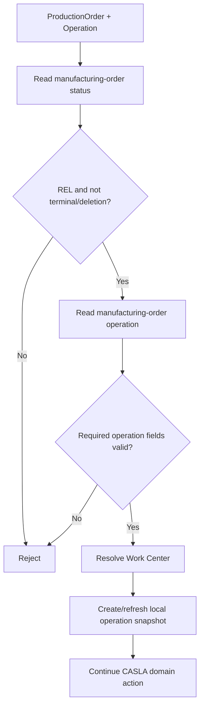
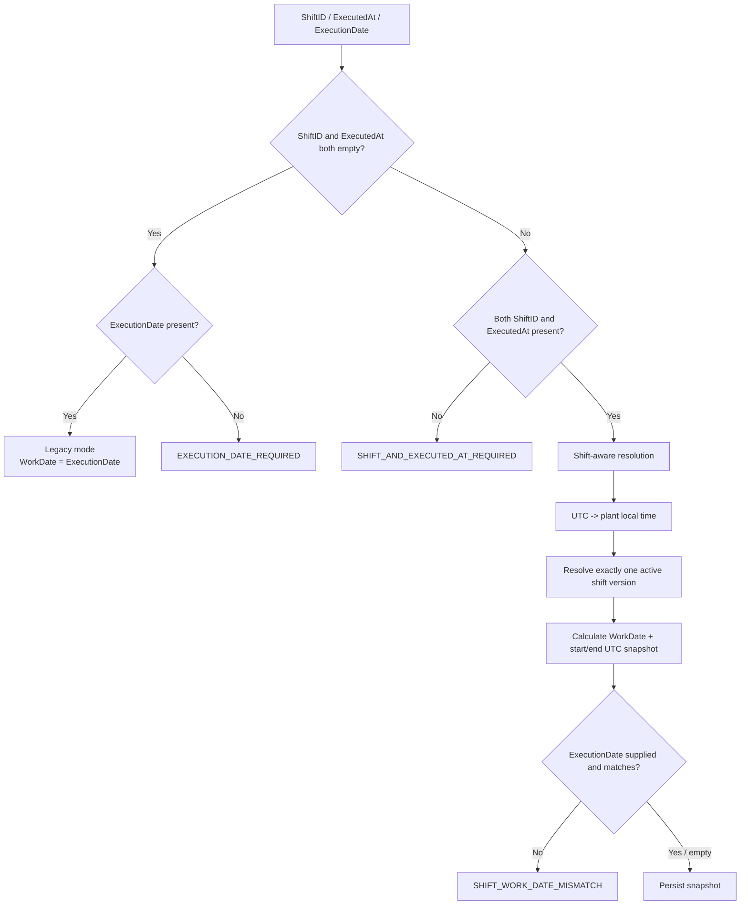
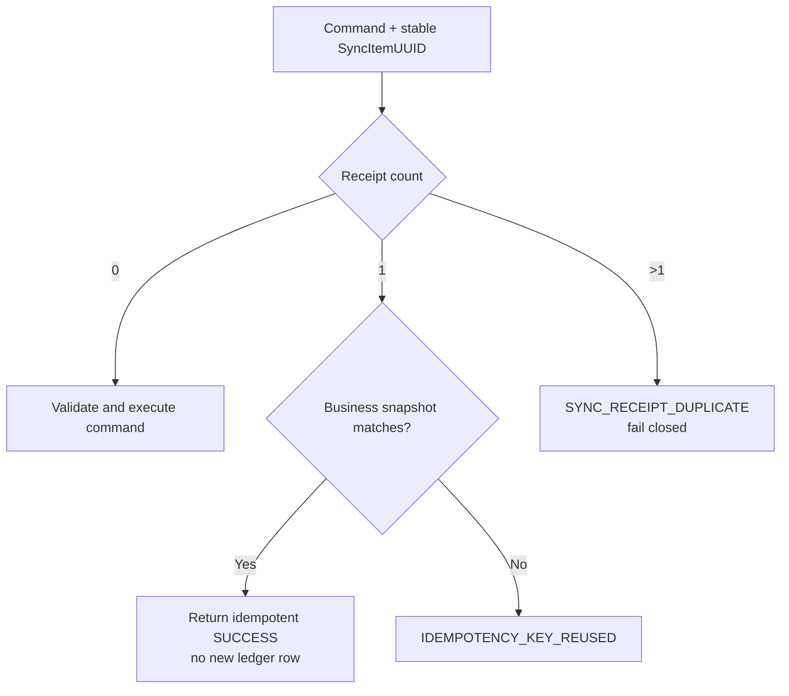

# CASLA Mobile — Technical Documentation

**Cập nhật:** 2026-09-08  
**Phạm vi:** ABAP Cloud RAP + OData V4 backend trong `serialized/`  
**Đối tượng:** ABAP developer, mobile developer, Fiori developer, QA, DevOps và SAP administrator

## 1. Mục tiêu và nguyên tắc nguồn sự thật

CASLA Mobile là backend phục vụ phân bổ công việc theo production-order operation, điều chuyển/thu hồi số lượng, ghi nhận sản lượng hoàn thành, đồng bộ offline và truy vết lịch sử.

Tài liệu này mô tả **implementation hiện tại**. Khi có mâu thuẫn, ưu tiên theo thứ tự:

```text
1. ABAP implementation / RAP behavior đang được serialize trong Git
2. CDS abstract entity / service definition hiện tại
3. Tài liệu này
4. Các plan, review và audit document lịch sử
```

Điểm biên quan trọng nhất:

> CASLA duy trì một **custom allocation ledger**. Luồng hiện tại không tạo standard SAP Production Confirmation, material document, goods movement hoặc chứng từ SAP chuẩn khác. Các trường legacy có tên SAP confirmation trong ledger không thay đổi ranh giới này.

### In scope

- Mobile login, refresh, logout, change password.
- User/session/device validation.
- RBAC theo role, function và work context.
- Live validation của SAP production order operation.
- Initial assignment, transfer, recall, confirm, reverse.
- Controlled confirmation correction ở Fiori/IAM admin.
- Stable idempotency bằng `SyncItemUUID`.
- Timeout reconciliation bằng `getSyncStatus`.
- Personal/team work history.
- Working-shift catalog có version và snapshot vào ledger.
- Versioned Công đoạn master.
- OData V4 service definitions/bindings cho mobile và admin.

### Out of scope

- SAP-side durable queue thay cho mobile queue.
- Tự động tạo standard SAP confirmation.
- Payroll/time evaluation/attendance.
- Tự bịa hoặc backfill shift cho ledger legacy không có snapshot.
- Xóa/sửa trực tiếp posted ledger để “chữa” lịch sử.

---

## 2. Kiến trúc tổng thể



### Nguyên tắc thiết kế

1. **Server authoritative:** client không quyết định actor, permission, work scope, worker validity hoặc trạng thái SAP operation.
2. **Command surface:** mobile gửi business action; không CRUD trực tiếp balance/ledger.
3. **Immutable history:** reverse/correction append dòng bù có lineage tới dòng gốc.
4. **Atomic RAP LUW:** update balance và append ledger phải cùng transactional unit.
5. **Stable retry key:** một business attempt giữ nguyên `SyncItemUUID` qua retry.
6. **Timeout != failure:** mất response không chứng minh transaction chưa commit.
7. **Shift is event metadata:** balance không bị partition theo shift.

---

## 3. Repository layout và naming

```text
serialized/
  *.tabl.xml                 DDIC table serialization
  *.asddls                   CDS / abstract entity
  *.asbdef                   RAP behavior definition
  *.clas.abap                global class
  *.locals_imp.abap          behavior local handler
  *.srvdsrv                  service definition
  *.srvb.xml                 OData V4 binding descriptor

  zpk_xnsl_sm_backend_auth/  authentication/session/password
  zpk_xnsl_sm_backend_role/  role/function
  zpk_xnsl_sm_backend_wc/    work context + worker reference
  zpk_xnsl_sm_backend_cd/    Công đoạn master

docs/                        documentation
scripts/                     repository checks
.github/workflows/           CI
```

Prefix chính:

| Prefix | Ý nghĩa |
| --- | --- |
| `ZI_` | interface/reusable CDS |
| `ZR_` | RAP root/interface data model |
| `ZC_` | consumption/projection CDS |
| `ZA_` | abstract action parameter/result |
| `ZTB_` | persisted active table |
| `ZTD_` | draft table |
| `ZUI_` | UI/API-facing service definition |
| `ZCL_` | ABAP class |

---

## 4. Identity, authentication và authorization

### 4.1 Data model



- User là actor/account của mobile.
- Worker nhận/phát sinh sản lượng là business identity riêng được resolve qua worker mapping/reference.
- Không được suy luận “manager gửi lệnh” đồng nghĩa manager là worker nhận quantity.
- Function quyết định **được làm gì**.
- Work context quyết định **được làm ở plant/work center nào**.

### 4.2 Mobile auth surface

`ZUI_MOB_AUTH` expose `ZC_MOB_User` dưới entity `MobileAuthentication`.

Mobile projection chỉ expose:

```text
login
logout
refresh
changePassword
```

Các action quản trị user/role không thuộc mobile auth surface.

Login input:

```json
{
  "Username": "lead.pp01",
  "Password": "<password>",
  "DeviceID": "CASLA-ANDROID-001"
}
```

Login result có các field chính:

```text
UserUUID
SessionID
AccessToken
RefreshToken
ExpiresAt
Status
FullName
Email
WorkerID
PasswordChangeRequired
_Permissions[]
_WorkContexts[]
```

`_Permissions` và `_WorkContexts` giúp mobile dựng UI; backend **không tin lại** dữ liệu permission do client gửi ở các command sau đó.

### 4.3 Secret/configuration

`ZCL_MOB_SEC_CONFIG` yêu cầu ít nhất hai config active:

```text
PASSWORD_PEPPER
TOKEN_SECRET
```

Nếu thiếu giá trị bắt buộc, security code fail thay vì âm thầm dùng default yếu.

### 4.4 Command authorization chain



Actor ghi xuống ledger phải lấy từ validated session (`ActorUserUUID`), không nhận actor từ payload mobile.

---

## 5. Production allocation data model



### 5.1 `ZTB_PP_OP_ALLOC`

Lưu local snapshot của live SAP manufacturing-order operation. Business identity được resolve từ:

```text
ProductionOrder + Operation
```

Mobile facade nhận hai field này và server resolve/create/refresh local `OperationUUID` nội bộ.

### 5.2 `ZTB_PP_EMP_ALLOC`

Lưu **current balance** cho một worker trong một operation.

Invariant:

```text
RemainingQuantity
  = InitialAssignedQuantity
  + TransferredInQuantity
  - TransferredOutQuantity
  - RecalledQuantity
  - CompletedQuantity
```

Balance không chia theo shift. Điều này có nghĩa một assignment từ ca/ngày trước vẫn có thể còn quantity để worker xử lý ở event sau, nếu các validation nghiệp vụ khác vẫn hợp lệ.

### 5.3 `ZTB_PP_ALLOC_TXN`

Là ledger audit của command đã post. Dòng transaction lưu các nhóm dữ liệu:

- transaction identity (`TransactionUUID`, `TransactionType`, `TransactionStatus`),
- idempotency (`SyncItemUUID`),
- lineage (`OriginalTransactionUUID`, `OriginalTransactionType`),
- actor/session/device,
- worker verification,
- worker/from/to worker,
- quantity + UoM,
- execution/work date,
- shift snapshot,
- reason/source channel.

History không nên được “sửa đẹp” bằng cách update/delete posted row. Reverse/correction là compensating transaction.

---

## 6. Live SAP operation guard

Mỗi mutation mới phải resolve operation qua `ZCL_PP_OPERATION_GUARD` trước khi thay đổi balance.

Luồng khái quát:



Implementation hiện tại yêu cầu order released và chặn các trạng thái kết thúc/xóa mà code đang kiểm tra. Operation phải có planned quantity dương, UoM, Plant, Work Center và các thuộc tính operation-control cần thiết.

**Tenant dependency:** tên/availability của released SAP CDS và field phải được kiểm tra ở target tenant. Repository lint không chứng minh runtime CDS/API đã được release/authorize trên tenant đó.

---

## 7. RAP business surface

Root BO: `ZR_PP_OpAlloc`, implementation `ZBP_R_PP_OPALLOC`.

Child entities:

```text
EmployeeAllocation
AllocationTransaction
```

### 7.1 Internal bound actions

| Action | Vai trò |
| --- | --- |
| `initialAssign` | Update/create target worker balance + append `INITIAL_ASSIGN` |
| `transfer` | Move remaining quantity A -> B + append `TRANSFER` |
| `recall` | Remove unused quantity + append `RECALL` |
| `confirm` | Completed += qty, Remaining -= qty + append `CONFIRM` |
| `reverse` | Compensate a posted `CONFIRM` + append `REVERSE` |
| `correctConfirm` | IAM/Fiori correction bằng signed delta + append `CORRECTION` |

### 7.2 Mobile static facade actions

| Action | Parameter | Result |
| --- | --- | --- |
| `submitInitialAssign` | `ZA_PP_InitialAssign` | `ZA_PP_CommandResult` |
| `submitTransfer` | `ZA_PP_Transfer` | `ZA_PP_CommandResult` |
| `submitRecall` | `ZA_PP_Recall` | `ZA_PP_CommandResult` |
| `submitConfirm` | `ZA_PP_Confirm` | `ZA_PP_CommandResult` |
| `submitReverse` | `ZA_PP_Reverse` | `ZA_PP_CommandResult` |
| `getSyncStatus` | `ZA_PP_SyncStatusQuery` | `ZA_PP_SyncStatusResult` |
| `getWorkHistory` | `ZA_PP_HistQuery` | deep `ZA_PP_HistResult` |

Facade nhận `ProductionOrder + Operation`, resolve live SAP operation và gọi bound action với `OperationUUID` nội bộ. Đây là contract phù hợp cho mobile.

### 7.3 `ZA_PP_CommandResult`

```text
Status
SyncItemUUID
TransactionUUID
ProductionOrder
Operation
MaCongDoan
ErrorCode
Message
```

---

## 8. Mobile mutation contracts

### 8.1 Common fields

Các mutation theo worker dùng các nhóm field sau:

```text
ProductionOrder
Operation
Quantity
UnitOfMeasure
AccessToken
DeviceID
SyncItemUUID
```

Action cần worker verification có thêm `WorkerPassword` và worker-related field tương ứng.

### 8.2 Exact action matrix

| Action | Worker fields | Lineage | Shift/event | Ghi chú |
| --- | --- | --- | --- | --- |
| `submitInitialAssign` | `ToWorkerID`, `WorkerPassword` | — | `ShiftID`, `ExecutionDate`, `ExecutedAt` | Target worker được verify |
| `submitTransfer` | `FromWorkerID`, `ToWorkerID`, `WorkerPassword` | — | `ShiftID`, `ExecutionDate`, `ExecutedAt` | Password xác minh target worker; source cần đủ remaining |
| `submitRecall` | `WorkerID`, `WorkerPassword` | `OriginalTransactionUUID` | `ShiftID`, `ExecutionDate`, `ExecutedAt` | Original phải là eligible assignment/transfer |
| `submitConfirm` | `WorkerID`, `WorkerPassword` | `OriginalTransactionUUID` | `ShiftID`, `ExecutionDate`, `ExecutedAt` | Original phải cấp quantity cho worker đó |
| `submitReverse` | — | `TransactionUUID` | snapshot lấy từ confirm gốc | `Reason` bắt buộc |

### 8.3 Initial assign rules

Server kiểm tra tối thiểu:

- action permission `PP_INITIAL_ASSIGN`,
- actor work scope,
- operation tồn tại và live validation pass,
- quantity > 0,
- target worker hợp lệ cho plant/work center/business date,
- target worker password đúng,
- UoM trùng operation UoM,
- `SyncItemUUID` hợp lệ,
- total allocated không vượt operation quantity,
- shift/event contract hợp lệ.

Nếu target balance chưa tồn tại, tạo mới; nếu đã có, tăng `InitialAssignedQuantity` và `RemainingQuantity`.

### 8.4 Transfer rules

- permission `PP_TRANSFER`,
- `FromWorkerID != ToWorkerID`,
- target worker active/allowed và password đúng,
- source balance tồn tại và `RemainingQuantity >= Quantity`,
- source `TransferredOut += Quantity`, `Remaining -= Quantity`,
- target `TransferredIn += Quantity`, `Remaining += Quantity`,
- append `TRANSFER`.

Transfer không làm tăng tổng quantity đã được phân bổ; nó chỉ chuyển ownership của quantity còn lại.

### 8.5 Recall rules

`OriginalTransactionUUID` phải trỏ tới posted transaction cùng operation có type phù hợp (`INITIAL_ASSIGN` hoặc `TRANSFER`) và liên quan đúng worker. Worker phải còn đủ remaining để thu hồi.

Khi success:

```text
RecalledQuantity += Quantity
RemainingQuantity -= Quantity
```

Ledger append `RECALL` có link tới original transaction.

### 8.6 Confirm rules

`OriginalTransactionUUID` là bắt buộc. Original phải:

- cùng operation,
- status posted,
- type `INITIAL_ASSIGN` hoặc `TRANSFER`,
- cấp quantity cho đúng worker đang confirm.

Worker balance phải còn đủ remaining.

Khi success:

```text
CompletedQuantity += Quantity
RemainingQuantity -= Quantity
```

Sau đó append `CONFIRM`. Đây là CASLA confirmation transaction, **không phải standard SAP Production Confirmation**.

### 8.7 Reverse rules

Target phải là posted `CONFIRM` cùng operation và chưa bị reverse. Reverse dùng effective quantity của confirmation (bao gồm correction hợp lệ nếu implementation tính correction chain) để bù balance và append `REVERSE` linked về transaction gốc.

`submitReverse` không yêu cầu client gửi shift event mới; audit shift của reversal được giữ theo event gốc cần bù.

### 8.8 Controlled correction

`correctConfirm` dành cho IAM/Fiori admin, không phải mobile action.

Logic delta:

```text
currentEffectiveQuantity = original CONFIRM + existing CORRECTION deltas

delta = NewQuantity - currentEffectiveQuantity
```

Nếu delta khác 0 và balance vẫn hợp lệ:

```text
Completed += delta
Remaining -= delta
```

Append `CORRECTION` với reason và source Fiori/IAM. Không update row `CONFIRM` gốc.

---

## 9. Shift model và business date

### 9.1 Shift configuration

Shift được version theo plant và validity. Các field nghiệp vụ chính:

```text
Plant
ShiftID
ShiftName
StartTime
EndTime
EndDayOffset
TimeZone
ValidFrom
ValidTo
IsActive
```

- Same-day shift: `EndDayOffset = 0`, end phải sau start.
- Overnight shift: `EndDayOffset = 1`.
- Interval được xử lý theo dạng **[start, end)**: start inclusive, end exclusive.

### 9.2 New client vs legacy client



### 9.3 Stored snapshot

Một posted event có thể lưu:

```text
ShiftID
WorkDate
ExecutedAt
ShiftStartAt
ShiftEndAt
ShiftTimeZone
ShiftValidFrom
ExecutionDate   = WorkDate compatibility copy
```

Mục đích snapshot là lịch sử không đổi khi admin thay đổi shift config sau này.

### 9.4 Overnight example

Giả sử ca `NIGHT` local 22:00 -> 06:00 hôm sau:

| Local event | WorkDate |
| --- | --- |
| 2026-09-08 22:00 | 2026-09-08 |
| 2026-09-08 23:30 | 2026-09-08 |
| 2026-09-09 02:00 | 2026-09-08 |
| 2026-09-09 05:59 | 2026-09-08 |
| 2026-09-09 06:00 | thuộc ca tiếp theo |

Offline mobile phải giữ **thời điểm nghiệp vụ thực tế** ở `ExecutedAt`, không thay bằng thời điểm upload lại sau khi có mạng.

---

## 10. Idempotency và offline synchronization

### 10.1 Rule

Mobile tạo `SyncItemUUID` trước first send và không đổi UUID khi retry cùng business attempt.



Payload comparison không chỉ nhìn UUID; nó so business identity tương ứng action, gồm actor/type/operation/worker/quantity/UoM/lineage và shift event fields khi áp dụng.

### 10.2 `submitConfirm` retry nuance

`submitConfirm` tìm persisted receipt theo `SyncItemUUID` **trước** khi resolve live operation cho một request chưa biết. Vì vậy một retry đã commit có thể trả success từ receipt ngay cả khi trạng thái live SAP operation sau đó đã thay đổi. Đây là hành vi đúng cho idempotency: retry không được biến một success đã commit thành failure chỉ vì world state đã đổi.

### 10.3 Timeout reconciliation

`getSyncStatus` input:

```json
{
  "AccessToken": "<access-token>",
  "DeviceID": "CASLA-ANDROID-001",
  "SyncItemUUID": "11111111-1111-4111-8111-111111111111"
}
```

Nếu backend tìm được đúng một posted receipt thuộc actor, trả `SUCCESS` với transaction identity/business snapshot.

Nếu không tìm thấy, trả `NOT_FOUND`. Ý nghĩa chính xác:

> SAP chưa chứng minh request đã commit. `NOT_FOUND` không tự động chứng minh business command đã fail.

Client nên giữ pending state, sau đó retry **cùng payload + cùng SyncItemUUID** theo policy mobile.

---

## 11. Work history

`getWorkHistory` nhận:

```text
AccessToken
DeviceID
RangeCode
DateFrom
DateTo
WorkerID
ShiftID
SummaryOnly
```

### Range semantics

Implementation history hỗ trợ các range code dạng ngày/tuần/tháng/custom và validation custom-range. Client không nên giả định range vô hạn; server có scan/output cap để bảo vệ runtime.

### Authorization semantics

- Team-history permission: actor thấy scope team mà backend xác định, cùng lineage liên quan.
- Self-history permission: worker được derive từ account mapping; client không thể đổi identity bằng cách tự gửi một worker khác.
- Role/work-context inactive không được coi là quyền hợp lệ.

### Summary semantics

Trong period report:

```text
INITIAL_ASSIGN  -> +Assigned
TRANSFER        -> +Assigned cho worker nhận
RECALL          -> -Assigned
CONFIRM         -> +Completed
CORRECTION      -> +/-Completed
REVERSE         -> -Completed
```

`Remaining` trong summary period là phép reconciliation của **period**, không nhất thiết bằng current all-time `ZTB_PP_EMP_ALLOC-RemainingQuantity`. Nếu assignment nằm ngoài range nhưng confirmation nằm trong range thì period remaining thậm chí có thể âm. UI phải phân biệt hai khái niệm.

---

## 12. Service map

### Mobile

| Service | Main exposure |
| --- | --- |
| `ZUI_MOB_AUTH` | `MobileAuthentication` |
| `ZUI_PP_OPALLOC` | `OperationAllocations`, `Shifts`, `UnitValueHelp` |

`ZUI_PP_OPALLOC` expose `ZI_PP_Shift` as `Shifts`, `I_UnitOfMeasure` as `UnitValueHelp` và `ZC_PP_OpAlloc` as `OperationAllocations`.

### Admin

| Service | Mục đích |
| --- | --- |
| `ZUI_MOB_USER_ADM` | User administration |
| `ZUI_MOB_RBAC_ADM` | Role/function/work-context administration |
| `ZUI_MD_CONGDOAN_ADM` | Versioned Công đoạn master |
| `ZUI_PP_ALLOC_ADM` | Allocation audit + controlled correction |
| `ZUI_PP_SHIFT_ADM` | Managed-draft shift configuration |

Binding file trong Git không đồng nghĩa endpoint đã publish và authorized ở target tenant.

---

## 13. Công đoạn master

`ZTB_MD_CONGDOAN` là versioned master theo business key dạng:

```text
CLIENT + MA_CONGDOAN + VALID_FROM
```

Master này phục vụ enrichment/administration. Nó không thay thế live SAP operation guard trong quyết định một operation có được mutate hay không.

Versioning cho phép lịch sử cũ giữ ngữ nghĩa tại thời điểm hiệu lực; tránh overwrite một record đã được dùng cho audit/reporting.

---

## 14. Error taxonomy quan trọng

| Code | Ý nghĩa |
| --- | --- |
| `MISSING_PERMISSION` | Actor thiếu function cần thiết |
| `WORK_CONTEXT_NOT_ALLOWED` | Plant/work center ngoài scope |
| `WORKER_NOT_ALLOWED` | Worker không hợp lệ cho scope/date |
| `WORKER_AUTH_FAILED` | Worker password verification fail |
| `UNIT_OF_MEASURE_MISMATCH` | Payload UoM khác operation/balance UoM |
| `OPERATION_QUANTITY_EXCEEDED` | Initial allocation vượt operation quantity |
| `SOURCE_BALANCE_INSUFFICIENT` | Transfer source không đủ remaining |
| `RECALL_NOT_ALLOWED` | Recall lineage/balance không hợp lệ |
| `CONFIRM_QUANTITY_EXCEEDED` | Worker không đủ remaining để confirm |
| `CONFIRM_ORIGINAL_TRANSACTION_INVALID` | Confirm lineage sai |
| `TRANSACTION_ALREADY_REVERSED` | Confirm đã được reverse |
| `IDEMPOTENCY_KEY_REUSED` | Cùng sync key nhưng payload khác |
| `SYNC_RECEIPT_DUPLICATE` | Có nhiều hơn một receipt cho sync key |
| `EXECUTION_DATE_REQUIRED` | Legacy request thiếu date |
| `SHIFT_AND_EXECUTED_AT_REQUIRED` | New request gửi thiếu một trong cặp shift/time |
| `EXECUTED_AT_IN_FUTURE` | Event time ở tương lai |
| `SHIFT_NOT_APPLICABLE` | Không có shift version match event |
| `SHIFT_CONFIG_AMBIGUOUS` | Nhiều shift version cùng match |
| `SHIFT_WORK_DATE_MISMATCH` | Explicit date khác calculated work date |

Gateway/serialization error do tenant UoM/customizing không phải business validation code. Khi thấy 5xx cần kiểm tra Gateway log, transaction ID và tenant configuration thay vì map tất cả thành “command failed”.

---

## 15. Fiori/IAM admin boundaries

Admin surface được tách khỏi mobile surface để giảm capability accidental exposure.

Ví dụ:

- mobile user tự login/logout/refresh/change password,
- user creation/reset/role assignment nằm ở admin service,
- mobile không có `correctConfirm`,
- confirmation correction là IAM/Fiori-controlled action có reason/audit,
- shift maintenance dùng managed draft service riêng.

Security boundary phải được giữ cả ở projection/service definition và IAM/catalog/communication authorization trên tenant.

---

## 16. Deployment và activation

abapGit source file không phải database row. Không được xóa/recreate production table chỉ vì serialized source thay đổi.

Recommended activation order:

```text
1. DDIC tables + draft tables
2. Interface/value-help CDS
3. Root/consumption CDS
4. Abstract action parameter/result entities
5. RAP behavior definitions
6. Behavior/resolver/history/security classes
7. Metadata extensions
8. Service definitions
9. Service bindings + publish
10. IAM/catalog/communication authorization
```

Checklist:

- review abapGit object list, đặc biệt delete/add bất thường,
- preserve table name/key/object type với dữ liệu production,
- activate dependencies theo order,
- publish service binding,
- maintain authorization default values,
- configure business role/IAM app hoặc communication arrangement,
- test bằng đúng user type sẽ chạy production.

---

## 17. Testing strategy

### Repository/static checks

Chạy script hiện có trong `scripts/` và CI workflow. Static pass không thay thế tenant runtime test.

### ABAP Unit

Repository có test cho các lớp trọng yếu như shift resolver, history và security helpers. Đặc biệt shift tests cần cover:

- daytime shift,
- overnight trước/sau midnight,
- inclusive start,
- exclusive end,
- invalid config,
- legacy date-only mode,
- missing shift/timestamp pair.

### Integration acceptance

Ít nhất phải chạy:

1. login và permission/work context,
2. initial assign success,
3. retry cùng SyncItemUUID không duplicate ledger,
4. transfer source -> target,
5. confirm có đúng lineage,
6. recall còn đủ balance,
7. reverse confirm,
8. timeout -> getSyncStatus,
9. changed payload + same SyncItemUUID -> reject,
10. overnight shift trước/sau midnight + exact end boundary,
11. self/team history,
12. invalid UoM/worker/work context,
13. Fiori correction + audit lineage.

Các happy case với dữ liệu nhất quán nằm ở [`FLOWS_AND_HAPPY_CASES.md`](FLOWS_AND_HAPPY_CASES.md).

---

## 18. Operational notes

- Ledger tăng theo mọi command/correction/reverse; cần monitor volume và index effectiveness trên tenant thật.
- Không log access token, refresh token, plaintext password/worker password hoặc secret config.
- Mobile phải persist pending queue đủ lâu để survive app restart/network loss.
- `SyncItemUUID` là business retry key, không phải random key sinh lại mỗi lần HTTP retry.
- `TransactionUUID` là receipt/server transaction identity; không dùng thay `SyncItemUUID` trước khi server đã trả receipt.
- `ExecutedAt` là event time, không phải upload time.
- `WorkDate` là business date do shift resolver tính, có thể khác calendar date sau midnight ở ca đêm.
- Current balance và period history summary là hai khái niệm khác nhau.

---

## 19. Known assumptions / tenant dependencies

Các giá trị dưới đây **không nên hard-code từ tài liệu**:

- plant thật,
- work center thật,
- SAP timezone key,
- active shift IDs,
- UoM mapping/configuration,
- released SAP CDS availability,
- IAM catalog/business role,
- communication arrangement,
- production-order/control profile customizing.

Dữ liệu trong happy case là **illustrative contract data**, cố tình dùng cùng một dataset để dễ review. Khi test tenant phải map sang dữ liệu thật nhưng giữ invariant/lineage tương đương.

---

## 20. Related docs

- [Flows and happy cases](FLOWS_AND_HAPPY_CASES.md)
- [Working shift design](WORKING_SHIFTS.md)
- [Fiori admin guidance](FIORI_ELEMENTS_ADMIN.md)
- [Production demo data queries](PP_DEMO_DATA_QUERIES.md)
- [Mobile synchronization plan](ABAP_RAP_MOBILE_SYNC_PLAN.md)
- [Metadata UX audit](METADATA_UX_AUDIT.md)

---

## Appendix A — Canonical action payload skeletons

### Initial assign

```json
{
  "ProductionOrder": "100000000001",
  "Operation": "0010",
  "ToWorkerID": "HD000001",
  "Quantity": 40,
  "UnitOfMeasure": "ST",
  "ShiftID": "DAY",
  "ExecutionDate": "2026-09-08",
  "ExecutedAt": "2026-09-08T02:00:00Z",
  "AccessToken": "<access-token>",
  "DeviceID": "CASLA-ANDROID-001",
  "WorkerPassword": "<worker-password>",
  "SyncItemUUID": "11111111-1111-4111-8111-111111111111"
}
```

### Transfer

```json
{
  "ProductionOrder": "100000000001",
  "Operation": "0010",
  "FromWorkerID": "HD000001",
  "ToWorkerID": "HD000002",
  "Quantity": 10,
  "UnitOfMeasure": "ST",
  "ShiftID": "DAY",
  "ExecutionDate": "2026-09-08",
  "ExecutedAt": "2026-09-08T02:30:00Z",
  "AccessToken": "<access-token>",
  "DeviceID": "CASLA-ANDROID-001",
  "WorkerPassword": "<worker-B-password>",
  "SyncItemUUID": "22222222-2222-4222-8222-222222222222"
}
```

### Confirm

```json
{
  "ProductionOrder": "100000000001",
  "Operation": "0010",
  "WorkerID": "HD000001",
  "Quantity": 25,
  "UnitOfMeasure": "ST",
  "ExecutionDate": "2026-09-08",
  "OriginalTransactionUUID": "aaaaaaaa-aaaa-4aaa-8aaa-aaaaaaaaaaaa",
  "AccessToken": "<access-token>",
  "DeviceID": "CASLA-ANDROID-001",
  "WorkerPassword": "<worker-A-password>",
  "SyncItemUUID": "33333333-3333-4333-8333-333333333333",
  "ShiftID": "DAY",
  "ExecutedAt": "2026-09-08T03:00:00Z"
}
```

### Recall

```json
{
  "ProductionOrder": "100000000001",
  "Operation": "0010",
  "WorkerID": "HD000002",
  "Quantity": 5,
  "UnitOfMeasure": "ST",
  "ShiftID": "DAY",
  "ExecutionDate": "2026-09-08",
  "ExecutedAt": "2026-09-08T03:15:00Z",
  "OriginalTransactionUUID": "bbbbbbbb-bbbb-4bbb-8bbb-bbbbbbbbbbbb",
  "AccessToken": "<access-token>",
  "DeviceID": "CASLA-ANDROID-001",
  "WorkerPassword": "<worker-B-password>",
  "SyncItemUUID": "44444444-4444-4444-8444-444444444444"
}
```

### Reverse

```json
{
  "ProductionOrder": "100000000001",
  "Operation": "0010",
  "TransactionUUID": "cccccccc-cccc-4ccc-8ccc-cccccccccccc",
  "Reason": "Nhập nhầm sản lượng",
  "AccessToken": "<access-token>",
  "DeviceID": "CASLA-ANDROID-001",
  "SyncItemUUID": "55555555-5555-4555-8555-555555555555"
}
```

> URL/action segment chính xác phải lấy từ `$metadata` của binding đã publish trên tenant. Các block trên mô tả **business payload contract**, không hard-code service-root của một tenant cụ thể.
